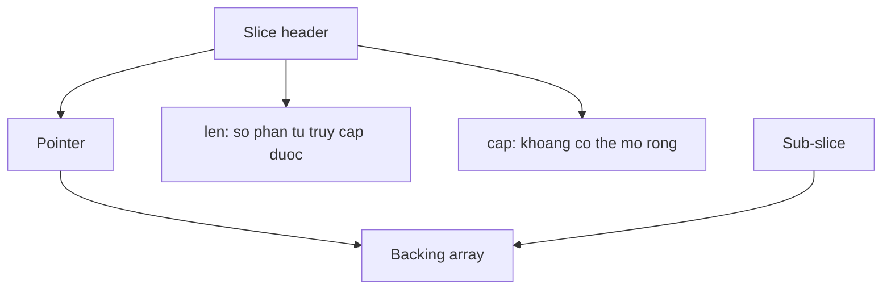

# Arrays, slices và ownership

## Bài toán và ví dụ đầu tiên

Một hàm lọc danh sách nhận slice từ caller rồi sửa phần tử đầu. Caller bất ngờ thấy dữ liệu của mình cũng đổi, dù Go truyền tham số bằng value. Nguyên nhân là giá trị được copy của slice chỉ mô tả một vùng dữ liệu, không copy toàn bộ các phần tử trong vùng đó. Hãy quan sát một ví dụ trước khi nói tới header hay allocator.

## Đi từng bước qua một tình huống

```go
package main

import "fmt"

func main() {
    a := []int{1, 2, 3}
    b := a[:2]
    b[0] = 100
    fmt.Println(a, b)
    b = append(b, 9)
    fmt.Println(a, b)
    independent := append([]int(nil), a...)
    independent[0] = 7
    fmt.Println(a, independent)
}
```

### Giải thích code từng bước

A ban đầu có ba phần tử. B là view hai phần tử đầu của cùng backing array — array thực sự giữ dữ liệu. Vì thế b[0]=100 cũng làm a[0]=100; dòng in đầu là [100 2 3] và [100 2]. B có len 2 nhưng còn capacity 3, nên append 9 sử dụng chỗ thứ ba của array cũ. Dòng in tiếp cho thấy cả a và b là [100 2 9].

Dòng tạo independent append toàn bộ phần tử a vào một nil slice, buộc dữ liệu int được copy sang storage riêng cho kết quả không rỗng này. Sửa independent[0] không đổi a. Với []struct chứa pointer hoặc [][]byte, copy các phần tử vẫn chỉ copy pointer/header bên trong; muốn độc lập sâu hơn phải quyết định copy object graph nào.

## Hiểu cơ chế từ kết quả quan sát

Slice có ba thành phần khái niệm: pointer tới phần tử đầu của view, len là số phần tử được index hợp lệ, cap là số phần tử có thể mở rộng từ điểm bắt đầu đó trong backing array. Bắt đầu view ở vị trí khác làm capacity khác. Chỉ số nhỏ hơn cap nhưng không nhỏ hơn len vẫn không được index trực tiếp.

Append trả về slice mới vì len thay đổi, và pointer/cap cũng có thể thay đổi nếu array hiện tại không đủ chỗ. Khi thiếu capacity, runtime cấp array lớn hơn và copy phần tử hiện có. Không dựa vào một công thức tăng gấp đôi cố định: chính sách tăng là implementation detail và phụ thuộc kích thước. Nếu hàm append nhưng caller không nhận slice trả về, caller không thấy len mới dù một phần storage cũ có thể đã bị ghi.

Full slice expression `a[:2:2]` đặt cap của view bằng 2. Append vào view đó phải có storage khác, nhưng việc sửa hai phần tử sẵn có vẫn ảnh hưởng a. Giới hạn cap ngăn append ghi vào phần đuôi chung; nó không tạo một bản copy và không tự làm dữ liệu an toàn khi đọc/ghi concurrent.

Array `[3]int` có độ dài thuộc type và khi gán sẽ copy ba int. Slice `[]int` không có độ dài trong type và là view biến đổi được. Cả hai đều pass by value: khác biệt nằm ở nội dung value được copy, không phải Go có một chế độ truyền tham chiếu riêng dành cho slice.

## Khái niệm

Array `[N]T` là value có độ dài thuộc type; gán array sao chép các phần tử. Slice `[]T` là view lên một đoạn array, được truyền bằng value. Sao chép slice không sao chép dữ liệu phía sau.

## Mô hình làm việc



### Cách đọc diagram

S là slice header gồm pointer, len và cap; các mũi tên từ S mô tả thành phần của một value, không phải trình tự chạy. Pointer dẫn tới backing array chứa phần tử thật. T là sub-slice có header riêng nhưng cũng trỏ tới array đó, nên sửa phần tử chung hiện ra qua cả hai view. Len giới hạn index, cap giới hạn mở rộng view trước khi cần storage khác.

## Vì sao cơ chế này cần thiết

Slice giúp xử lý batch mà không copy mỗi bước. `len` giới hạn index; `cap` tính từ điểm bắt đầu view đến cuối vùng backing array. `append` trả về header mới: đủ capacity thì dùng array cũ; thiếu capacity thì allocate array mới và copy. Luôn nhận giá trị trả về. Quy luật tăng capacity không phải contract của spec.

## Cơ chế runtime

Mental model gồm pointer, len, cap; không dựa vào layout unsafe để viết business code. Hai slice cùng array có thể đọc/ghi cùng ô nhớ. Full slice expression `s[:n:n]` giới hạn capacity, khiến append vượt n tạo array khác; nó không ngăn ghi vào n phần tử đang chia sẻ. `copy` xử lý vùng overlap và chỉ copy `min(len(dst), len(src))` phần tử. Với `[]*T`, copy vẫn chia sẻ các object T.

Một sub-slice nhỏ vẫn giữ array lớn reachable qua pointer. GC không thể giải phóng riêng phần còn lại của allocation. Muốn detach, allocate slice mới rồi copy; chỉ giảm cap không giải phóng array. Khi xóa phần tử pointer bằng dịch trái, clear phần đuôi không còn dùng để bỏ reference. Slice nil có len/cap 0 và append được; empty non-nil khác nil trong một số API/JSON.

## Ví dụ code

Chương trình độc lập, in `9 2 7 0`:

```go
package main
import "fmt"
func main() {
    a := []int{1, 2, 3}
    b := a[:1]
    b[0] = 9
    c := append(a[:1:1], 7)
    detached := append([]int(nil), a[:1]...)
    a[0] = 0
    fmt.Println(detached[0], a[1], c[1], a[0])
}
```

### Giải thích code và kết quả

B sửa phần tử đầu trên array chung nên a[0] thành9. Full slice a[:1:1] chỉ có cap 1, nên append 7 tạo storage mới cho c; detached copy phần tử đầu lúc nó còn9 sang storage riêng. Sau a[0]=0, detached vẫn9, a[1] vẫn 2, c[1] là 7, a[0] là0. Output9 2 7 0 tách rõ alias, cap limit và copy; đây là code tuần tự nên không có blocking/concurrent access.

## Áp dụng vào hệ thống thật

Parser đọc payload 32 MiB nhưng cache giữ token 20 byte: clone token trước khi lưu lâu dài. Khi pool buffer, consumer phải hoàn thành trước khi producer tái sử dụng buffer; gửi slice qua channel chỉ copy header, không chuyển ownership một cách tự động.

## Những đường lỗi cần hiểu

Append trong helper sửa dữ liệu caller khi còn capacity; bug biến mất khi input lớn gây reallocation. Cache token làm heap live tăng; concurrent handlers tái dùng cùng buffer tạo data race hoặc response lẫn dữ liệu.

## Đánh đổi

| Cách | Phù hợp | Giá phải trả |
|---|---|---|
| Sub-slice | Parse tạm trong một request | Retention, aliasing |
| Clone | Ownership/lifetime độc lập | Allocation và copy |
| Preallocate | Kích thước batch biết trước | Overcapacity giữ RAM |

## Những cách hiểu dễ sai

Truyền slice bằng value không tạo deep copy. Capacity giới hạn không phải cơ chế bảo vệ ghi. `append` không luôn allocate, và không bảo đảm luôn tăng gấp đôi.

## Khi nên chọn cách khác

Không giữ view vào buffer pool sau khi trả buffer. Với kích thước cố định nhỏ và cần value semantics, array có thể dễ kiểm soát hơn.

## Lần theo bằng chứng khi có sự cố

So sánh `inuse_space` và `alloc_space`; tìm allocation của payload lớn còn sống sau GC. Trace từ cache/global/closure giữ slice đến backing array. Reproduce với cap thừa và cap sát len; chạy race detector trên trường hợp buffer reuse. Sau khi clone, đo cả live heap giảm và allocation tăng để đánh giá lợi ích.

## Thực hành, debugging và kết luận

Ở production, parser có thể trả một sub-slice 20 byte từ buffer 10 MB. Nếu caller giữ 20 byte đó trong cache, backing array 10 MB vẫn có thể bị giữ sống. Copy phần nhỏ khi cần lifetime dài hơn buffer nguồn giúp giảm retained memory, nhưng tốn allocation và copying; quyết định từ kích thước và thời gian giữ thực tế.

Khi reuse buffer từ sync.Pool, chỉ trả buffer sau khi không còn consumer giữ slice view. Gửi slice qua channel không đổi quy tắc đó. Hai goroutine cùng append vào những header copy vẫn có thể ghi chung vùng capacity, gây data race. Preallocate giúp giảm allocation nhưng cũng làm sharing tồn tại lâu hơn, nên ownership cần rõ trước khi tối ưu.

Để debug, ghi len/cap và in các giá trị trước/sau thao tác, dựng test với cap vừa đủ và cap dư để lộ hai nhánh append. Heap profile giúp tìm nơi allocate vùng lớn, rồi đọc code để xác định view nào giữ nó. Test []int độc lập chưa đủ cho nested pointers; chọn mức copy theo semantics của API.


## Đọc tiếp

- [memory-leak](../02-memory-runtime/memory-leak.md)
- [channels](../04-concurrency/channels.md)
- [race-detector](../18-testing/race-detector.md)

## Nguồn đối chiếu

- [Go specification](https://go.dev/ref/spec#Slice_types)
