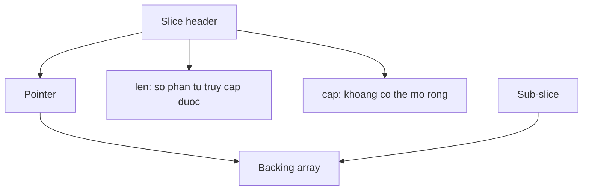

# Arrays, slices và ownership

**P0 · Must know**

## Concept

Array `[N]T` là value có độ dài thuộc type; gán array sao chép các phần tử. Slice `[]T` là view lên một đoạn array, được truyền bằng value. Sao chép slice không sao chép dữ liệu phía sau.

## Mental Model



## Why và How

Slice giúp xử lý batch mà không copy mỗi bước. `len` giới hạn index; `cap` tính từ điểm bắt đầu view đến cuối vùng backing array. `append` trả về header mới: đủ capacity thì dùng array cũ; thiếu capacity thì allocate array mới và copy. Luôn nhận giá trị trả về. Quy luật tăng capacity không phải contract của spec.

## Internals và runtime behavior

Mental model gồm pointer, len, cap; không dựa vào layout unsafe để viết business code. Hai slice cùng array có thể đọc/ghi cùng ô nhớ. Full slice expression `s[:n:n]` giới hạn capacity, khiến append vượt n tạo array khác; nó không ngăn ghi vào n phần tử đang chia sẻ. `copy` xử lý vùng overlap và chỉ copy `min(len(dst), len(src))` phần tử. Với `[]*T`, copy vẫn chia sẻ các object T.

Một sub-slice nhỏ vẫn giữ array lớn reachable qua pointer. GC không thể giải phóng riêng phần còn lại của allocation. Muốn detach, allocate slice mới rồi copy; chỉ giảm cap không giải phóng array. Khi xóa phần tử pointer bằng dịch trái, clear phần đuôi không còn dùng để bỏ reference. Slice nil có len/cap 0 và append được; empty non-nil khác nil trong một số API/JSON.

## Code Example

Chương trình độc lập, in `9 2 7 0`:

```go
package main
import "fmt"
func main() {
    a := []int{1, 2, 3}
    b := a[:1]
    b[0] = 9
    c := append(a[:1:1], 7)
    detached := append([]int(nil), a[:1]...)
    a[0] = 0
    fmt.Println(detached[0], a[1], c[1], a[0])
}
```

## Production Use Case

Parser đọc payload 32 MiB nhưng cache giữ token 20 byte: clone token trước khi lưu lâu dài. Khi pool buffer, consumer phải hoàn thành trước khi producer tái sử dụng buffer; gửi slice qua channel chỉ copy header, không chuyển ownership một cách tự động.

## Failure Scenarios

Append trong helper sửa dữ liệu caller khi còn capacity; bug biến mất khi input lớn gây reallocation. Cache token làm heap live tăng; concurrent handlers tái dùng cùng buffer tạo data race hoặc response lẫn dữ liệu.

## Trade-offs

| Cách | Phù hợp | Giá phải trả |
|---|---|---|
| Sub-slice | Parse tạm trong một request | Retention, aliasing |
| Clone | Ownership/lifetime độc lập | Allocation và copy |
| Preallocate | Kích thước batch biết trước | Overcapacity giữ RAM |

## Common Misconceptions

Truyền slice bằng value không tạo deep copy. Capacity giới hạn không phải cơ chế bảo vệ ghi. `append` không luôn allocate, và không bảo đảm luôn tăng gấp đôi.

## When NOT to use

Không giữ view vào buffer pool sau khi trả buffer. Với kích thước cố định nhỏ và cần value semantics, array có thể dễ kiểm soát hơn.

## How I would debug this in production

So sánh `inuse_space` và `alloc_space`; tìm allocation của payload lớn còn sống sau GC. Trace từ cache/global/closure giữ slice đến backing array. Reproduce với cap thừa và cap sát len; chạy race detector trên trường hợp buffer reuse. Sau khi clone, đo cả live heap giảm và allocation tăng để đánh giá lợi ích.

## Key Takeaways

Nói rõ owner, vùng nhớ chia sẻ và thời điểm hết lifetime. Kích thước slice nhìn thấy không phản ánh toàn bộ memory nó giữ.

## Interview Questions

### Basic / Mid — 10

1. How do arrays differ from slices?
2. What does len measure?
3. What does cap measure?
4. What does a slice assignment copy?
5. When does append allocate?
6. Why must append return a slice?
7. How does copy handle overlap?
8. Can a nil slice be appended to?
9. What does a full slice expression do?
10. Does copying a pointer slice clone objects?

### Senior — 10

1. Why can a tiny slice retain a large array?
2. How would you define buffer ownership?
3. Can capacity restriction prevent element mutation?
4. How can append change caller-visible data?
5. What is the cost of preallocation?
6. How do you detach a sub-slice?
7. How can deleting an element retain pointers?
8. Why is slice growth not an API guarantee?
9. How does JSON distinguish nil and empty slices?
10. How would you benchmark clone versus retention?

### Production scenarios — 5

1. Why does a parser retain 32 MiB per cached token?
2. Why does a bug disappear with larger inputs?
3. How would you investigate corrupted pooled responses?
4. How can concurrent append race despite different headers?
5. Why did preallocation increase RSS?

### Senior Follow-ups — 5

1. Who owns the backing array?
2. Who can mutate it?
3. When does that owner release it?
4. Which reference prevents collection?
5. Which profile would prove the fix?

Chuỗi follow-up: trả lời lần lượt 5 câu cuối; mỗi câu cần một invariant, bằng chứng runtime hoặc trade-off cụ thể.


## See also

- [memory-leak](../02-memory-runtime/memory-leak.md)
- [channels](../04-concurrency/channels.md)
- [race-detector](../18-testing/race-detector.md)

## Nguồn đối chiếu

- [Go specification](https://go.dev/ref/spec#Slice_types)
