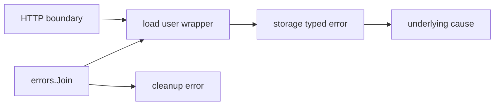

# Error handling và error chains

## Bài toán và ví dụ đầu tiên

Một repository không tìm thấy user; một lần khác database mất kết nối. Nếu cả hai chỉ trở thành string “failed”, handler không biết nên trả 404 hay 503, có retry được không và log ở đâu. Error value mang thất bại qua call boundary để mỗi tầng bổ sung thông tin mà vẫn giữ khả năng phân loại nguyên nhân.

## Đi từng bước qua một tình huống

Giả sử GetUser trả một lỗi sentinel ErrNotFound. Service thêm tên operation bằng fmt.Errorf với %w; handler dùng errors.Is để nhận ra ErrNotFound qua wrapper. Nếu dùng %v, chỉ còn text mô tả trong lỗi mới, nên Is không tự tìm lại cause. Với lỗi có field như status hay retry-after, errors.As lấy dạng typed error để caller đọc dữ liệu có kiểu.

Không so err.Error()=="not found" vì text là thông tin cho người đọc và có thể thay đổi khi thêm context. Sentinel identity, typed error hoặc error interface cụ thể là phần contract phù hợp hơn. Error message nên mô tả operation nào thất bại, không lặp “error occurred” ở mọi tầng.

## Hiểu cơ chế từ kết quả quan sát

Error là interface có Error() string. Wrapper có thể công bố quan hệ với cause qua Unwrap; errors.Is và As duyệt cấu trúc lỗi theo API. errors.Join có thể giữ nhiều nhánh, hữu ích khi operation lỗi và cleanup cũng lỗi. Caller không nên giả định mọi lỗi là một linked list có duy nhất một cause.

Quyết định wrap còn là quyết định API: nếu công khai lỗi driver ra ngoài boundary, caller có thể bắt đầu phụ thuộc vào nó. Một adapter có thể chuyển lỗi lưu trữ sang lỗi domain ổn định trong khi log chi tiết ở nơi sở hữu operation. Đừng vừa log cùng một lỗi ở mọi tầng vừa wrap, vì một thất bại có thể tạo nhiều log trùng làm incident khó đọc.

## Khái niệm và vấn đề cần giải quyết

`error` là interface có `Error() string`. Error là giá trị truyền thông tin thất bại qua call boundary; caller quyết định retry, map sang status hay dừng workflow. Panic dành cho lỗi không có contract phục hồi thông thường.

## Mô hình làm việc



### Cách đọc diagram

Đọc từ HTTP boundary xuống wrapper của service, typed error của storage và cause gốc. Các mũi tên diễn tả quan hệ bọc/nguyên nhân để errors.Is/As có thể lần theo, không phải mọi error đều phải có đủ bốn lớp. errors.Join thêm một nhánh cleanup error bên cạnh lỗi chính; caller cần phân loại cause thay vì chỉ đọc text ở node ngoài cùng.

## Cơ chế bên trong

`fmt.Errorf("load user: %w", err)` thêm operation context và giữ cause. `%v` chỉ render text, không giữ chain cho Is/As. `errors.Is` kiểm tra identity hoặc method Is qua error tree; `errors.As` tìm type có thể assign tới target. Target của As phải là pointer hợp lệ, ví dụ `var e *MyError; errors.As(err, &e)`. `errors.Join` bỏ nil và tạo error tree nhiều cause; nếu tất cả nil thì trả nil. Không giả định mọi error chỉ có `Unwrap() error`: Join dùng nhiều children và Is/As biết cách traverse.

Sentinel biểu diễn condition ổn định như not-found; typed error mang metadata như retry-after. Wrapping error của dependency làm loại lỗi đó trở thành một phần observable API. Nếu muốn giữ boundary ổn định, chuyển sang domain error có chủ đích và giữ cause trong log phù hợp. Không so sánh error string để quyết định retry.

## Ví dụ code

```go
package main
import (
    "errors"
    "fmt"
)
var ErrNotFound = errors.New("not found")
type StoreError struct { Operation string; Cause error }
func (e *StoreError) Error() string { return e.Operation + ": " + e.Cause.Error() }
func (e *StoreError) Unwrap() error { return e.Cause }
func main() {
    err := fmt.Errorf("load user: %w", &StoreError{"select", ErrNotFound})
    var se *StoreError
    fmt.Println(errors.Is(err, ErrNotFound))
    fmt.Println(errors.As(err, &se), se.Operation)
    fmt.Println(errors.Join(nil, nil) == nil)
}
```

### Giải thích code và kết quả

ErrNotFound là identity ổn định. StoreError giữ operation và cause, Unwrap cho phép errors.Is tìm cause qua lớp fmt.Errorf %w. errors.As đặt pointer se tới typed StoreError nên đọc được Operation=select sau khi match; code minh họa biết trước match thành công, code tổng quát phải kiểm tra bool trước dereference. errors.Join bỏ các lỗi nil và trả nil khi không có lỗi, nên dòng cuối true.

## Từ runtime đến production

Error creation/wrapping có allocation tùy optimization; đừng bỏ context để tối ưu khi chưa đo. Log một lần ở boundary có request ID; internal layers wrap với operation và trả lên. Phân biệt context deadline, client cancel, validation và dependency failure để metrics có ý nghĩa. Retry chỉ khi operation replay-safe và còn budget.

## Những đường lỗi cần hiểu

Typed nil error khiến success thành failure. Wrapping `%v` phá `errors.Is`. Retry tất cả lỗi tạo storm với validation error. Log mỗi layer tạo năm dòng cho một incident và lộ SQL/token.

## Đánh đổi

| Kiểu | Dùng khi | Hạn chế |
|---|---|---|
| Sentinel | Condition ổn định | Ít metadata |
| Typed error | Caller cần field | Coupling public type |
| Wrapped cause | Cần phân loại xuyên layer | Có thể lộ implementation |
| Joined errors | Main và cleanup cùng lỗi | Không phải chain đơn |

## Những cách hiểu dễ sai

Error khác nhau có cùng text vẫn không bằng nhau. As không tự unwrap mọi field tùy ý. Recover không biến programmer bug thành request hợp lệ.

## Khi nên chọn cách khác

Không dùng panic cho not-found/invalid input. Không xuất raw database error cho client. Không Join hàng nghìn error vô hạn; aggregate counts và sample thay thế.

## Lần theo bằng chứng khi có sự cố

Tìm boundary làm mất `%w`; test errors.Is/As qua nhiều wrapper. Kiểm tra metrics phân loại cancel/deadline. So sánh retry attempts trên mỗi logical request. Với cleanup failure, bảo toàn main error và thêm cleanup cause; không overwrite silent trong defer.

## Thực hành, debugging và kết luận

Production cần phân biệt lỗi transient có thể thử lại, lỗi input/permission cần trả ngay và unknown outcome sau timeout của mutation. Việc là net.Error hoặc context deadline chưa đủ để khẳng định retry an toàn; phải biết operation có side effect và có idempotency không. Khi cleanup thất bại, giữ nguyên lỗi chính để không mất nguyên nhân đầu nhưng vẫn ghi nhận cleanup có thể để lại tài nguyên.

Test errors.Is/As trên API thay vì exact string toàn bộ chain. Test nhánh thành công trả nil interface thật để tránh typed nil. Với panic, chỉ recover ở boundary có thể xử lý state an toàn; biến mọi panic thành nil error sẽ che lỗi và có thể báo hoàn thành một job thực ra chưa được thực hiện.


## Đọc tiếp

- [panic-recover](panic-recover.md)
- [cancellation](../05-context/cancellation.md)
- [retry](../12-distributed-systems/retry.md)

## Nguồn đối chiếu

- [errors package](https://pkg.go.dev/errors)
