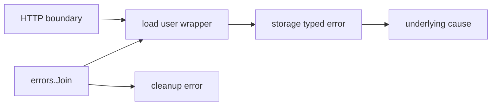

# Error handling và error chains

**P0 · Must know**

## Concept và Why

`error` là interface có `Error() string`. Error là giá trị truyền thông tin thất bại qua call boundary; caller quyết định retry, map sang status hay dừng workflow. Panic dành cho lỗi không có contract phục hồi thông thường.

## Mental Model



## How và Internals

`fmt.Errorf("load user: %w", err)` thêm operation context và giữ cause. `%v` chỉ render text, không giữ chain cho Is/As. `errors.Is` kiểm tra identity hoặc method Is qua error tree; `errors.As` tìm type có thể assign tới target. Target của As phải là pointer hợp lệ, ví dụ `var e *MyError; errors.As(err, &e)`. `errors.Join` bỏ nil và tạo error tree nhiều cause; nếu tất cả nil thì trả nil. Không giả định mọi error chỉ có `Unwrap() error`: Join dùng nhiều children và Is/As biết cách traverse.

Sentinel biểu diễn condition ổn định như not-found; typed error mang metadata như retry-after. Wrapping error của dependency làm loại lỗi đó trở thành một phần observable API. Nếu muốn giữ boundary ổn định, chuyển sang domain error có chủ đích và giữ cause trong log phù hợp. Không so sánh error string để quyết định retry.

## Code Example

```go
package main
import (
    "errors"
    "fmt"
)
var ErrNotFound = errors.New("not found")
type StoreError struct { Operation string; Cause error }
func (e *StoreError) Error() string { return e.Operation + ": " + e.Cause.Error() }
func (e *StoreError) Unwrap() error { return e.Cause }
func main() {
    err := fmt.Errorf("load user: %w", &StoreError{"select", ErrNotFound})
    var se *StoreError
    fmt.Println(errors.Is(err, ErrNotFound))
    fmt.Println(errors.As(err, &se), se.Operation)
    fmt.Println(errors.Join(nil, nil) == nil)
}
```

## Runtime behavior và Production Use Case

Error creation/wrapping có allocation tùy optimization; đừng bỏ context để tối ưu khi chưa đo. Log một lần ở boundary có request ID; internal layers wrap với operation và trả lên. Phân biệt context deadline, client cancel, validation và dependency failure để metrics có ý nghĩa. Retry chỉ khi operation replay-safe và còn budget.

## Failure Scenarios

Typed nil error khiến success thành failure. Wrapping `%v` phá `errors.Is`. Retry tất cả lỗi tạo storm với validation error. Log mỗi layer tạo năm dòng cho một incident và lộ SQL/token.

## Trade-offs

| Kiểu | Dùng khi | Hạn chế |
|---|---|---|
| Sentinel | Condition ổn định | Ít metadata |
| Typed error | Caller cần field | Coupling public type |
| Wrapped cause | Cần phân loại xuyên layer | Có thể lộ implementation |
| Joined errors | Main và cleanup cùng lỗi | Không phải chain đơn |

## Common Misconceptions

Error khác nhau có cùng text vẫn không bằng nhau. As không tự unwrap mọi field tùy ý. Recover không biến programmer bug thành request hợp lệ.

## When NOT to use

Không dùng panic cho not-found/invalid input. Không xuất raw database error cho client. Không Join hàng nghìn error vô hạn; aggregate counts và sample thay thế.

## How I would debug this in production

Tìm boundary làm mất `%w`; test errors.Is/As qua nhiều wrapper. Kiểm tra metrics phân loại cancel/deadline. So sánh retry attempts trên mỗi logical request. Với cleanup failure, bảo toàn main error và thêm cleanup cause; không overwrite silent trong defer.

## Key Takeaways

Error contract quyết định hành vi caller. Preserve cause có chủ đích, log đúng boundary và kiểm soát retry.

## Interview Questions

### Basic / Mid — 10

1. What is the error interface?
2. What is a sentinel error?
3. What is a typed error?
4. What does percent-w preserve?
5. How does errors.Is work?
6. How does errors.As work?
7. What does errors.Join do?
8. What does Unwrap expose?
9. Can a typed nil error be non-nil?
10. Where should an error be logged?

### Senior — 10

1. When does wrapping expose implementation details?
2. Why is string matching fragile?
3. How do error trees differ from chains?
4. How would you preserve a cleanup failure?
5. How should context cancellation be classified?
6. How do you design retryable errors?
7. Why can As panic with an invalid target?
8. How can Is be customized?
9. When should a boundary translate errors?
10. What is the allocation cost of richer errors?

### Production scenarios — 5

1. Why did not-found become HTTP 500 after refactoring?
2. Why do five logs represent one failure?
3. Why are validation failures being retried?
4. Why was a commit error overwritten by rollback?
5. Why does a successful constructor return non-nil error?

### Senior Follow-ups — 5

1. Who consumes this error?
2. Which condition must remain stable?
3. Which cause may cross the boundary?
4. Is the operation safe to retry?
5. How would a test prove classification survives wrapping?

Chuỗi follow-up: trả lời lần lượt 5 câu cuối; mỗi câu cần một invariant, bằng chứng runtime hoặc trade-off cụ thể.


## See also

- [panic-recover](panic-recover.md)
- [cancellation](../05-context/cancellation.md)
- [retry](../12-distributed-systems/retry.md)

## Nguồn đối chiếu

- [errors package](https://pkg.go.dev/errors)
