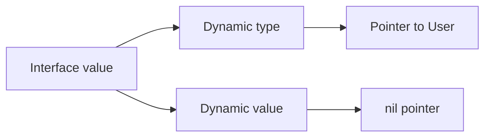

# Interfaces: behavior, representation và typed nil

**P0 · Must know**

## Concept

Interface mô tả tập method; type thỏa interface một cách implicit. Interface nhỏ ở phía consumer cho phép thay implementation mà không buộc domain phụ thuộc storage.

## Mental Model



Interface chỉ bằng nil khi cả dynamic type và value đều không có. `(type=*User, value=nil)` khác `(type=nil, value=nil)`.

## Why và How

Dùng interface ở boundary cần nhiều implementation: reader, transaction executor, clock. Method set của T gồm method receiver T; của *T gồm receiver T và *T. Compiler có thể tự lấy địa chỉ khi gọi method trên biến addressable, nhưng không tự biến T thành *T khi gán interface. Type assertion dạng `v, ok := x.(T)` tránh panic khi không biết concrete type.

## Internals và runtime behavior

Runtime hiện tại dùng metadata type và data; non-empty interface có thông tin dispatch method. Đây là mental model, không phải ABI cam kết. Dynamic dispatch có thể cản inlining; compiler có thể devirtualize khi biết type. Boxing không đồng nghĩa luôn heap allocation: escape analysis và optimization quyết định. Interface equality so sánh dynamic types rồi values; có thể panic nếu dynamic value không comparable, như slice.

## Code Example

```go
package main
import "fmt"
type User struct { Name string }
func (u *User) String() string {
    if u == nil { return "<nil-user>" }
    return u.Name
}
func main() {
    var p *User
    var x any = p
    fmt.Println(x == nil) // false
    fmt.Println(p.String()) // receiver nil co the duoc xu ly
    _, ok := x.(*User)
    fmt.Println(ok) // true, khong co nghia pointer non-nil
}
```

## Production Use Case

Constructor trả `error` phải `return nil` khi thành công. Trả biến `*MyError` nil dưới dạng error tạo interface non-nil, khiến caller hiểu là thất bại. Test double nên mô phỏng contract của consumer, không sao chép toàn bộ API của vendor.

## Failure Scenarios

Nil dependency ẩn trong interface qua constructor; panic khi so sánh interface chứa slice; abstraction quá rộng kéo cả ORM vào domain; allocation tăng ở hot path sau khi chuyển concrete value sang `any`.

## Trade-offs

| Lựa chọn | Tốt cho | Chi phí |
|---|---|---|
| Concrete type | Một implementation, API rõ | Coupling cụ thể |
| Small interface | Boundary thay thế được | Dispatch, nil semantics |
| Generic constraint | Thuật toán type-safe | Complexity của type set |

## Common Misconceptions

Interface không phải class cha; embedding không tạo inheritance. `x != nil` không chứng minh pointer bên trong khác nil. “Accept interfaces, return structs” là heuristic: trả interface hợp lý nếu cần che implementation hoặc API có nhiều concrete return types.

## When NOT to use

Không tạo interface một-method cho mọi struct chỉ để mock. Nếu caller cần toàn bộ concrete behavior và không có substitution thực tế, thêm interface làm API khó đọc.

## How I would debug this in production

Log type bằng `%T` ở boundary lỗi, tránh log PII. Viết unit test cho nil concrete pointer được trả như error. Dùng `errors.As` để xét typed error thay vì parse string. Với allocation regression, chạy benchmark và `-gcflags=-m=2` ở call site sau khi compiler inline.

## Key Takeaways

Tách method contract, dynamic value và ownership. Nilness thuộc interface value, không chỉ pointer được chứa.

## Interview Questions

### Basic / Mid — 10

1. What is an interface?
2. How is interface satisfaction declared?
3. What is a method set?
4. Does T implement pointer-receiver methods?
5. What is the dynamic type?
6. What is the dynamic value?
7. When is an interface nil?
8. What is a type assertion?
9. How does a type switch work?
10. Are all interface values comparable?

### Senior — 10

1. Why can a nil error pointer produce a non-nil error?
2. How does consumer-owned interface design reduce coupling?
3. When is returning an interface justified?
4. Does boxing always allocate?
5. When can dispatch be devirtualized?
6. Why can interface equality panic?
7. How do generics differ from behavioral interfaces?
8. Can a method handle a nil receiver?
9. How does embedding affect method promotion?
10. How would you avoid an overgrown repository interface?

### Production scenarios — 5

1. Why did a successful request return an error?
2. Why did comparing cached values panic?
3. Why did an interface refactor increase allocations?
4. Why does a mock pass while a real dependency panics?
5. Why does a value compile in a method call but fail interface assignment?

### Senior Follow-ups — 5

1. Which method set is required?
2. Which concrete type is stored?
3. Is its dynamic value nil?
4. What contract should the caller rely on?
5. How would you test that contract?

Chuỗi follow-up: trả lời lần lượt 5 câu cuối; mỗi câu cần một invariant, bằng chứng runtime hoặc trade-off cụ thể.


## See also

- [nil](nil.md)
- [errors](errors.md)
- [dependency-injection](../11-software-architecture/dependency-injection.md)

## Nguồn đối chiếu

- [Language specification](https://go.dev/ref/spec#Interface_types)
