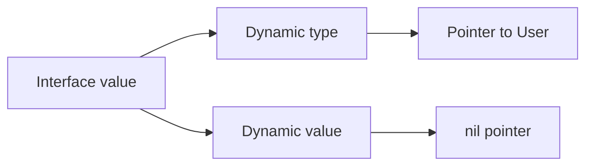

# Interfaces: behavior, representation và typed nil

## Bài toán và ví dụ đầu tiên

Một hàm copy dữ liệu chỉ cần khả năng đọc, không cần biết dữ liệu đến từ file, network hay memory. Interface cho phép mô tả đúng tập hành vi cần dùng. Một type thỏa interface nếu có đủ method tương ứng, không cần khai báo implements. Đây là implicit implementation: quan hệ được xác định từ method set.

## Đi từng bước qua một tình huống

```go
package main

import "fmt"

type Greeter interface { Greet() string }
type Person struct { Name string }
func (p Person) Greet() string { return "Hello " + p.Name }

type ServiceError struct { Message string }
func (e *ServiceError) Error() string {
    if e == nil { return "nil ServiceError" }
    return e.Message
}

func main() {
    var g Greeter = Person{Name: "An"}
    fmt.Println(g.Greet())
    var p *ServiceError
    var err error = p
    fmt.Println(p == nil, err == nil)
}
```

### Giải thích code từng bước

Person có method Greet đúng chữ ký nên g có thể chứa Person mà không cần thêm khai báo trên Person. Lời gọi g.Greet dùng implementation của giá trị đang được chứa. Phần sau tạo nil pointer p, rồi đưa p vào error interface. Kết quả là true,false: p không trỏ tới object, nhưng err vẫn mang thông tin kiểu *ServiceError.

Method Error xử lý nil receiver để ví dụ có thể gọi an toàn nếu cần; thông thường dereference field của nil receiver sẽ panic. Interface không tự bỏ dynamic type khi dynamic value là nil. Vì thế hàm trả error nên `return nil` ở nhánh thành công, thay vì trả một biến *ServiceError đang nil.

## Hiểu cơ chế từ kết quả quan sát

Mental model của interface value là cặp dynamic type và dynamic value. Interface nil không chứa cả hai; interface chứa một nil pointer có type nên không bằng nil. Mô hình này giúp suy luận typed nil trước khi xem eface/itab trong runtime. Các tên cấu trúc đó giải thích representation cụ thể, không phải điều kiện để sử dụng interface đúng.

Type assertion `v, ok := x.(T)` kiểm tra dynamic value có thể được lấy theo T hay không. Không có ok thì assertion sai gây panic; type switch chọn hành vi theo các type được hỗ trợ. Nếu dùng assertion ở mọi nơi để lấy lại concrete type, interface có thể đã được chọn quá rộng hoặc boundary chưa rõ. Consumer nên yêu cầu đúng method cần dùng.

Method set của T và *T khác nhau khi có pointer receiver. Một biến T có thể gọi pointer method nhờ compiler lấy địa chỉ trong trường hợp addressable, nhưng gán T vào interface vẫn phải thỏa method set thật. Compiler convenience tại call site không biến T thành type có tất cả method của *T.

Boxing là cách gọi việc đưa một concrete value vào biểu diễn interface; không có quy tắc mọi lần boxing đều allocate heap. Escape analysis, kích thước value, inlining và cách interface được dùng ảnh hưởng placement. Chỉ kết luận từ compiler output và benchmark của call site cần tối ưu; pointer không luôn nhanh hơn value và interface không luôn chậm tới mức đáng quan tâm.

## Khái niệm

Interface mô tả tập method; type thỏa interface một cách implicit. Interface nhỏ ở phía consumer cho phép thay implementation mà không buộc domain phụ thuộc storage.

## Mô hình làm việc



### Cách đọc diagram

Interface value tách thành dynamic type và dynamic value. Nhánh type chỉ tới *User, nhánh value chỉ tới nil pointer. Đây là một cặp có type nhưng không có object đích; vì thế interface không bằng nil. Sơ đồ mô tả ý nghĩa dữ liệu, không khẳng định layout memory cụ thể của mọi Go version hoặc một allocation bắt buộc.

Interface chỉ bằng nil khi cả dynamic type và value đều không có. `(type=*User, value=nil)` khác `(type=nil, value=nil)`.

## Vì sao cơ chế này cần thiết

Dùng interface ở boundary cần nhiều implementation: reader, transaction executor, clock. Method set của T gồm method receiver T; của *T gồm receiver T và *T. Compiler có thể tự lấy địa chỉ khi gọi method trên biến addressable, nhưng không tự biến T thành *T khi gán interface. Type assertion dạng `v, ok := x.(T)` tránh panic khi không biết concrete type.

## Cơ chế runtime

Runtime hiện tại dùng metadata type và data; non-empty interface có thông tin dispatch method. Đây là mental model, không phải ABI cam kết. Dynamic dispatch có thể cản inlining; compiler có thể devirtualize khi biết type. Boxing không đồng nghĩa luôn heap allocation: escape analysis và optimization quyết định. Interface equality so sánh dynamic types rồi values; có thể panic nếu dynamic value không comparable, như slice.

## Ví dụ code

```go
package main
import "fmt"
type User struct { Name string }
func (u *User) String() string {
    if u == nil { return "<nil-user>" }
    return u.Name
}
func main() {
    var p *User
    var x any = p
    fmt.Println(x == nil) // false
    fmt.Println(p.String()) // receiver nil co the duoc xu ly
    _, ok := x.(*User)
    fmt.Println(ok) // true, khong co nghia pointer non-nil
}
```

### Giải thích code và kết quả

P là nil pointer *User; gán vào any giữ type đó nên x==nil là false. String có nhánh kiểm tra u==nil trước dereference nên lời gọi trên p hợp lệ và trả chuỗi marker. Type assertion x.(*User) thành công vì đúng dynamic type; ok=true không chứng minh pointer bên trong khác nil. Code không cần runtime representation cụ thể để suy kết quả.

## Áp dụng vào hệ thống thật

Constructor trả `error` phải `return nil` khi thành công. Trả biến `*MyError` nil dưới dạng error tạo interface non-nil, khiến caller hiểu là thất bại. Test double nên mô phỏng contract của consumer, không sao chép toàn bộ API của vendor.

## Những đường lỗi cần hiểu

Nil dependency ẩn trong interface qua constructor; panic khi so sánh interface chứa slice; abstraction quá rộng kéo cả ORM vào domain; allocation tăng ở hot path sau khi chuyển concrete value sang `any`.

## Đánh đổi

| Lựa chọn | Tốt cho | Chi phí |
|---|---|---|
| Concrete type | Một implementation, API rõ | Coupling cụ thể |
| Small interface | Boundary thay thế được | Dispatch, nil semantics |
| Generic constraint | Thuật toán type-safe | Complexity của type set |

## Những cách hiểu dễ sai

Interface không phải class cha; embedding không tạo inheritance. `x != nil` không chứng minh pointer bên trong khác nil. “Accept interfaces, return structs” là heuristic: trả interface hợp lý nếu cần che implementation hoặc API có nhiều concrete return types.

## Khi nên chọn cách khác

Không tạo interface một-method cho mọi struct chỉ để mock. Nếu caller cần toàn bộ concrete behavior và không có substitution thực tế, thêm interface làm API khó đọc.

## Lần theo bằng chứng khi có sự cố

Log type bằng `%T` ở boundary lỗi, tránh log PII. Viết unit test cho nil concrete pointer được trả như error. Dùng `errors.As` để xét typed error thay vì parse string. Với allocation regression, chạy benchmark và `-gcflags=-m=2` ở call site sau khi compiler inline.

## Thực hành, debugging và kết luận

Production thường định nghĩa một interface nhỏ như UserReader ở package sử dụng dữ liệu, rồi inject implementation DB và fake trong test. Đừng tạo interface cho từng struct chỉ vì muốn theo một sơ đồ architecture. Khi chỉ có một concrete implementation và không có nhu cầu tách dependency, concrete type giúp code dễ theo dấu hơn.

Một lỗi phổ biến là middleware nhận err khác nil ở đường đáng ra thành công rồi log “<nil>”. Hãy xem dynamic type bằng công cụ debug hoặc formatter thích hợp, tìm constructor trả typed nil và sửa ở nguồn. So sánh text Error không giải quyết bản chất. Test constructor thành công bằng err==nil và test errors.As trên lỗi thật.

Interface cho phép nhiều implementation cùng contract nhưng không tự bảo đảm các implementation có cùng semantics: timeout, thread safety và ownership vẫn cần ghi trong API. Một mock trả ngay không tái hiện SQL pool wait hay network failure; bổ sung integration test ở các ranh giới hành vi đó.


## Đọc tiếp

- [nil](nil.md)
- [errors](errors.md)
- [dependency-injection](../11-software-architecture/dependency-injection.md)

## Nguồn đối chiếu

- [Language specification](https://go.dev/ref/spec#Interface_types)
