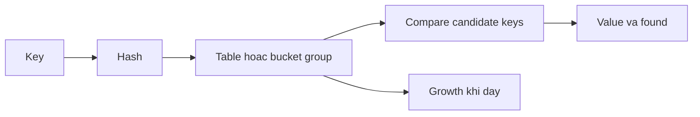

# Maps: hashing, growth và concurrent access

**P0 · Must know**

## Concept và Why

Map ánh xạ unique comparable keys tới values. Lookup trung bình gần O(1), nhưng hashing key dài, cache locality, allocation và growth vẫn ảnh hưởng latency. Map phù hợp index theo ID; thứ tự iteration không phải contract.

## Mental Model



## How và Internals

Lookup hash key, chọn vùng ứng viên, so sánh key thật để xử lý collision. Insert có thể cấp phát và reorganize storage; delete bỏ entry nhưng không cam kết trả ngay toàn bộ capacity cho OS. Dùng `v, ok := m[k]` để phân biệt missing với zero value. Keys phải comparable; interface key chứa slice có thể panic.

**Implementation detail, subject to change between Go releases.** Trước Go 1.24 thường mô tả buckets và overflow buckets. Go 1.24 đưa Swiss Tables vào implementation mặc định: groups chứa slots và control metadata giúp lọc candidate bằng phần hash, probing tìm group tiếp theo; tables và directory hỗ trợ growth. Không dùng sơ đồ bucket cũ như mô tả mọi Go release. `make(map[K]V, n)` chỉ là capacity hint, không reserve đúng n entry theo API. Không phụ thuộc layout nội bộ hay thứ tự iteration dù test nhỏ trông ổn định.

Concurrent read chỉ an toàn khi không có write đồng thời. Một write có thể đổi metadata/growth làm reader thấy trạng thái không nhất quán. Runtime có một số kiểm tra fatal concurrent access nhưng không bảo đảm phát hiện mọi race; `recover` không chữa được. Khóa phải bảo vệ cả invariant nhiều bước, không chỉ từng lookup/assignment.

## Code Example

```go
package main
import (
    "fmt"
    "sync"
)
type Counts struct {
    mu sync.RWMutex
    values map[string]int
}
func (c *Counts) Inc(key string) {
    c.mu.Lock()
    defer c.mu.Unlock()
    if c.values == nil { c.values = make(map[string]int) }
    c.values[key]++
}
func (c *Counts) Get(key string) int {
    c.mu.RLock()
    defer c.mu.RUnlock()
    return c.values[key]
}
func main() { var c Counts; c.Inc("ok"); fmt.Println(c.Get("ok")) }
```

## Production Use Case

Registry có nhiều reads và ít writes: bắt đầu bằng typed map + mutex; nếu read critical section rất ngắn, benchmark RWMutex với Mutex. Cache append-only hoặc keys độc lập có thể hợp với sync.Map. Map trả pointer vẫn đòi hỏi quy tắc bảo vệ object bên trong sau khi unlock.

## Failure Scenarios

Check-then-set ngoài lock tạo duplicate init; lock bao map nhưng không bao mutation của *Value; sorted API output trở nên ngẫu nhiên sau deploy. Cache xóa nhiều entries nhưng RSS không giảm vì capacity và allocator reuse.

## Trade-offs

| Option | Best for | Weakness |
|---|---|---|
| map + Mutex | Invariant nhiều keys | Readers tuần tự |
| map + RWMutex | Read-heavy có critical section đủ lớn | Bookkeeping, writer chờ |
| sync.Map | Write-once/read-many hoặc keys độc lập | Type assertions, invariant nhiều keys khó |
| Immutable snapshot | Cấu hình ít đổi | Copy khi publish |

## Common Misconceptions

Không thể cho rằng mỗi key thuộc một goroutine thì native map an toàn: vẫn chung metadata. `len(m)` không phải synchronization. Một read lock không bảo vệ write.

## When NOT to use

Không dùng map iteration cho canonical signature hoặc ordered response. Không chọn sync.Map chỉ vì tên có chữ sync; đo workload và giữ invariant đơn giản.

## How I would debug this in production

Thu crash stack và xác định writer cùng reader; chạy `go test -race` với workload tái hiện. Xem mutex profile nếu fix bằng global lock tạo contention. Benchmark theo cardinality/key size/read-write ratio thực tế; xem heap trước/sau churn. Sort key khi cần deterministic output.

## Key Takeaways

Spec quyết định semantics; version quyết định storage. Đồng bộ toàn bộ invariant và cả object được map tham chiếu.

## Interview Questions

### Basic / Mid — 10

1. Which map keys are valid?
2. What does a missing lookup return?
3. How does comma-ok help?
4. Can a nil map be read?
5. Can a nil map be written?
6. Is iteration ordered?
7. Is make capacity exact?
8. What does delete return?
9. Can map elements be addressed?
10. What is hashing used for?

### Senior — 10

1. Why can concurrent read and write corrupt state?
2. Why are independent keys insufficient for native map safety?
3. How do Swiss Tables differ from legacy buckets?
4. Why is average O(1) not constant latency?
5. How can a pointer value escape lock protection?
6. When is RWMutex slower than Mutex?
7. When is sync.Map appropriate?
8. How would you publish an immutable snapshot?
9. Why may deletion not reduce RSS?
10. How would you atomically check and insert?

### Production scenarios — 5

1. How would you debug a concurrent map fatal error?
2. Why did signed responses differ after restart?
3. Why did a cache grow after mass deletion?
4. Why did a global mutex hurt P99?
5. Why did an interface key panic only for one input?

### Senior Follow-ups — 5

1. Which invariant spans operations?
2. Which lock owns it?
3. Which values remain shared after unlock?
4. What workload stresses growth?
5. Which benchmark justifies the chosen map?

Chuỗi follow-up: trả lời lần lượt 5 câu cuối; mỗi câu cần một invariant, bằng chứng runtime hoặc trade-off cụ thể.


## See also

- [sync-map](../04-concurrency/sync-map.md)
- [rwmutex](../04-concurrency/rwmutex.md)
- [race-detector](../18-testing/race-detector.md)

## Nguồn đối chiếu

- [Go map implementation change](https://go.dev/blog/swisstable)
- [Go specification](https://go.dev/ref/spec#Map_types)
