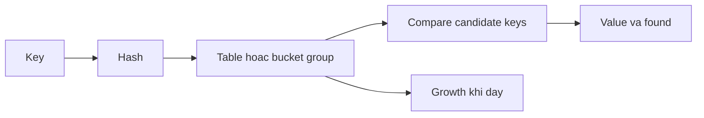

# Maps: hashing, growth và concurrent access

## Bài toán và ví dụ đầu tiên

Một endpoint cần tìm user theo ID. Duyệt slice mỗi lần làm số bước tăng theo số user; map cho phép dùng key để tìm value trực tiếp theo cơ chế băm. Trước khi nhìn bảng băm bên trong, cần hiểu kết quả lookup, zero value, thứ tự duyệt và quyền cập nhật của map trong Go.

## Đi từng bước qua một tình huống

```go
package main

import "fmt"

func main() {
    counts := map[string]int{"alice": 0}
    n, found := counts["alice"]
    fmt.Println(n, found)
    n, found = counts["bob"]
    fmt.Println(n, found)
    alias := counts
    alias["bob"] = 2
    fmt.Println(counts["bob"])
    delete(counts, "alice")
}
```

### Giải thích code từng bước

Alice tồn tại với value 0 nên lookup trả 0,true. Bob chưa tồn tại nên trả 0,false. Nếu chỉ đọc một giá trị, hai trường hợp đó trông giống nhau; dạng comma-ok giữ được ý nghĩa có key hay không. Gán counts cho alias không clone entries: cả hai value tham chiếu cùng map storage, nên cập nhật alias hiện ra qua counts. Delete một key không có là hợp lệ và không báo lỗi.

Nil map cho phép lookup, len và delete theo semantics của nó, nhưng ghi vào nil map panic. Make hoặc map literal khởi tạo map ghi được. Điều này hữu ích cho kiểu cấu hình read-only mặc định, nhưng constructor cần bảo đảm các field map được khởi tạo trước khi method muốn ghi.

## Hiểu cơ chế từ kết quả quan sát

Hash function biến key thành thông tin giúp chọn vùng ứng viên. Nhiều key có thể có hash trùng nhau, gọi là collision, nên map vẫn phải so sánh key thật để quyết định bằng nhau. Key phải comparable: Go phải định nghĩa phép so sánh == cho kiểu đó. Slice không comparable nên không dùng làm key trực tiếp; array có phần tử comparable có thể dùng.

Lookup thường có chi phí kỳ vọng gần hằng số theo số entry, nhưng hash một string dài vẫn tốn đọc dữ liệu string. Growth khi thêm nhiều entry có thể cấp phát và phân phối lại nội dung. Capacity hint trong make giúp runtime dự tính storage nhưng không phải giới hạn tối đa của map. Delete không cam kết trả ngay mọi bộ nhớ từng cấp phát về OS.

Language spec bảo đảm cách lookup, assignment, delete và các quy tắc range; nó không hứa thứ tự iteration ổn định. Muốn output có thứ tự cho test hoặc API, thu keys rồi sort. Layout bucket/group, thuật toán probe và tăng trưởng là implementation detail. Go 1.24 chuyển implementation map sang thiết kế dựa trên Swiss Tables; không nên trình bày sơ đồ bucket của release cũ như một luật của ngôn ngữ.

Nhiều reader có thể dùng map đã được publish đúng và không có writer đồng thời. Khi có mutation, các access liên quan phải có cơ chế đồng bộ thích hợp. Hai writer sửa hai key khác nhau vẫn dùng chung metadata/map storage, nên không được coi độc lập chỉ vì key khác. Một số runtime phát hiện lỗi concurrent access và dừng process, nhưng không có panic không có nghĩa code không race.

## Khái niệm và vấn đề cần giải quyết

Map ánh xạ unique comparable keys tới values. Lookup trung bình gần O(1), nhưng hashing key dài, cache locality, allocation và growth vẫn ảnh hưởng latency. Map phù hợp index theo ID; thứ tự iteration không phải contract.

## Mô hình làm việc



### Cách đọc diagram

Key đi qua hash để chọn vùng ứng viên trong table; sau đó phải so sánh key thật trước khi trả value cùng found. Nhánh growth biểu diễn insert có thể thay đổi storage khi cần thêm chỗ, không phải mỗi lookup đều growth. Tên table/bucket group là mô hình khái niệm; layout cụ thể cần đối chiếu runtime version, còn collision và comma-ok là phần giúp hiểu kết quả quan sát.

## Cơ chế bên trong

Lookup hash key, chọn vùng ứng viên, so sánh key thật để xử lý collision. Insert có thể cấp phát và reorganize storage; delete bỏ entry nhưng không cam kết trả ngay toàn bộ capacity cho OS. Dùng `v, ok := m[k]` để phân biệt missing với zero value. Keys phải comparable; interface key chứa slice có thể panic.

**Implementation detail, subject to change between Go releases.** Trước Go 1.24 thường mô tả buckets và overflow buckets. Go 1.24 đưa Swiss Tables vào implementation mặc định: groups chứa slots và control metadata giúp lọc candidate bằng phần hash, probing tìm group tiếp theo; tables và directory hỗ trợ growth. Không dùng sơ đồ bucket cũ như mô tả mọi Go release. `make(map[K]V, n)` chỉ là capacity hint, không reserve đúng n entry theo API. Không phụ thuộc layout nội bộ hay thứ tự iteration dù test nhỏ trông ổn định.

Concurrent read chỉ an toàn khi không có write đồng thời. Một write có thể đổi metadata/growth làm reader thấy trạng thái không nhất quán. Runtime có một số kiểm tra fatal concurrent access nhưng không bảo đảm phát hiện mọi race; `recover` không chữa được. Khóa phải bảo vệ cả invariant nhiều bước, không chỉ từng lookup/assignment.

## Ví dụ code

```go
package main
import (
    "fmt"
    "sync"
)
type Counts struct {
    mu sync.RWMutex
    values map[string]int
}
func (c *Counts) Inc(key string) {
    c.mu.Lock()
    defer c.mu.Unlock()
    if c.values == nil { c.values = make(map[string]int) }
    c.values[key]++
}
func (c *Counts) Get(key string) int {
    c.mu.RLock()
    defer c.mu.RUnlock()
    return c.values[key]
}
func main() { var c Counts; c.Inc("ok"); fmt.Println(c.Get("ok")) }
```

### Giải thích code và kết quả

Inc lấy exclusive lock rồi mới khởi tạo map nếu nil và tăng counter; defer nhả trên mọi đường return. Get dùng RLock và đọc nil map hợp lệ nếu chưa có Inc. Cả read lẫn write tuân cùng mutex trong Counts. Main dùng zero value, tăng ok rồi đọc 1. Pointer receivers tránh copy lock, nhưng caller cũng phải tránh sao chép Counts sau first use.

## Áp dụng vào hệ thống thật

Registry có nhiều reads và ít writes: bắt đầu bằng typed map + mutex; nếu read critical section rất ngắn, benchmark RWMutex với Mutex. Cache append-only hoặc keys độc lập có thể hợp với sync.Map. Map trả pointer vẫn đòi hỏi quy tắc bảo vệ object bên trong sau khi unlock.

## Những đường lỗi cần hiểu

Check-then-set ngoài lock tạo duplicate init; lock bao map nhưng không bao mutation của *Value; sorted API output trở nên ngẫu nhiên sau deploy. Cache xóa nhiều entries nhưng RSS không giảm vì capacity và allocator reuse.

## Đánh đổi

| Option | Best for | Weakness |
|---|---|---|
| map + Mutex | Invariant nhiều keys | Readers tuần tự |
| map + RWMutex | Read-heavy có critical section đủ lớn | Bookkeeping, writer chờ |
| sync.Map | Write-once/read-many hoặc keys độc lập | Type assertions, invariant nhiều keys khó |
| Immutable snapshot | Cấu hình ít đổi | Copy khi publish |

## Những cách hiểu dễ sai

Không thể cho rằng mỗi key thuộc một goroutine thì native map an toàn: vẫn chung metadata. `len(m)` không phải synchronization. Một read lock không bảo vệ write.

## Khi nên chọn cách khác

Không dùng map iteration cho canonical signature hoặc ordered response. Không chọn sync.Map chỉ vì tên có chữ sync; đo workload và giữ invariant đơn giản.

## Lần theo bằng chứng khi có sự cố

Thu crash stack và xác định writer cùng reader; chạy `go test -race` với workload tái hiện. Xem mutex profile nếu fix bằng global lock tạo contention. Benchmark theo cardinality/key size/read-write ratio thực tế; xem heap trước/sau churn. Sort key khi cần deterministic output.

## Thực hành, debugging và kết luận

Một cache user bắt đầu từ map cùng RWMutex hoặc Mutex, bảo vệ cả lookup lẫn update theo invariant. Nếu value là *User, lấy pointer ra khỏi lock rồi sửa User không còn được lock map bảo vệ. Có thể dùng immutable snapshot, clone value hoặc lock ở object theo nhu cầu.

Giả sử memory tăng sau burst import rồi không giảm dù đã delete entries. So sánh live heap, số entry và lịch sử peak size; map storage giữ lại không nhất thiết là key leak. Rebuild map nhỏ hơn có thể giảm footprint nhưng cần tính chi phí copy và publish an toàn. Đừng thực hiện rebuild khi chưa đo vì nó tạo allocation spike và gián đoạn nếu giữ lock quá lâu.

Test missing key và zero value riêng, kiểm tra output qua sort thay vì giả định range order, chạy race detector trên các đường cache mutation. Benchmark key length và distribution giống production: benchmark int key không đại diện lookup JSON string ID dài. Chọn native map với lock cho invariant rõ; cân nhắc sync.Map chỉ khi workload và contract của nó phù hợp.


## Đọc tiếp

- [sync-map](../04-concurrency/sync-map.md)
- [rwmutex](../04-concurrency/rwmutex.md)
- [race-detector](../18-testing/race-detector.md)

## Nguồn đối chiếu

- [Go map implementation change](https://go.dev/blog/swisstable)
- [Go specification](https://go.dev/ref/spec#Map_types)
