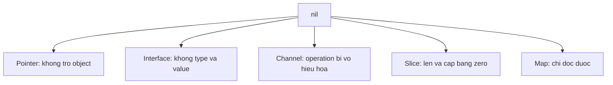

# nil: zero value theo từng loại

**P0 · Must know**

## Concept và Why

`nil` biểu thị zero value của pointer, slice, map, channel, function và interface. Nó không có một behavior thống nhất: đọc nil map được, gửi nil channel block, gọi nil function panic.

## Mental Model



## How và Internals

Slice nil vẫn có type `[]T`, còn untyped nil cần context để suy ra type. Interface chứa `(*User)(nil)` có type động *User nên không bằng nil. Typed nil có thể đi qua nhiều lớp trước khi panic ở method dereference. Không dùng reflection như bản vá phổ quát cho API contract mơ hồ; sửa constructor và quy ước optional dependency.

| Value nil | Đọc / gọi | Ghi / gửi |
|---|---|---|
| Slice | len/range hợp lệ; index panic | append hợp lệ |
| Map | lookup trả zero + false; range rỗng | assignment panic |
| Channel | receive block mãi | send block mãi; close panic |
| Pointer | so sánh hợp lệ | dereference panic |
| Function | gọi panic | có thể gán function |
| Interface | so sánh nil hợp lệ | gọi method panic |

## Code Example

```go
package main
import "fmt"
type User struct{}
func main() {
    var p *User
    var x any = p
    var m map[string]int
    var s []int
    fmt.Println(x == nil, m["missing"], len(s)) // false 0 0
    s = append(s, 1)
    fmt.Println(s)
}
```

## Runtime behavior và Production Use Case

Trong multiplexing, gán local channel variable về nil sau khi nguồn đóng để vô hiệu hóa case select. Nếu giữ channel closed trong select, receive luôn ready và có thể gây busy loop. Optional JSON fields cần phân biệt không được gửi, null và zero; pointer một mình không luôn biểu diễn đủ ba trạng thái khi decode.

## Failure Scenarios

Nil map chỉ crash khi request đầu tiên ghi. Nil jobs channel khiến worker không bao giờ chạy. Typed nil dependency vượt qua `dep != nil` rồi crash dưới tải. `range` trên nil channel không kết thúc khi service shutdown nếu thiếu case cancel.

## Trade-offs

| Biểu diễn thiếu dữ liệu | Ưu điểm | Hạn chế |
|---|---|---|
| Pointer nil | Gọn | Aliasing; chỉ hai trạng thái |
| Value + bool | Contract rõ | Caller phải xử lý bool |
| Explicit optional type | Hỗ trợ patch/null | Thêm kiểu và validation |

## Common Misconceptions

Zero value không phải mọi type đều sẵn sàng ghi. Nil slice và empty slice thường tương đương khi range nhưng có serialization khác nhau. Kiểm tra nil interface không kiểm tra mọi nil nằm bên trong.

## When NOT to use

Không dùng nil channel làm stop signal; nó vô hiệu hóa operation. Đóng channel hoặc cancel context để đánh thức waiter. Không dùng nil return mơ hồ thay cho `(value, found, error)` khi cần phân biệt not-found và failure.

## How I would debug this in production

Phân biệt panic dereference với waiter treo bằng stack trace. Xem nơi khởi tạo map/channel, bao gồm config fallback. Thêm test cho zero value và typed nil. Với select spin, xem CPU profile và xác nhận closed case được chuyển sang nil đúng ownership.

## Key Takeaways

Luôn nêu loại của nil trước khi dự đoán behavior. Dùng zero value như một phần contract có test.

## Interview Questions

### Basic / Mid — 10

1. Which types can be nil?
2. Can an integer be nil?
3. What is an untyped nil?
4. Is a nil slice appendable?
5. Can a nil map be read?
6. Can a nil map be written?
7. What happens on a nil channel send?
8. Can a nil channel be closed?
9. Is a typed nil interface nil?
10. Can a nil receiver method run?

### Senior — 10

1. Why does interface nilness need two components?
2. How would you encode absent versus explicit null?
3. How does nil disable a select case?
4. Why can a closed channel cause a busy loop?
5. Should constructors return typed nil errors?
6. How would you design optional dependencies?
7. Can reflection reliably replace a clear contract?
8. What changes when a nil slice is serialized?
9. How do zero-value APIs improve usability?
10. Why is nil not a cancellation event?

### Production scenarios — 5

1. Why did a cache panic only on the first write?
2. Why are all workers waiting on a nil channel?
3. Why did a nil guard fail before a method call?
4. Why did JSON change from an empty array to null?
5. Why did a closed input saturate CPU?

### Senior Follow-ups — 5

1. Which type owns the zero value?
2. What behavior does nil have for it?
3. Does conversion change observable nilness?
4. Which branch should handle absence?
5. What test proves the API contract?

Chuỗi follow-up: trả lời lần lượt 5 câu cuối; mỗi câu cần một invariant, bằng chứng runtime hoặc trade-off cụ thể.


## See also

- [Interfaces: behavior, representation và typed nil](interfaces.md)
- [select](../04-concurrency/select.md)
- [maps](maps.md)

## Nguồn đối chiếu

- [Go specification](https://go.dev/ref/spec#The_zero_value)
