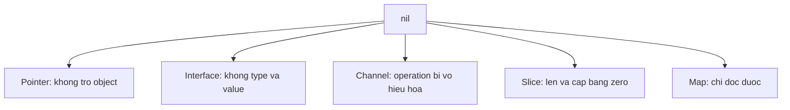

# nil: zero value theo từng loại

## Bài toán và ví dụ đầu tiên

Go có nhiều kiểu zero value dùng được ngay, nhưng nil không có một hành vi chung cho tất cả kiểu. Một nil slice append được, nil map đọc được nhưng ghi panic, nil channel send/receive chờ mãi. Học nil bằng từng operation dễ chính xác hơn coi nó giống một “object rỗng” chung.

## Đi từng bước qua một tình huống

```go
package main

import "fmt"

func main() {
    var items []int
    items = append(items, 1)
    var counts map[string]int
    n, ok := counts["missing"]
    fmt.Println(items, len(counts), n, ok)
    var value any
    var pointer *int
    value = pointer
    fmt.Println(pointer == nil, value == nil)
}
```

### Giải thích code từng bước

Nil slice có len/cap zero; append trả slice có storage cho phần tử 1. Nil map không có entry nên lookup trả zero,false mà không cần allocate. Không có phép ghi nil map trong ví dụ vì nó sẽ panic. Biến value sau khi nhận pointer nil vẫn chứa dynamic type *int, nên in true,false. Nil interface chỉ có khi chưa có dynamic type/value hoặc được gán nil đúng ngữ cảnh.

## Hiểu cơ chế từ kết quả quan sát

Untyped nil cần một type từ ngữ cảnh: `var p *int = nil` hợp lệ, còn `x := nil` không cho compiler biết kiểu nào. Pointer nil có thể được truyền vào method pointer receiver; method chỉ an toàn nếu tự xử lý trước khi dereference. Function nil khi được gọi sẽ panic. Channel nil trong select vô hiệu hóa case nên đôi khi là một công cụ state machine có chủ đích.

Nil và empty slice cùng có len zero nhưng có thể khác khi encode, so nil hoặc xét ownership. API cần định nghĩa trả null hay [] theo contract của encoder và response, đừng để khác biệt khởi tạo vô tình làm client lỗi. Không dùng nil để biểu diễn đồng thời quá nhiều ý nghĩa như chưa tải, không tồn tại, lỗi và danh sách rỗng: một kiểu result rõ thường dễ dùng hơn.

## Khái niệm và vấn đề cần giải quyết

`nil` biểu thị zero value của pointer, slice, map, channel, function và interface. Nó không có một behavior thống nhất: đọc nil map được, gửi nil channel block, gọi nil function panic.

## Mô hình làm việc



### Cách đọc diagram

Node nil tỏa ra các kiểu có zero value nil. Mỗi nhánh có operation riêng: pointer chưa trỏ object, interface không chứa type/value, nil channel vô hiệu hóa send/receive, nil slice có len/cap zero và nil map đọc được. Mũi tên là phân loại, không phải chuyển đổi tự động giữa các kiểu; phải biết type trước khi kết luận một operation block, panic hay hợp lệ.

## Cơ chế bên trong

Slice nil vẫn có type `[]T`, còn untyped nil cần context để suy ra type. Interface chứa `(*User)(nil)` có type động *User nên không bằng nil. Typed nil có thể đi qua nhiều lớp trước khi panic ở method dereference. Không dùng reflection như bản vá phổ quát cho API contract mơ hồ; sửa constructor và quy ước optional dependency.

| Value nil | Đọc / gọi | Ghi / gửi |
|---|---|---|
| Slice | len/range hợp lệ; index panic | append hợp lệ |
| Map | lookup trả zero + false; range rỗng | assignment panic |
| Channel | receive block mãi | send block mãi; close panic |
| Pointer | so sánh hợp lệ | dereference panic |
| Function | gọi panic | có thể gán function |
| Interface | so sánh nil hợp lệ | gọi method panic |

## Ví dụ code

```go
package main
import "fmt"
type User struct{}
func main() {
    var p *User
    var x any = p
    var m map[string]int
    var s []int
    fmt.Println(x == nil, m["missing"], len(s)) // false 0 0
    s = append(s, 1)
    fmt.Println(s)
}
```

### Giải thích code và kết quả

Interface x chứa type *User và nil value nên false khi so nil. Lookup nil map trả zero int, len nil slice bằng0. Append trả slice chứa1 nên gán lại s rồi in[1]. Ví dụ không ghi vào m, không dereference p và không dùng nil channel; nếu thêm các operations đó, phải áp semantics riêng thay vì suy từ nil slice.

## Từ runtime đến production

Trong multiplexing, gán local channel variable về nil sau khi nguồn đóng để vô hiệu hóa case select. Nếu giữ channel closed trong select, receive luôn ready và có thể gây busy loop. Optional JSON fields cần phân biệt không được gửi, null và zero; pointer một mình không luôn biểu diễn đủ ba trạng thái khi decode.

## Những đường lỗi cần hiểu

Nil map chỉ crash khi request đầu tiên ghi. Nil jobs channel khiến worker không bao giờ chạy. Typed nil dependency vượt qua `dep != nil` rồi crash dưới tải. `range` trên nil channel không kết thúc khi service shutdown nếu thiếu case cancel.

## Đánh đổi

| Biểu diễn thiếu dữ liệu | Ưu điểm | Hạn chế |
|---|---|---|
| Pointer nil | Gọn | Aliasing; chỉ hai trạng thái |
| Value + bool | Contract rõ | Caller phải xử lý bool |
| Explicit optional type | Hỗ trợ patch/null | Thêm kiểu và validation |

## Những cách hiểu dễ sai

Zero value không phải mọi type đều sẵn sàng ghi. Nil slice và empty slice thường tương đương khi range nhưng có serialization khác nhau. Kiểm tra nil interface không kiểm tra mọi nil nằm bên trong.

## Khi nên chọn cách khác

Không dùng nil channel làm stop signal; nó vô hiệu hóa operation. Đóng channel hoặc cancel context để đánh thức waiter. Không dùng nil return mơ hồ thay cho `(value, found, error)` khi cần phân biệt not-found và failure.

## Lần theo bằng chứng khi có sự cố

Phân biệt panic dereference với waiter treo bằng stack trace. Xem nơi khởi tạo map/channel, bao gồm config fallback. Thêm test cho zero value và typed nil. Với select spin, xem CPU profile và xác nhận closed case được chuyển sang nil đúng ownership.

## Thực hành, debugging và kết luận

Một server treo ở select có thể do tất cả channel được gán nil sau khi các nguồn đóng, trong khi vòng lặp chưa có điều kiện return. Một error khác nil nhưng payload nil có thể do typed nil đi qua interface. Hai lỗi cùng liên quan nil nhưng cần cách debug khác: xem kiểu động với interface và xem trạng thái channel/lifecycle với select.

Test zero value của mỗi type công khai: method nào được phép gọi trước constructor, method nào yêu cầu initialization. Nếu nil là input không hợp lệ, trả lỗi hoặc ghi contract rõ ở boundary; không để panic xảy ra sâu trong một dependency. Không biến mọi nil thành empty object nếu điều đó che mất một dependency bắt buộc chưa được cấu hình.


## Đọc tiếp

- [Interfaces: behavior, representation và typed nil](interfaces.md)
- [select](../04-concurrency/select.md)
- [maps](maps.md)

## Nguồn đối chiếu

- [Go specification](https://go.dev/ref/spec#The_zero_value)
