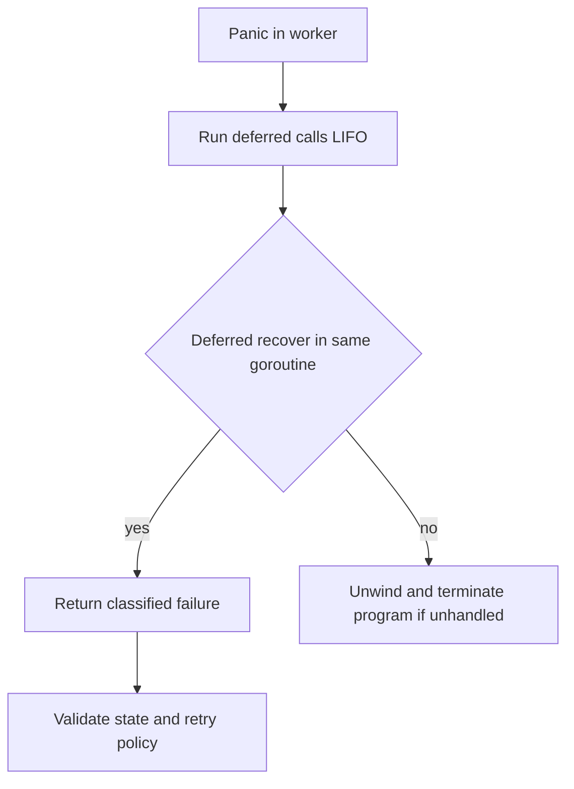

# Panic và recover

## Bài toán và ví dụ đầu tiên

Một parser gặp index out of range do bug. Panic bắt đầu quá trình tháo stack của goroutine, chạy các defer. Nó khác error trả về theo contract cho input không hợp lệ: panic thể hiện đường điều khiển bất thường cần boundary xử lý có chủ đích.

## Đi từng bước qua một tình huống

Recover phải được gọi trực tiếp từ deferred function đang xử lý panic theo quy tắc Go. Sau khi recover thành công, function chứa defer kết thúc; code không nhảy trở lại dòng vừa panic rồi tiếp tục như chưa xảy ra. Defer recover ở handler cha không bắt panic trong goroutine con.

## Hiểu cơ chế từ kết quả quan sát

Recovery boundary cần biết state nào còn hợp lệ. Nếu mutation đã thực hiện một nửa trong memory, bắt panic rồi tiếp tục phục vụ có thể để lại invariant hỏng. Trong net/http có cơ chế xử lý panic của handler theo contract của server, nhưng không thay thế recovery/logging có chủ đích của application và không bao phủ goroutine tùy ý.

## Khái niệm và mô hình làm việc

Panic unwind stack trong cùng goroutine, chạy defer. Recover chỉ có tác dụng khi gọi trực tiếp từ deferred function đang xử lý panic.

## Cơ chế và những ranh giới cần giữ

Goroutine cha không recover panic của con. Sau recover, function chứa defer return; không tiếp tục tại instruction gây panic. Fatal runtime errors không phải mọi thứ đều recover được.

## Áp dụng vào hệ thống thật

Recovery middleware log stack có giới hạn và trả 500 nếu chưa gửi response; worker recover tại task boundary chỉ khi state có thể bỏ an toàn.

## Những đường lỗi cần hiểu

Recover rồi báo success làm mất job; panic sau response headers không thể đổi status; os.Exit bỏ cleanup.

## Lần theo bằng chứng khi có sự cố

Phân loại panic stack và runtime fatal; xác nhận invariant sau recovery, ack policy và partial side effects.

## Đánh đổi và giới hạn sử dụng

Panic cho impossible invariant; expected validation/network errors dùng error. Không recover rộng để che data corruption.

## Thực hành, debugging và kết luận

Production nên log stack với dữ liệu nhạy cảm được loại bỏ và báo failure đúng cho job. Nếu response headers đã gửi thì không thể đổi thành một status hoàn toàn mới như lúc chưa ghi gì. Test panic trước/sau side effect; dùng error cho lỗi dự kiến và chỉ recover khi có chiến lược bỏ hoặc phục hồi state an toàn.


## Đọc tiếp

- [Interfaces: behavior, representation và typed nil](interfaces.md)
- [Error handling và error chains](errors.md)
- [unit-testing](../18-testing/unit-testing.md)

## Nguồn đối chiếu

- [Tài liệu chính thức](https://go.dev/ref/spec)

## Code Example — boundary có lỗi rõ ràng

```go
package main
import "fmt"
func task() (err error) {
    defer func() {
        if p := recover(); p != nil {
            err = fmt.Errorf("task panic: %v", p)
        }
    }()
    panic("broken invariant")
}
func main() { fmt.Println(task()) }
```

### Giải thích code và kết quả

Task đăng ký defer rồi panic. Trong deferred closure cùng goroutine, recover nhận payload và gán named error; task return lỗi thay vì tiếp tục tới vị trí panic. Main in lỗi đó. Mẫu minh họa chuyển panic thành failure ở boundary; production phải log stack theo policy và xác định state còn hợp lệ, không blanket-recover rồi coi operation thành công.

Chương trình in error, không tiếp tục sau dòng panic trong task. Production boundary còn cần stack capture/redaction và policy: nếu shared state có thể corrupt thì return error chưa đủ để tiếp tục process an toàn. HTTP recovery không đổi được status khi body đã commit; worker recovery không được ack success cho failed task. Không dùng recover cho expected validation/network errors.



### Cách đọc diagram

Panic bắt đầu trong worker rồi chạy các defer theo LIFO, nghĩa là đăng ký sau chạy trước. Nút quyết định kiểm tra recover đúng cơ chế trong cùng goroutine. Nhánh có recover chuyển thành failure theo policy của boundary và phải xét state/retry; nhánh không xử lý tiếp tục unwind và có thể kết thúc chương trình. Recover không tự tiếp tục lại dòng đã panic.

[Executable boundary example](../examples/core_test.go).
