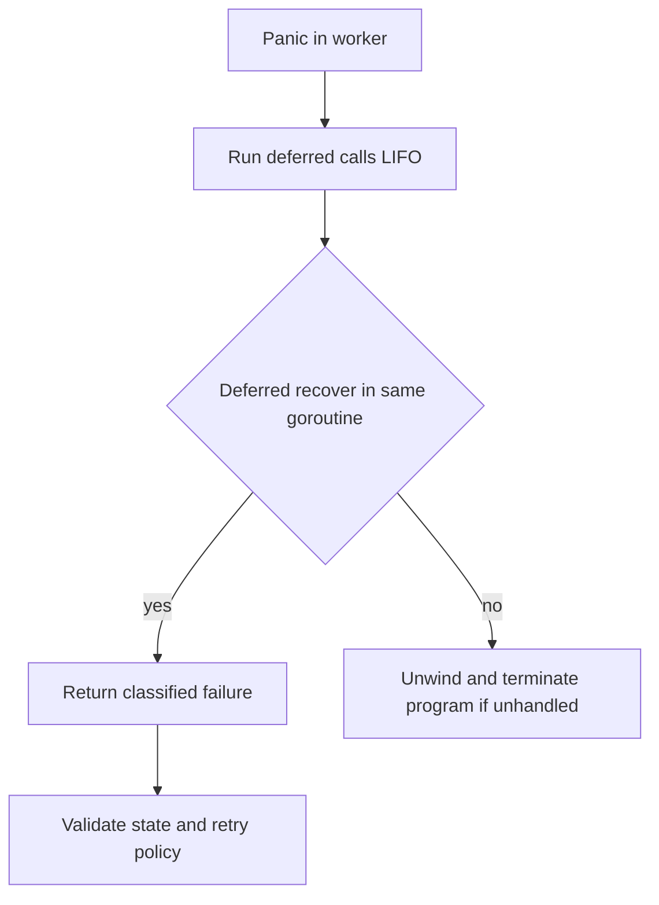

# Panic và recover

## Concept và Mental Model

Panic unwind stack trong cùng goroutine, chạy defer. Recover chỉ có tác dụng khi gọi trực tiếp từ deferred function đang xử lý panic.

## How it works

Goroutine cha không recover panic của con. Sau recover, function chứa defer return; không tiếp tục tại instruction gây panic. Fatal runtime errors không phải mọi thứ đều recover được.

## Production Use Case

Recovery middleware log stack có giới hạn và trả 500 nếu chưa gửi response; worker recover tại task boundary chỉ khi state có thể bỏ an toàn.

## Failure Scenarios

Recover rồi báo success làm mất job; panic sau response headers không thể đổi status; os.Exit bỏ cleanup.

## How I would debug this in production

Phân loại panic stack và runtime fatal; xác nhận invariant sau recovery, ack policy và partial side effects.

## Trade-offs và When NOT to use

Panic cho impossible invariant; expected validation/network errors dùng error. Không recover rộng để che data corruption.

## Interview practice

Can a parent recover a child goroutine panic? Không: cần boundary trong goroutine con và policy báo lỗi.

## Key Takeaways

Panic unwind stack trong cùng goroutine, chạy defer.


## See also

- [Interfaces: behavior, representation và typed nil](interfaces.md)
- [Error handling và error chains](errors.md)
- [unit-testing](../18-testing/unit-testing.md)

## Nguồn đối chiếu

- [Tài liệu chính thức](https://go.dev/ref/spec)

## Code Example — boundary có lỗi rõ ràng

```go
package main
import "fmt"
func task() (err error) {
    defer func() {
        if p := recover(); p != nil {
            err = fmt.Errorf("task panic: %v", p)
        }
    }()
    panic("broken invariant")
}
func main() { fmt.Println(task()) }
```

Chương trình in error, không tiếp tục sau dòng panic trong task. Production boundary còn cần stack capture/redaction và policy: nếu shared state có thể corrupt thì return error chưa đủ để tiếp tục process an toàn. HTTP recovery không đổi được status khi body đã commit; worker recovery không được ack success cho failed task. Không dùng recover cho expected validation/network errors.



[Executable boundary example](../examples/core_test.go).
