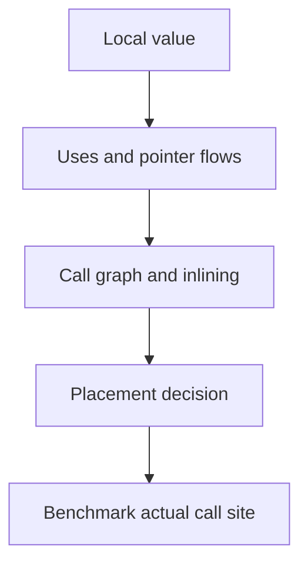

# Escape analysis: đọc quyết định của compiler

## Bài toán và ví dụ đầu tiên

Ta muốn biết vì sao một endpoint tạo nhiều heap object dù code chỉ có các biến local. Escape analysis là phân tích của compiler để quyết định liệu một giá trị có thể được lưu ở nơi có lifetime ngắn mà vẫn an toàn hay không. Nó phải theo cách pointer được dùng, không chỉ cú pháp khai báo.

Trước hết cần nhớ: stack theo trạng thái lời gọi của goroutine; heap giữ object khi lifetime hoặc placement không phù hợp stack. Nếu object còn được dùng sau khi frame tạo nó kết thúc, compiler không được để pointer trỏ vào vùng đã tái sử dụng. Đây là yêu cầu tính đúng trước khi là tối ưu tốc độ.

## Đi từng bước qua một tình huống

So sánh ba cách dùng: helper tạo struct và trả value; helper trả pointer nhưng caller chỉ đọc ngay; helper tạo pointer rồi đặt vào global cache. Trường hợp cache buộc object sống ngoài lần gọi. Trường hợp đọc ngay có thể được inline để compiler nhìn thấy toàn bộ lifetime ngắn. Vì thế cùng source helper có thể tạo allocation khác nhau ở các call site.

Chạy `go test -gcflags=-m=2` trên package nhỏ để đọc thông báo “escapes to heap”, “moved to heap” và thông tin inlining. Diagnostic có thể rất dài vì một flow pointer dẫn qua nhiều tham số. Theo chuỗi từ object được tạo tới nơi lưu lâu dài; đừng chỉ tìm từ heap rồi sửa mọi dòng có dấu &.

## Hiểu cơ chế từ kết quả quan sát

Phân tích là conservative: nếu không chứng minh đủ an toàn, compiler chọn cách giữ lifetime rộng hơn. Closure được lưu để gọi sau, goroutine dùng dữ liệu của caller, interface đi qua call opaque và object lớn đều có thể ảnh hưởng quyết định. Một closure gọi ngay có thể được tối ưu khác closure được lưu vào slice.

Interface không mặc nhiên allocate mỗi lần và pointer không mặc nhiên escape mỗi lần. Compiler có thể devirtualize một lời gọi khi biết implementation, inline hàm và thay đổi kết luận. Conversely, đổi build flags hoặc code xung quanh có thể làm tối ưu đó mất. Dữ liệu diagnostic là bằng chứng cho build được xét, không phải quy tắc ngôn ngữ bất biến.

## Khái niệm và lý do tồn tại

Escape analysis suy ra object có thể sống ở đâu mà pointer vẫn hợp lệ. Nó là conservative static analysis: một giá trị **may escape** không phải luật mọi execution đều allocate heap.



### Cách đọc diagram

Đi từ value local tới các nơi dùng và dòng pointer, sau đó xét call graph/inlining trước quyết định placement. Mũi tên cuối tới benchmark nhắc rằng diagnostic compiler cần được đối chiếu allocation thật tại caller. Đây là quy trình phân tích, không là một pipeline runtime chạy cho mỗi request; escape analysis diễn ra khi compile.

## Cơ chế bên trong

Các case cần kiểm tra: return pointer qua function boundary; closure được lưu hay chỉ gọi ngay; interface boxing qua opaque call; goroutine dùng local sau caller return; large object vượt lựa chọn stack của compiler; object bị inline hoặc dead-code elimination. Không case nào nên thay cho diagnostic trên compiler thực tế.

## Ví dụ code

Lưu chương trình vào `escape.go` trong thư mục thí nghiệm riêng dưới `golang/`:

```go
package main
var sink *int
func local() int { n := 7; return *(&n) }
func shared() *int { n := 7; return &n }
func main() { _ = local(); sink = shared() }
```

### Giải thích code và kết quả

Local tạo n và chỉ trả giá trị 7, pointer tạm không cần sống ngoài call. Shared trả pointer và main lưu vào global sink nên object phải sống đủ lâu sau call theo semantics. Inlining có thể đổi nơi cấp phát nhưng không được làm sink trỏ tới vùng không hợp lệ. Compiler output của đúng build mới cho placement thực; ví dụ không có output hay blocking.

```bash
go build -gcflags="-m" escape.go
go build -gcflags="-m=2" escape.go
go build -gcflags="-m=2 -l" escape.go
```

### Giải thích code và kết quả

Lưu chương trình trước vào escape.go trong thư mục thử dưới golang/.cache, rồi chạy các lệnh trong thư mục đó. -m in quyết định escape/inlining; -m=2 thêm chi tiết dòng chảy; -l tắt inlining để thấy một yếu tố tối ưu ảnh hưởng kết quả. Bản tắt inlining không đại diện mặc nhiên build production. So diagnostics rồi đo allocation caller, không chỉ đếm số dòng chứa heap.

`moved to heap: n` báo placement cho một instance được compiler phân tích; `can inline` và `inlining call` giải thích vì sao cùng source có kết quả khác tại caller. `leaking param` mô tả pointer flow/lifetime của parameter, không nói “memory leak” kiểu giữ tài nguyên mãi. `does not escape` không bảo đảm toàn function không có allocation khác. Đừng copy một output version cũ làm expected output cố định.

## Từ runtime đến production

Analysis chạy khi compile; runtime không chạy escape analysis cho mỗi request. Nó ảnh hưởng allocation rate và từ đó GC work. Hot JSON/path parser cần benchmark dữ liệu thực: escaping string/interface và buffer growth có thể chi phối hơn một pointer local.

## Những đường lỗi cần hiểu

Benchmark loại bỏ toàn bộ computation; global sink làm escape không giống production; thêm fmt.Println để quan sát lại tạo allocations; disable inlining rồi tối ưu cho configuration không deploy.

## Đánh đổi

| Công cụ | Trả lời | Giới hạn |
|---|---|---|
| -m=2 | Vì sao compiler chọn placement | Nhiều noise, version-dependent |
| benchmem | Allocation trên path chạy | Input/test harness có bias |
| allocs profile | Call stacks tạo churn | Sampling, không lifetime đầy đủ |

## Những cách hiểu dễ sai

Escape khác leak. Pointer return không tự đồng nghĩa heap ở final optimized caller. Interface conversion không luôn allocate. Closure capture by reference có thể được tối ưu khi lifetime hẹp.

## Khi nên chọn cách khác

Không rewrite code chỉ dựa một dòng diagnostic nếu path không hot. Không dùng unsafe để né escape khi chưa chứng minh lifetime và hiệu quả.

## Lần theo bằng chứng khi có sự cố

Chốt Go version, build flags và workload. So before/after benchmark với nhiều samples; dùng benchstat. Mở alloc_space tìm site lớn nhất, đối chiếu compiler diagnostics tại site đó. Giữ correctness/race tests sau thay đổi ownership. Kết luận bằng alloc bytes/s, GC CPU và P99 thay vì một con số allocations đơn lẻ.

## Thực hành, debugging và kết luận

Một bản tối ưu loại fmt.Sprintf trong hot loop có thể giảm allocation thật; một bản đổi mọi struct thành pointer có thể tăng heap object và GC. Xác nhận bằng benchmark -benchmem, giữ result để compiler không bỏ công việc và profile service ở workload đại diện. Với giá trị nhạy cảm về correctness, test ownership trước rồi mới benchmark.

Nếu closure giữ buffer lớn đến sau request, sửa lifetime có lợi hơn micro-optimize một allocation nhỏ. Escape analysis giúp tìm đường cấp phát; heap profile giúp xem nơi tiêu nhiều memory; goroutine profile và code review giúp tìm retention. Ba bằng chứng trả lời ba câu hỏi khác nhau và nên được nối lại trước khi kết luận.


## Đọc tiếp

- [Stack versus heap: lifetime thay vì cú pháp](stack-vs-heap.md)
- [allocations](../16-performance/allocations.md)

## Nguồn đối chiếu

- [Compiler](https://pkg.go.dev/cmd/compile)
