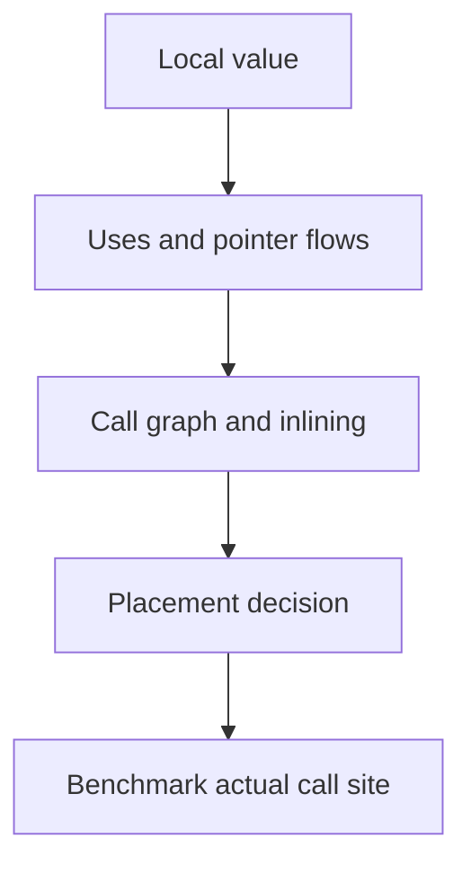

# Escape analysis: đọc quyết định của compiler

**P0 · Must know**

## Concept, Why và Mental Model

Escape analysis suy ra object có thể sống ở đâu mà pointer vẫn hợp lệ. Nó là conservative static analysis: một giá trị **may escape** không phải luật mọi execution đều allocate heap.



## How và Internals

Các case cần kiểm tra: return pointer qua function boundary; closure được lưu hay chỉ gọi ngay; interface boxing qua opaque call; goroutine dùng local sau caller return; large object vượt lựa chọn stack của compiler; object bị inline hoặc dead-code elimination. Không case nào nên thay cho diagnostic trên compiler thực tế.

## Code Example

Lưu chương trình vào `escape.go` trong thư mục thí nghiệm riêng dưới `golang/`:

```go
package main
var sink *int
func local() int { n := 7; return *(&n) }
func shared() *int { n := 7; return &n }
func main() { _ = local(); sink = shared() }
```

```bash
go build -gcflags="-m" escape.go
go build -gcflags="-m=2" escape.go
go build -gcflags="-m=2 -l" escape.go
```

`moved to heap: n` báo placement cho một instance được compiler phân tích; `can inline` và `inlining call` giải thích vì sao cùng source có kết quả khác tại caller. `leaking param` mô tả pointer flow/lifetime của parameter, không nói “memory leak” kiểu giữ tài nguyên mãi. `does not escape` không bảo đảm toàn function không có allocation khác. Đừng copy một output version cũ làm expected output cố định.

## Runtime behavior và Production Use Case

Analysis chạy khi compile; runtime không chạy escape analysis cho mỗi request. Nó ảnh hưởng allocation rate và từ đó GC work. Hot JSON/path parser cần benchmark dữ liệu thực: escaping string/interface và buffer growth có thể chi phối hơn một pointer local.

## Failure Scenarios

Benchmark loại bỏ toàn bộ computation; global sink làm escape không giống production; thêm fmt.Println để quan sát lại tạo allocations; disable inlining rồi tối ưu cho configuration không deploy.

## Trade-offs

| Công cụ | Trả lời | Giới hạn |
|---|---|---|
| -m=2 | Vì sao compiler chọn placement | Nhiều noise, version-dependent |
| benchmem | Allocation trên path chạy | Input/test harness có bias |
| allocs profile | Call stacks tạo churn | Sampling, không lifetime đầy đủ |

## Common Misconceptions

Escape khác leak. Pointer return không tự đồng nghĩa heap ở final optimized caller. Interface conversion không luôn allocate. Closure capture by reference có thể được tối ưu khi lifetime hẹp.

## When NOT to use

Không rewrite code chỉ dựa một dòng diagnostic nếu path không hot. Không dùng unsafe để né escape khi chưa chứng minh lifetime và hiệu quả.

## How I would debug this in production

Chốt Go version, build flags và workload. So before/after benchmark với nhiều samples; dùng benchstat. Mở alloc_space tìm site lớn nhất, đối chiếu compiler diagnostics tại site đó. Giữ correctness/race tests sau thay đổi ownership. Kết luận bằng alloc bytes/s, GC CPU và P99 thay vì một con số allocations đơn lẻ.

## Key Takeaways

Đọc source → compiler → measurement. Phân biệt analysis conservative và allocation thật ở optimized executable.

## Interview Questions

### Basic / Mid — 10

1. What does escape analysis decide?
2. When does it run?
3. What does moved to heap mean?
4. What does does not escape mean?
5. What does leaking param mean?
6. How does inlining affect analysis?
7. Can a returned pointer remain local after inlining?
8. Can a closure allocate?
9. Can an interface conversion allocate?
10. Why might a large value be heap allocated?

### Senior — 10

1. Why is may escape not a universal rule?
2. How do goroutines affect captured lifetimes?
3. How can a global sink distort a benchmark?
4. Why does fmt affect diagnostics?
5. How do you compare builds with different optimization flags?
6. How do compiler diagnostics differ from allocs profiles?
7. Why can a closure called immediately avoid allocation?
8. What input sizes should an allocation benchmark cover?
9. How can reducing escapes increase copying?
10. Why is unsafe a poor first optimization?

### Production scenarios — 5

1. Why did a trivial benchmark report zero work?
2. Why did logging create an allocation regression?
3. Why did upgrading Go alter diagnostics?
4. Why did lower allocs not improve P99?
5. Why did a background queue force payloads to outlive handlers?

### Senior Follow-ups — 5

1. What is the relevant call site?
2. Which values cross its lifetime?
3. What optimization is enabled?
4. What allocation remains in the executable?
5. Which production metric benefits?

Chuỗi follow-up: trả lời lần lượt 5 câu cuối; mỗi câu cần một invariant, bằng chứng runtime hoặc trade-off cụ thể.


## See also

- [Stack versus heap: lifetime thay vì cú pháp](stack-vs-heap.md)
- [allocations](../16-performance/allocations.md)

## Nguồn đối chiếu

- [Compiler](https://pkg.go.dev/cmd/compile)
