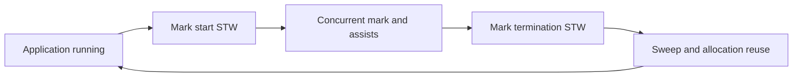

# Garbage collection: live heap, pacing và memory budget

## Bài toán và ví dụ đầu tiên

Một service liên tục tạo response object, parse JSON và xử lý buffer. Tự gọi free cho mọi object sẽ khó vì nhiều hàm hoặc goroutine có thể giữ tham chiếu. Garbage collector, viết tắt GC, tìm object heap không còn được chương trình sử dụng thông qua bất kỳ đường tham chiếu hợp lệ nào để tái sử dụng bộ nhớ.

“Không còn được sử dụng” ở đây được xét bằng reachability, không phải ý nghĩa nghiệp vụ. Một cache không bao giờ xóa entry vẫn giữ object reachable dù user đã rời hệ thống. GC không biết entry đó đã vô ích, không đóng socket theo business lifetime và không làm worker tự return.

## Đi từng bước qua một tình huống

Hãy tưởng tượng global cache trỏ tới User A, một goroutine đang chạy trỏ tới User B, còn User C không có đường tham chiếu nào từ chương trình. A và B là live objects; C có thể được thu hồi. Nếu xóa cache entry A nhưng còn một closure giữ A, A vẫn live. Nếu goroutine B kẹt channel mãi, B có thể bị giữ cùng goroutine.

Allocation rate là tốc độ tạo object/byte mới, chẳng hạn 200 MB/s. Live heap là lượng object còn reachable sau khi xác định sống/chết. Một service có thể allocate rất nhanh nhưng live heap nhỏ, tạo GC CPU pressure; service khác allocate chậm nhưng giữ cache lớn, tạo memory pressure. Hai tình huống cần cách sửa khác nhau.

## Hiểu cơ chế từ kết quả quan sát

Mark là giai đoạn tìm và đánh dấu object còn sống bằng cách đi từ roots, gồm tham chiếu trên stack, globals và state runtime. Sweep là thu hồi vùng của object không được đánh dấu để allocator tái sử dụng. Go thực hiện phần lớn công việc liên quan theo cách concurrent với application, cùng những điểm dừng phối hợp ngắn gọi là stop-the-world, viết tắt STW. STW không có nghĩa cả chu kỳ GC đều dừng ứng dụng.

Khi application tiếp tục chạy, nó có thể thay đổi pointer trong lúc collector đi qua object graph. Write barrier là code hỗ trợ ghi pointer theo quy tắc giúp collector không bỏ sót object còn sống. Đây không phải lock ứng dụng; nó không sửa data race hay bảo vệ invariant nghiệp vụ. Tri-color là mô hình giải thích: chưa đánh dấu, đã biết nhưng chưa scan, và đã scan. Học màu sau reachability giúp hiểu nó phục vụ việc không bỏ sót object nào.

Pacing là cách runtime điều tiết thời điểm và lượng GC work theo tốc độ allocation và mục tiêu heap. Nếu ứng dụng allocate nhanh, một phần công việc đánh dấu có thể được tính vào goroutine allocate, thường được gọi là mark assist. Vì thế GC có thể ảnh hưởng latency ngay cả khi pause STW không lớn.

GOGC điều chỉnh mục tiêu tăng trưởng heap giữa các chu kỳ theo mô hình của runtime. Giá trị cao hơn thường cho phép dùng thêm memory để giảm tần suất GC; giá trị thấp hơn thường đổi memory lấy CPU. GOMEMLIMIT là soft memory limit cho phần memory runtime quản lý, không phải hard cap toàn RSS. Cgo, mmap và memory ngoài runtime làm container có thể hết memory dù heap còn dưới mức người vận hành tưởng là trần.

## Khái niệm và vấn đề cần giải quyết

GC thu hồi heap objects không còn reachable để programmer không phải free thủ công. GC không đóng DB rows, socket hoặc dừng goroutine theo business lifetime. Reachable nhưng vô dụng vẫn là application memory leak.

## Mô hình làm việc

Tri-color là abstraction: white chưa đánh dấu, gray cần scan, black đã scan. Roots gồm stacks/globals và references runtime giữ. Collector tìm reachable graph trong khi application còn mutate pointers.



### Cách đọc diagram

Ứng dụng chạy rồi có điểm phối hợp STW để bắt đầu mark; phần mark và assists diễn ra cùng application theo cơ chế runtime. Mark termination có điểm phối hợp tiếp, rồi sweep/tái sử dụng vùng object chết. Vòng quay trở về application biểu diễn các chu kỳ lặp. Đây là mô hình pha để hiểu CPU/memory trade-off, không phải timeline có độ dài cố định hoặc mọi công việc sweep đều chờ nguyên chu kỳ mới bắt đầu.

## Cơ chế bên trong

**Implementation detail, subject to change between Go releases.** Mental model ổn định là tracing concurrent mark/sweep với write barrier và các STW coordination phases. Go 1.26 dùng Green Tea GC mặc định; scan scheduling/locality thay đổi không làm mất nhu cầu hiểu roots, reachability, barrier và pacing. Đừng mô tả exact work queue/color layout như API.

Write barrier ghi nhận pointer mutations cần thiết để collector không bỏ sót reachable objects khi graph đổi. Barrier không tạo user-level synchronization cho data races. Mark workers chạy concurrent; allocation-heavy goroutine có thể phải làm mark assist, do đó latency có thể tăng ngay cả khi STW pause nhỏ. Sweep trả object slots cho allocator; scavenging trả physical pages cho OS theo policy riêng nên heap live giảm không đồng nghĩa RSS giảm tức thì.

## Ví dụ code

Chạy một binary workload đã build, không dùng số demo làm production recommendation:

```bash
GODEBUG=gctrace=1 GOGC=100 ./service
GOMEMLIMIT=768MiB ./service
```

### Giải thích code và kết quả

Hai lệnh là hai lần chạy riêng một binary tên service đã build; thay path bằng binary cần đo. Lệnh đầu bật gctrace và mục tiêu GOGC100 để quan sát chu kỳ; lệnh sau đặt soft runtime memory limit768MiB minh họa. Chúng không khẳng định limit này phù hợp container bất kỳ. Ghi workload và CPU/P99 cùng heap để thấy trade-off; runtime limit không hard-cap mọi RSS hoặc hủy live objects.

`GOGC` điều chỉnh mức tăng heap mục tiêu tương đối với live heap và roots theo GC guide. Tăng GOGC thường đổi thêm memory lấy ít GC frequency. `GOMEMLIMIT` là soft limit cho memory do Go runtime quản lý, không phải hard cgroup RSS cap; còn cgo, mappings và OS overhead. Chừa headroom và đo total memory. Limit thấp hơn working set có thể gây GC thrashing; không chữa bằng cách ép giảm mãi.

## Áp dụng vào hệ thống thật

Container limit 1 GiB: đo live set, runtime overhead, traffic burst và native memory trước khi chọn limit dưới 1 GiB. Nếu allocation rate tăng sau thêm JSON conversion, giảm churn tại hot site có thể hiệu quả hơn tuning GOGC.

## Những đường lỗi cần hiểu

Cache unbounded tăng live set; tiny slice giữ huge array; goroutine stack giữ request; memory limit quá chặt gây mark assists; RSS cao do cgo dù Go heap nhỏ.

## Đánh đổi

| Cách | Lợi ích | Giá |
|---|---|---|
| Tăng GOGC | Ít GC cycles | Heap lớn hơn |
| Giảm allocations | Ít mark/allocator work | Code/ownership phức tạp hơn |
| Giới hạn cache | Live set bounded | Cache misses tăng |
| Pool | Tái dùng buffers | Retention, reset/race risk |

## Những cách hiểu dễ sai

STW ngắn không nghĩa GC CPU thấp. GC không dựa reference counting nên cycle unreachable vẫn được thu hồi. GOMEMLIMIT không bảo đảm không OOM. GOGC off không loại bỏ mọi GC behavior khi memory limit đang áp dụng.

## Khi nên chọn cách khác

Không gọi runtime.GC mỗi request. Không thêm sync.Pool trước khi đo; pool có thể mất contents qua GC và không là cache bền vững.

## Lần theo bằng chứng khi có sự cố

So live heap, allocated bytes/s, GC cycles, mark assist CPU, pause distribution và RSS. Lấy heap profile inuse_space để tìm retained objects, alloc_space để tìm churn. Theo dõi vài chu kỳ GC dưới tải ổn định; kiểm tra limits/quota, cache cardinality và goroutine trend. Canary tuning, giữ đủ memory headroom và rollback khi P99 hoặc GC CPU xấu đi.

## Thực hành, debugging và kết luận

Giả sử sau deploy RPS giữ nguyên nhưng GC CPU tăng, live heap sau collection gần như cũ. Điều tra allocation churn: JSON decode vào nhiều object tạm, chuyển string/byte hoặc format log trong hot loop. Nếu live heap tăng đều sau mỗi burst và không về baseline, tìm cache, queue, sub-slice và goroutine giữ references. Chọn đúng view alloc_space hay inuse_space của profile để tránh nhầm hai tình huống.

Không đặt GOMEMLIMIT sát container limit mà bỏ qua headroom cho stack, runtime metadata, network buffers và phần ngoài Go. Khi live set thật sự gần limit, GC có thể chạy nhiều mà không thu được đủ, khiến throughput giảm. Soft limit không biến workload quá lớn thành vừa bộ nhớ. Giảm retained set hoặc workload concurrency là quyết định ứng dụng.

Sync.Pool có thể giảm object tạm nhưng không phải cache bền: runtime có thể bỏ object trong pool theo contract. Pool buffer rất lớn sau một request bất thường có thể làm memory behavior xấu hơn; áp size policy và reset references trước reuse khi phù hợp. Đo allocation, CPU, P99 và memory cùng workload sau mỗi thay đổi, không chọn GOGC chỉ từ một benchmark rỗng.

Các thuật toán/runtime tối ưu GC có thể đổi theo Go release; mô hình reachability và trade-off CPU–memory vẫn là nền tảng. Khi đọc source hoặc release notes, ghi rõ toolchain của binary đang chạy. Một profile Go version khác có tên hàm khác không tự chứng minh ứng dụng thay đổi hành vi nghiệp vụ.


## Đọc tiếp

- [write-barrier](write-barrier.md)
- [memory-profiling](memory-profiling.md)
- [memory-profile](../16-performance/memory-profile.md)

## Nguồn đối chiếu

- [GC guide](https://go.dev/doc/gc-guide)
- [Go 1.26 runtime](https://go.dev/doc/go1.26#runtime)
