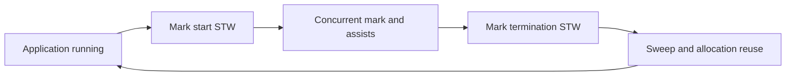

# Garbage collection: live heap, pacing và memory budget

**P0 · Must know**

## Concept và Why

GC thu hồi heap objects không còn reachable để programmer không phải free thủ công. GC không đóng DB rows, socket hoặc dừng goroutine theo business lifetime. Reachable nhưng vô dụng vẫn là application memory leak.

## Mental Model

Tri-color là abstraction: white chưa đánh dấu, gray cần scan, black đã scan. Roots gồm stacks/globals và references runtime giữ. Collector tìm reachable graph trong khi application còn mutate pointers.



## How và Internals

**Implementation detail, subject to change between Go releases.** Mental model ổn định là tracing concurrent mark/sweep với write barrier và các STW coordination phases. Go 1.26 dùng Green Tea GC mặc định; scan scheduling/locality thay đổi không làm mất nhu cầu hiểu roots, reachability, barrier và pacing. Đừng mô tả exact work queue/color layout như API.

Write barrier ghi nhận pointer mutations cần thiết để collector không bỏ sót reachable objects khi graph đổi. Barrier không tạo user-level synchronization cho data races. Mark workers chạy concurrent; allocation-heavy goroutine có thể phải làm mark assist, do đó latency có thể tăng ngay cả khi STW pause nhỏ. Sweep trả object slots cho allocator; scavenging trả physical pages cho OS theo policy riêng nên heap live giảm không đồng nghĩa RSS giảm tức thì.

## Code Example

Chạy một binary workload đã build, không dùng số demo làm production recommendation:

```bash
GODEBUG=gctrace=1 GOGC=100 ./service
GOMEMLIMIT=768MiB ./service
```

`GOGC` điều chỉnh mức tăng heap mục tiêu tương đối với live heap và roots theo GC guide. Tăng GOGC thường đổi thêm memory lấy ít GC frequency. `GOMEMLIMIT` là soft limit cho memory do Go runtime quản lý, không phải hard cgroup RSS cap; còn cgo, mappings và OS overhead. Chừa headroom và đo total memory. Limit thấp hơn working set có thể gây GC thrashing; không chữa bằng cách ép giảm mãi.

## Production Use Case

Container limit 1 GiB: đo live set, runtime overhead, traffic burst và native memory trước khi chọn limit dưới 1 GiB. Nếu allocation rate tăng sau thêm JSON conversion, giảm churn tại hot site có thể hiệu quả hơn tuning GOGC.

## Failure Scenarios

Cache unbounded tăng live set; tiny slice giữ huge array; goroutine stack giữ request; memory limit quá chặt gây mark assists; RSS cao do cgo dù Go heap nhỏ.

## Trade-offs

| Cách | Lợi ích | Giá |
|---|---|---|
| Tăng GOGC | Ít GC cycles | Heap lớn hơn |
| Giảm allocations | Ít mark/allocator work | Code/ownership phức tạp hơn |
| Giới hạn cache | Live set bounded | Cache misses tăng |
| Pool | Tái dùng buffers | Retention, reset/race risk |

## Common Misconceptions

STW ngắn không nghĩa GC CPU thấp. GC không dựa reference counting nên cycle unreachable vẫn được thu hồi. GOMEMLIMIT không bảo đảm không OOM. GOGC off không loại bỏ mọi GC behavior khi memory limit đang áp dụng.

## When NOT to use

Không gọi runtime.GC mỗi request. Không thêm sync.Pool trước khi đo; pool có thể mất contents qua GC và không là cache bền vững.

## How I would debug this in production

So live heap, allocated bytes/s, GC cycles, mark assist CPU, pause distribution và RSS. Lấy heap profile inuse_space để tìm retained objects, alloc_space để tìm churn. Theo dõi vài chu kỳ GC dưới tải ổn định; kiểm tra limits/quota, cache cardinality và goroutine trend. Canary tuning, giữ đủ memory headroom và rollback khi P99 hoặc GC CPU xấu đi.

## Key Takeaways

Tách live set, allocation rate, collection work và OS memory. Tune sau khi xác định thứ gì chi phối.

## Interview Questions

### Basic / Mid — 10

1. What is reachability?
2. What are GC roots?
3. What does marking do?
4. What does sweeping do?
5. What is the tri-color abstraction?
6. Why is a write barrier needed?
7. Is Go GC entirely stop-the-world?
8. What does GOGC influence?
9. What does GOMEMLIMIT constrain?
10. Does GC close application resources?

### Senior — 10

1. How can mark assists increase latency?
2. Why can low pauses coexist with high GC CPU?
3. How do live heap and allocation rate differ?
4. Why can a reachable object still be a leak?
5. Why is RSS different from Go-managed memory?
6. What changed with Green Tea at a high level?
7. How does scavenging differ from sweeping?
8. Why can a low memory limit cause thrashing?
9. How should cgo memory affect headroom?
10. Why is sync.Pool not a durable cache?

### Production scenarios — 5

1. Why did P99 rise while pause time stayed low?
2. Why did a service OOM below its expected heap size?
3. Why did increasing GOGC reduce CPU but raise RSS?
4. Why does a small cached slice retain megabytes?
5. Why does a forced GC not cure memory growth?

### Senior Follow-ups — 5

1. Which objects remain reachable?
2. How fast are new bytes allocated?
3. Which work does the collector perform?
4. What memory is outside its limit?
5. Which experiment changes one budget safely?

Chuỗi follow-up: trả lời lần lượt 5 câu cuối; mỗi câu cần một invariant, bằng chứng runtime hoặc trade-off cụ thể.


## See also

- [write-barrier](write-barrier.md)
- [memory-profiling](memory-profiling.md)
- [memory-profile](../16-performance/memory-profile.md)

## Nguồn đối chiếu

- [GC guide](https://go.dev/doc/gc-guide)
- [Go 1.26 runtime](https://go.dev/doc/go1.26#runtime)
