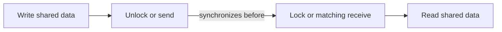

# Go memory model và happens-before

## Bài toán và ví dụ đầu tiên

Một goroutine ghi config rồi đặt ready=true; goroutine khác quay vòng đợi ready rồi đọc config. Người viết nghĩ thứ tự dòng code bảo đảm thấy dữ liệu mới. Nếu không có đồng bộ, các access concurrent có thể là data race và không có cơ sở suy luận chỉ từ đồng hồ hay thứ tự log.

Memory model định nghĩa điều kiện các goroutine được phép quan sát các write của nhau. Happens-before là quan hệ thứ tự logic được tạo từ thứ tự trong một goroutine cộng với các cạnh đồng bộ giữa goroutine. Nó giúp chứng minh một read nhìn dữ liệu đã được publish đúng.

## Đi từng bước qua một tình huống

```go
package main

import "fmt"

func main() {
    ready := make(chan struct{})
    value := 0
    go func() {
        value = 42
        close(ready)
    }()
    <-ready
    fmt.Println(value)
}
```

### Giải thích code từng bước

Worker ghi value trước close(ready). Main receive từ ready đã đóng rồi mới đọc value. Close và receive quan sát việc đóng tạo quan hệ đồng bộ phù hợp, nối write của worker tới read của main. Nếu thay channel bằng Sleep, chỉ có trì hoãn thời gian, không có cạnh đồng bộ; test chạy đúng nhiều lần vẫn không làm chương trình race-free.

Trong ví dụ không còn writer sửa value sau close. Nếu worker tiếp tục sửa value sau khi đóng ready, tín hiệu ready không tự bảo vệ các write tương lai. Publish một snapshot bất biến khác với tiếp tục chia sẻ một object mutable.

## Hiểu cơ chế từ kết quả quan sát

Unlock và Lock thành công theo quy tắc Mutex, channel send/receive theo quy tắc tương ứng và atomic operations cung cấp các quan hệ đồng bộ được mô tả bởi API. Không phải mọi thao tác “trông thread-safe” đều là một transaction cho nhiều field. Hai atomic riêng có thể cho hai read thuộc hai thời điểm khác nhau nếu invariant cần snapshot chung.

Một chương trình không có data race có thể được suy luận với mô hình sequential consistency phù hợp: kết quả như các operation xen kẽ theo một thứ tự đáp ứng thứ tự trong mỗi goroutine. Điều này không nói lịch xen kẽ duy nhất hoặc nghiệp vụ luôn đúng. Hai request check-then-act có thể vẫn tranh nhau dù từng access được khóa riêng.

## Khái niệm và vấn đề cần giải quyết

Memory model quy định khi nào một goroutine được phép quan sát write của goroutine khác. Race-free chương trình có thể suy luận theo sequential consistency; compiler/CPU không cần thực hiện unsynchronized code đúng với trực giác “dòng này chạy trước”.

## Mô hình làm việc



### Cách đọc diagram

Write dữ liệu xảy ra trước hành động publish như Unlock hoặc send trong goroutine nguồn. Cạnh synchronizes-before nối tới Lock hoặc receive phù hợp ở goroutine nhận, rồi mới tới read. Các cạnh ghép lại tạo happens-before để suy luận visibility. Phải dùng đúng cặp operation theo contract; sleep hoặc timestamp trước/sau không tạo cạnh giữa hai goroutine như trong hình.

Happens-before kết hợp thứ tự trong cùng goroutine với synchronization edges. Wall-clock order, sleep và việc log xuất hiện trước không tạo edge.

## Cơ chế bên trong

Write trước send được publish tới receiver sau matching receive. Close channel được đồng bộ trước receive trả zero vì channel đã closed. Với buffered channel capacity C, receive thứ k xảy ra trước completion send thứ k+C; không được áp toàn bộ handshake unbuffered cho mọi buffered send. Mutex unlock đồng bộ với lock tiếp theo; atomic operations có semantics theo contract sync/atomic, nhưng nhiều atomic riêng lẻ không tự bảo vệ invariant nhiều field.

Khởi chạy goroutine publish state đã chuẩn bị trước go statement cho child. Goroutine exit tự nó không là synchronization với parent; phải join bằng channel/WaitGroup phù hợp. Compiler escape analysis không thay thế memory synchronization. Garbage collector giữ object sống, không bảo vệ user data khỏi concurrent mutation.

## Ví dụ code

```go
package main
import "fmt"
func main() {
    done := make(chan struct{})
    var result string
    go func() {
        result = "ready"
        close(done)
    }()
    <-done
    fmt.Println(result)
}
```

### Giải thích code và kết quả

Worker gán result trước close(done). Main chờ receive quan sát channel đã đóng rồi đọc result, tạo happens-before qua cạnh đồng bộ. Output ready được suy từ protocol, không từ giả định worker chạy nhanh. Nếu worker sửa result sau close, các writes mới cần đồng bộ khác; done chỉ publish phần trước nó.

Read result sau receive có publication edge. Nếu thay `<-done` bằng sleep thì không có bảo đảm, dù test thường in đúng.

## Áp dụng vào hệ thống thật

Khởi tạo immutable routing config rồi publish qua atomic pointer. Sau publish không mutate object hoặc slices/maps nó tham chiếu; writer tạo snapshot mới. Với invariant balance và ledger version, mutex hoặc transaction phù hợp hơn nhiều atomic field độc lập.

## Những đường lỗi cần hiểu

Double-checked initialization đọc pointer không sync; shared bool stop flag; channel chuyển pointer nhưng sender tiếp tục mutate; hai counters atomic nhưng tổng invariant sai. Data race là unsynchronized conflicting memory accesses; race condition rộng hơn, có thể xảy ra ở DB check-then-insert dù không có Go data race.

## Đánh đổi

| Primitive | Bảo đảm hữu ích | Giới hạn |
|---|---|---|
| Mutex | Critical section nhiều field | Contention |
| Channel | Publication và communication | Lifecycle/blocking |
| Atomic | Một state transition nhỏ | Invariant phức tạp khó |

## Những cách hiểu dễ sai

“Chỉ một writer” vẫn race với reader không sync. Race detector pass không chứng minh không race: chỉ kiểm tra paths đã thực thi. Volatile-style intuition không phải contract Go.

## Khi nên chọn cách khác

Không dùng atomics để vá từng field của một cấu trúc có invariant nhiều field. Không dùng scheduler fairness hoặc sleep để chứng minh visibility.

## Lần theo bằng chứng khi có sự cố

Reproduce workload trên staging với `go test -race ./...`; report cho hai stacks access và creation site. Vẽ happens-before graph cho invariant, tìm read/write thiếu edge. Nếu không có data race nhưng vẫn duplicate business action, kiểm tra DB uniqueness, idempotency và transactional boundaries. Fix bằng ownership hoặc synchronization rồi test path tranh chấp có chủ đích.

## Thực hành, debugging và kết luận

Khi review concurrent code, đánh dấu write, hành động publish và read; tìm cạnh đồng bộ nối chúng. Nếu bằng chứng là “goroutine này thường chạy trước”, “đã sleep” hoặc “log tới trước” thì chưa đủ. Run race detector để tìm các đường đã thực thi thiếu đồng bộ, rồi sửa protocol cho mọi access liên quan.

Production snapshot config nên được tạo đầy đủ rồi publish qua lock/atomic/channel; reader không mutate nested maps. Nếu cần update nhiều field atomically, dùng cùng critical section hoặc immutable object được thay toàn bộ. Memory model giúp chọn quy tắc đúng, còn benchmark giúp quyết định chi phí của cách cài đặt.


## Đọc tiếp

- [race-condition](../04-concurrency/race-condition.md)
- [mutex](../04-concurrency/mutex.md)
- [atomic](../04-concurrency/atomic.md)

## Nguồn đối chiếu

- [Go Memory Model](https://go.dev/ref/mem)
