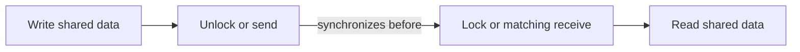

# Go memory model và happens-before

**P0 · Must know**

## Concept và Why

Memory model quy định khi nào một goroutine được phép quan sát write của goroutine khác. Race-free chương trình có thể suy luận theo sequential consistency; compiler/CPU không cần thực hiện unsynchronized code đúng với trực giác “dòng này chạy trước”.

## Mental Model



Happens-before kết hợp thứ tự trong cùng goroutine với synchronization edges. Wall-clock order, sleep và việc log xuất hiện trước không tạo edge.

## How và Internals

Write trước send được publish tới receiver sau matching receive. Close channel được đồng bộ trước receive trả zero vì channel đã closed. Với buffered channel capacity C, receive thứ k xảy ra trước completion send thứ k+C; không được áp toàn bộ handshake unbuffered cho mọi buffered send. Mutex unlock đồng bộ với lock tiếp theo; atomic operations có semantics theo contract sync/atomic, nhưng nhiều atomic riêng lẻ không tự bảo vệ invariant nhiều field.

Khởi chạy goroutine publish state đã chuẩn bị trước go statement cho child. Goroutine exit tự nó không là synchronization với parent; phải join bằng channel/WaitGroup phù hợp. Compiler escape analysis không thay thế memory synchronization. Garbage collector giữ object sống, không bảo vệ user data khỏi concurrent mutation.

## Code Example

```go
package main
import "fmt"
func main() {
    done := make(chan struct{})
    var result string
    go func() {
        result = "ready"
        close(done)
    }()
    <-done
    fmt.Println(result)
}
```

Read result sau receive có publication edge. Nếu thay `<-done` bằng sleep thì không có bảo đảm, dù test thường in đúng.

## Production Use Case

Khởi tạo immutable routing config rồi publish qua atomic pointer. Sau publish không mutate object hoặc slices/maps nó tham chiếu; writer tạo snapshot mới. Với invariant balance và ledger version, mutex hoặc transaction phù hợp hơn nhiều atomic field độc lập.

## Failure Scenarios

Double-checked initialization đọc pointer không sync; shared bool stop flag; channel chuyển pointer nhưng sender tiếp tục mutate; hai counters atomic nhưng tổng invariant sai. Data race là unsynchronized conflicting memory accesses; race condition rộng hơn, có thể xảy ra ở DB check-then-insert dù không có Go data race.

## Trade-offs

| Primitive | Bảo đảm hữu ích | Giới hạn |
|---|---|---|
| Mutex | Critical section nhiều field | Contention |
| Channel | Publication và communication | Lifecycle/blocking |
| Atomic | Một state transition nhỏ | Invariant phức tạp khó |

## Common Misconceptions

“Chỉ một writer” vẫn race với reader không sync. Race detector pass không chứng minh không race: chỉ kiểm tra paths đã thực thi. Volatile-style intuition không phải contract Go.

## When NOT to use

Không dùng atomics để vá từng field của một cấu trúc có invariant nhiều field. Không dùng scheduler fairness hoặc sleep để chứng minh visibility.

## How I would debug this in production

Reproduce workload trên staging với `go test -race ./...`; report cho hai stacks access và creation site. Vẽ happens-before graph cho invariant, tìm read/write thiếu edge. Nếu không có data race nhưng vẫn duplicate business action, kiểm tra DB uniqueness, idempotency và transactional boundaries. Fix bằng ownership hoặc synchronization rồi test path tranh chấp có chủ đích.

## Key Takeaways

Giải thích correctness bằng synchronization edge cụ thể. Timing đo được không phải proof.

## Interview Questions

### Basic / Mid — 10

1. What does the memory model specify?
2. What is happens-before?
3. What is a data race?
4. What is sequential consistency for race-free code?
5. Does sleep synchronize memory?
6. Does a channel send publish prior writes?
7. Does channel close synchronize?
8. Does a mutex unlock publish writes?
9. Does goroutine exit synchronize with its creator?
10. What does the race detector observe?

### Senior — 10

1. How do buffered channel synchronization rules differ?
2. Can a single writer race with readers?
3. Why can atomic fields violate a multi-field invariant?
4. How would you publish an immutable snapshot?
5. Why is GC unrelated to application race safety?
6. How can pointer transfer still race?
7. What does a go statement publish?
8. Why is double-checked locking tricky?
9. Can a race condition exist without a Go data race?
10. How would you prove a read sees initialization?

### Production scenarios — 5

1. Why does a stop flag occasionally fail?
2. Why did a sleep-based test become flaky?
3. Why are duplicates present despite a clean race run?
4. Why is a published config still racing?
5. Why do two atomic balances violate conservation?

### Senior Follow-ups — 5

1. Which write matters?
2. Which read observes it?
3. Which synchronization operation connects them?
4. Is there a transitive happens-before path?
5. What invariant remains outside that path?

Chuỗi follow-up: trả lời lần lượt 5 câu cuối; mỗi câu cần một invariant, bằng chứng runtime hoặc trade-off cụ thể.


## See also

- [race-condition](../04-concurrency/race-condition.md)
- [mutex](../04-concurrency/mutex.md)
- [atomic](../04-concurrency/atomic.md)

## Nguồn đối chiếu

- [Go Memory Model](https://go.dev/ref/mem)
