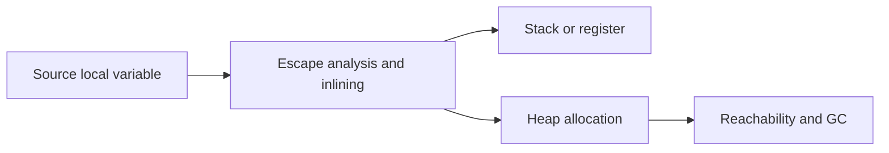

# Stack versus heap: lifetime thay vì cú pháp

## Bài toán và ví dụ đầu tiên

Một hàm tạo User rồi trả pointer tới nó. Trong C, trả địa chỉ của biến local đã hết lifetime là lỗi; trong Go, compiler và runtime phải bảo đảm pointer trả về vẫn hợp lệ. Vì vậy không thể quyết định stack hay heap chỉ từ chỗ biến được khai báo trong source.

Stack là vùng phục vụ trạng thái các lời gọi đang hoạt động của một goroutine. Heap là vùng lưu object có lifetime và cách sử dụng không phù hợp với việc thu hồi đơn giản theo call frame. Lifetime nghĩa là khoảng mà object còn phải tồn tại để chương trình dùng đúng; scope là vùng source có thể nhắc tên biến. Hai khái niệm này không đồng nhất.

## Đi từng bước qua một tình huống

```go
package main

import "fmt"

type User struct { Name string }

func NewUser(name string) *User {
    user := User{Name: name}
    return &user
}

func main() {
    u := NewUser("An")
    fmt.Println(u.Name)
}
```

### Giải thích code từng bước

User được tạo trong NewUser, địa chỉ được trả cho main rồi được đọc sau khi lời gọi kết thúc. Go giữ hành vi này hợp lệ. Một cách placement là đưa object lên heap, nhưng tại call site cụ thể compiler có thể inline NewUser và chứng minh phạm vi dùng ngắn hơn để chọn cách khác. Ví dụ chứng minh semantics lifetime, không chứng minh một allocation heap cố định.

Để đọc placement thực, compile với escape diagnostics ở đúng build và benchmark allocation của caller. Việc fmt.Println nhận interface cũng có thể ảnh hưởng escape và allocation quanh ví dụ, nên không dùng một dòng output compiler rời để quy toàn bộ chi phí cho dấu &.

## Hiểu cơ chế từ kết quả quan sát

Mỗi call frame cần giữ trạng thái để return và tiếp tục. Stack goroutine có thể tăng khi cần, nên object lớn hoặc recursion sâu vẫn tạo chi phí. Heap allocation cần allocator cấp vùng và GC xác định khi nào không còn reachable. Reachable nghĩa còn đường tham chiếu từ root như stack đang sống hoặc global tới object.

Compiler dùng escape analysis để theo dòng pointer và lifetime. new(T) tạo zero value và trả pointer theo semantics, nhưng không bắt buộc object luôn ở heap. Một value không có dấu & cũng có thể nằm trong object heap hoặc được box vào interface. Register, stack và heap placement còn chịu ảnh hưởng tối ưu compiler; ưu tiên code đúng ownership trước khi đo performance.

## Khái niệm và mô hình làm việc

Stack phục vụ call frames/lifetime của goroutine; heap lưu object cần lifetime hoặc placement không phù hợp stack. Đây là quyết định compiler/runtime, không phải lựa chọn người viết code qua `new` hay `&`.



### Cách đọc diagram

Biến local ở source được compiler phân tích escape cùng inlining. Hai nhánh thể hiện placement có thể ở register/stack hoặc heap; cú pháp local không chọn nhánh thay compiler. Object heap đi vào cơ chế reachability/GC để xác định lifetime. Sơ đồ không nói mọi pointer phải heap hay mọi value phải stack.

## Vì sao cơ chế này cần thiết

Stack allocation thường rẻ vì lifetime theo call frame; heap thêm allocator/GC work. Nhưng object lớn trên stack cũng tạo copy/stack-growth cost. Compiler cần bảo đảm pointer không trỏ tới memory đã hết lifetime và không tạo các tham chiếu không an toàn khi stack grow.

## Cơ chế runtime

Goroutine stack có thể grow và runtime điều chỉnh pointer được biết tới; không dùng uintptr để giữ object sống. Escape analysis xét graph của assignments/calls/closures. Inlining thay đổi boundary: object trong function trả pointer có thể được stack-allocated hoặc loại bỏ ở caller khi không escape. Compiler có thể chọn heap cho object lớn hoặc kích thước động; threshold phụ thuộc release.

## Ví dụ code

```go
package main
import "fmt"
type User struct { Age int }
func create() *User { u := User{Age: 42}; return &u }
func main() { fmt.Println(create().Age) }
```

### Giải thích code và kết quả

Create trả địa chỉ User local nhưng caller vẫn đọc Age42 hợp lệ vì Go giữ lifetime theo phân tích compiler. Source này không chứng minh object luôn heap: inlining và call site có thể cho placement khác. Fmt nhận giá trị Age để in, không có goroutine hay điểm blocking nghiệp vụ; dùng diagnostic/benchmark riêng nếu cần biết allocation.

Không kết luận “return pointer means heap” chỉ từ create. Xem cả escape diagnostics trước/sau inlining và đo allocations ở caller. fmt cũng có thể làm value escape do interface/formatting; tách benchmark để tránh đo nhầm.

## Áp dụng vào hệ thống thật

Request DTO tồn tại trong handler; nếu đưa pointer vào background queue thì lifetime kéo dài sau handler. Có thể phải allocate heap nhưng điều đó đúng về correctness. Chọn batching/value copy để giảm allocation khi profile cho thấy lợi ích.

## Những đường lỗi cần hiểu

Goroutine leak giữ frames và references; recursion sâu tăng stack; optimization giảm heap alloc nhưng copy struct lớn làm CPU tăng. Dùng unsafe để ép stack lifetime có thể phá memory safety.

## Đánh đổi

| Placement/design | Lợi ích | Chi phí |
|---|---|---|
| Local value | Ownership hẹp | Copy lớn |
| Shared pointer | Tránh copy, identity | Alias, GC lifetime |
| Bounded batch | Amortize allocations | Buffer retention |

## Những cách hiểu dễ sai

`new(T)` không bắt buộc heap; `var` không bắt buộc stack. Trả pointer local là hợp lệ trong Go vì compiler bảo đảm lifetime. Stack không luôn nhỏ và cố định.

## Khi nên chọn cách khác

Không đổi API sang pointer chỉ để đoán nhanh hơn. Không coi zero allocations là mục tiêu tuyệt đối khi readability hoặc throughput giảm.

## Lần theo bằng chứng khi có sự cố

Đọc `go build -gcflags='-m=2'` theo call site; benchmark B/op và allocs/op với input đại diện. Dùng heap profile xem object live, allocs profile xem churn. Xem goroutine profile nếu stack memory tăng; RSS còn gồm runtime/OS/cgo ngoài live heap.

## Thực hành, debugging và kết luận

Production có thể bị memory tăng khi goroutine chờ lâu giữ request graph trên stack. Chỉ nhìn heap allocation site chưa chỉ ra ai đang giữ object. Xem goroutine lifetime, closure và slice view dài hạn. Với CPU hot path, giảm object tạm có thể giảm GC pressure, nhưng ép mọi thứ thành pointer đôi khi làm object thoát lên heap nhiều hơn.

Thử cùng một helper với caller dùng result ngay và caller lưu result vào global, rồi xem -gcflags=-m=2 và B/op. Giữ workload giống nhau khi so trước/sau. Kết luận từ diagnostic đúng phiên bản, không học thuộc “local là stack, pointer là heap”.


## Đọc tiếp

- [escape-analysis](escape-analysis.md)
- [garbage-collector](garbage-collector.md)

## Nguồn đối chiếu

- [Compiler diagnostics](https://pkg.go.dev/cmd/compile)
- [GC guide](https://go.dev/doc/gc-guide)
