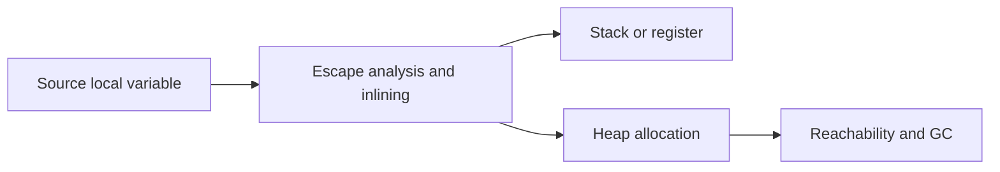

# Stack versus heap: lifetime thay vì cú pháp

**P0 · Must know**

## Concept và Mental Model

Stack phục vụ call frames/lifetime của goroutine; heap lưu object cần lifetime hoặc placement không phù hợp stack. Đây là quyết định compiler/runtime, không phải lựa chọn người viết code qua `new` hay `&`.



## Why và How

Stack allocation thường rẻ vì lifetime theo call frame; heap thêm allocator/GC work. Nhưng object lớn trên stack cũng tạo copy/stack-growth cost. Compiler cần bảo đảm pointer không trỏ tới memory đã hết lifetime và không tạo các tham chiếu không an toàn khi stack grow.

## Internals và runtime behavior

Goroutine stack có thể grow và runtime điều chỉnh pointer được biết tới; không dùng uintptr để giữ object sống. Escape analysis xét graph của assignments/calls/closures. Inlining thay đổi boundary: object trong function trả pointer có thể được stack-allocated hoặc loại bỏ ở caller khi không escape. Compiler có thể chọn heap cho object lớn hoặc kích thước động; threshold phụ thuộc release.

## Code Example

```go
package main
import "fmt"
type User struct { Age int }
func create() *User { u := User{Age: 42}; return &u }
func main() { fmt.Println(create().Age) }
```

Không kết luận “return pointer means heap” chỉ từ create. Xem cả escape diagnostics trước/sau inlining và đo allocations ở caller. fmt cũng có thể làm value escape do interface/formatting; tách benchmark để tránh đo nhầm.

## Production Use Case

Request DTO tồn tại trong handler; nếu đưa pointer vào background queue thì lifetime kéo dài sau handler. Có thể phải allocate heap nhưng điều đó đúng về correctness. Chọn batching/value copy để giảm allocation khi profile cho thấy lợi ích.

## Failure Scenarios

Goroutine leak giữ frames và references; recursion sâu tăng stack; optimization giảm heap alloc nhưng copy struct lớn làm CPU tăng. Dùng unsafe để ép stack lifetime có thể phá memory safety.

## Trade-offs

| Placement/design | Lợi ích | Chi phí |
|---|---|---|
| Local value | Ownership hẹp | Copy lớn |
| Shared pointer | Tránh copy, identity | Alias, GC lifetime |
| Bounded batch | Amortize allocations | Buffer retention |

## Common Misconceptions

`new(T)` không bắt buộc heap; `var` không bắt buộc stack. Trả pointer local là hợp lệ trong Go vì compiler bảo đảm lifetime. Stack không luôn nhỏ và cố định.

## When NOT to use

Không đổi API sang pointer chỉ để đoán nhanh hơn. Không coi zero allocations là mục tiêu tuyệt đối khi readability hoặc throughput giảm.

## How I would debug this in production

Đọc `go build -gcflags='-m=2'` theo call site; benchmark B/op và allocs/op với input đại diện. Dùng heap profile xem object live, allocs profile xem churn. Xem goroutine profile nếu stack memory tăng; RSS còn gồm runtime/OS/cgo ngoài live heap.

## Key Takeaways

Lý do object sống bao lâu quan trọng hơn vị trí khai báo. Xác minh placement bằng compiler và benchmark.

## Interview Questions

### Basic / Mid — 10

1. What belongs to a goroutine stack?
2. What is heap lifetime based on?
3. Is returning a local pointer legal?
4. Does new force heap allocation?
5. Does var guarantee stack allocation?
6. What is escape analysis?
7. How can a stack grow?
8. What is a GC root?
9. What does allocs per operation measure?
10. Is RSS equal to live heap?

### Senior — 10

1. How can inlining remove an apparent escape?
2. Why might a large object use the heap?
3. How can an interface affect placement?
4. How does a closure extend lifetime?
5. Why are raw uintptr values dangerous for liveness?
6. How can value copying hurt CPU?
7. Can stack memory shrink?
8. How would you compare pointer and value APIs?
9. Why is zero allocation not always optimal?
10. How do goroutines retain references in frames?

### Production scenarios — 5

1. Why did returning a pointer show zero allocations?
2. Why did a stack-heavy service consume more memory?
3. Why did a pointer refactor increase GC?
4. Why is RSS high after live heap drops?
5. Why did a benchmark change with inlining disabled?

### Senior Follow-ups — 5

1. How long is the object needed?
2. Which references outlive the frame?
3. Can the compiler inline the boundary?
4. What do diagnostics say?
5. What does the measured allocation rate confirm?

Chuỗi follow-up: trả lời lần lượt 5 câu cuối; mỗi câu cần một invariant, bằng chứng runtime hoặc trade-off cụ thể.


## See also

- [escape-analysis](escape-analysis.md)
- [garbage-collector](garbage-collector.md)

## Nguồn đối chiếu

- [Compiler diagnostics](https://pkg.go.dev/cmd/compile)
- [GC guide](https://go.dev/doc/gc-guide)
