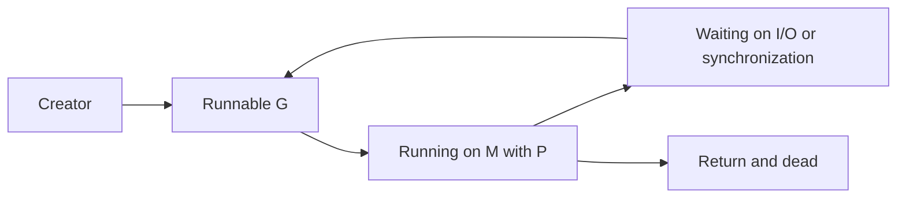

# Goroutine: lifetime, stack và ownership

**P0 · Must know**

## Concept và Why

Goroutine là execution context do Go runtime quản lý, chạy function đồng thời với caller. `go f()` không chứng minh f đã bắt đầu, hoàn tất hoặc thành công khi caller đi tiếp. Goroutine giúp viết blocking-style code trong hệ thống có nhiều I/O waits.

## Mental Model



## How và Internals

G có stack riêng và scheduler metadata. Stack ban đầu nhỏ; các runtime Go phổ biến bắt đầu khoảng vài KiB, thường nhắc 2 KiB, nhưng kích thước thực tế/adaptive starting size là implementation detail. Stack grow bằng cơ chế runtime khi cần và có thể shrink; không phải buffer 2 KiB cố định mãi. Các frame/locals giữ object reachable, nên goroutine treo giữ thêm memory ngoài stack.

G chạy trên M đang giữ P; `GOMAXPROCS` giới hạn P chạy Go code cùng lúc. G không cố định trên một M. Blocking syscall có thể giữ M trong kernel nhưng P được release/retake; network FD phù hợp dùng netpoller park G và M/P chạy work khác. Preemption giúp G CPU-heavy nhường execution; work stealing phân phối runnable work giữa P. Xem scheduler để tách các đường này.

## Code Example

Function hoàn chỉnh dùng trong package có import context. Caller sở hữu ctx và nhận result/error:

```go
func Receive(ctx context.Context, input <-chan int) (int, error) {
    select {
    case <-ctx.Done():
        return 0, ctx.Err()
    case n, ok := <-input:
        if !ok { return 0, io.EOF }
        return n, nil
    }
}
```

Snippet cần `context` và `io`; bản lab có module/test ở [examples](../examples/README.md). Nếu hai case ready, cancel không có priority tuyệt đối. Không gọi goroutine chỉ để bọc operation không hỗ trợ cancel rồi bỏ waiter: operation thật vẫn còn sống.

## Production Use Case

Mỗi worker phải có owner, stop signal và join point. Server nhận request có request context; background consumer cần service context riêng, lifecycle dài hơn request. Limit worker count dựa vào CPU hoặc downstream capacity, rồi bound queue và quy định overload.

## Failure Scenarios

Sender không có receiver; consumer đợi channel không bao giờ đóng; background loop không nghe cancel; HTTP call không deadline; goroutine con còn chạy sau test. Khi main return, process kết thúc mà không đợi tất cả G.

## Trade-offs

| Cách | Phù hợp | Chi phí |
|---|---|---|
| Synchronous call | Luồng tuyến tính | Chờ completion |
| Goroutine mỗi task | Tải nhỏ đã có bound | Dễ bỏ sót ownership |
| Worker pool | Workload liên tục | Queue và shutdown protocol |

## Common Misconceptions

Không có API an toàn để kill tùy ý một goroutine. GC không dọn goroutine đang blocked chỉ vì caller mất reference. Concurrency không bảo đảm parallelism hay thứ tự chạy.

## When NOT to use

Không spawn không giới hạn theo input không tin cậy. Không dùng sleep làm join hoặc synchronization; duration không thiết lập happens-before.

## How I would debug this in production

Xem trend `runtime.NumGoroutine`, rồi profile goroutine và group theo blocking stack. Phân biệt runnable, chan send/receive, netpoll, DB wait. Đối chiếu lifetime request với cancel/timeout và queue length. Sau fix, test repeated cancellation và chờ done channel có timeout; số G phải về steady state sau tải giảm, không nhất thiết bằng zero.

## Key Takeaways

Goroutine rẻ hơn dedicated OS thread cho nhiều workload, nhưng mỗi G đều có tài nguyên và lifetime cần owner.

## Interview Questions

### Basic / Mid — 10

1. What does a go statement start?
2. Does the caller wait automatically?
3. What state does a goroutine own?
4. Who schedules goroutines?
5. How does its stack grow?
6. Is it bound to one OS thread?
7. What happens when main returns?
8. How does a channel wait affect G?
9. What is a join point?
10. Can a goroutine be forcibly killed safely?

### Senior — 10

1. Why is initial stack size not total goroutine cost?
2. How can blocked stacks retain heap objects?
3. How does a syscall affect M and P?
4. How does netpoll release execution capacity?
5. What does preemption guarantee and not guarantee?
6. How does work stealing help runnable G?
7. How should a parent propagate cancellation?
8. Why does wrapping blocking work in a goroutine not cancel it?
9. How do you choose a worker limit?
10. Why does time.Sleep not synchronize memory?

### Production scenarios — 5

1. How would you debug a goroutine count that grows each minute?
2. Why did shutdown leave workers running?
3. Why does low CPU coexist with high goroutine count?
4. Why did tiny requests exhaust memory?
5. Why does a test pass with sleep but fail in CI?

### Senior Follow-ups — 5

1. Who creates the goroutine?
2. Who owns its lifetime?
3. Which operations can block?
4. Which event unblocks each operation?
5. Who waits for final completion?

Chuỗi follow-up: trả lời lần lượt 5 câu cuối; mỗi câu cần một invariant, bằng chứng runtime hoặc trade-off cụ thể.


## See also

- [Go scheduler: G, M, P và các đường blocking](scheduler-gmp.md)
- [goroutine-leak](../04-concurrency/goroutine-leak.md)
- [worker-pool](../04-concurrency/worker-pool.md)

## Nguồn đối chiếu

- [Runtime source](https://github.com/golang/go/blob/go1.26.4/src/runtime/runtime2.go)
