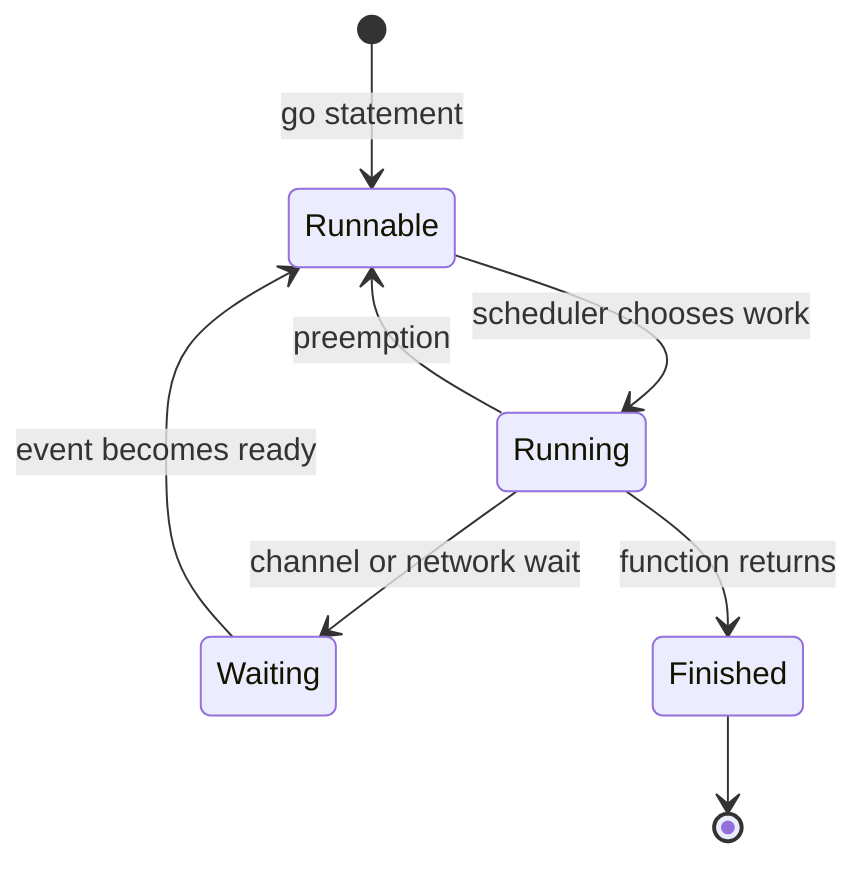

# Goroutine: chạy công việc đồng thời và quản lý vòng đời của nó

## Bài toán: một request không nên chặn mọi request khác

Một server nhận hai request. Request A chờ database 200 ms; request B chỉ đọc dữ liệu đã có trong bộ nhớ. Nếu chương trình thực hiện mọi thứ tuần tự trong một luồng điều khiển, B phải đợi cả thời gian A chờ mạng. Ta muốn các công việc có thể tiến triển độc lập: lúc A chưa làm gì được, B có thể sử dụng CPU.

Concurrency là khả năng tổ chức nhiều công việc có tiến trình chồng lấp về thời gian. Parallelism là thực sự chạy nhiều công việc cùng lúc trên các tài nguyên xử lý khác nhau. Máy một core vẫn có concurrency bằng cách xen kẽ công việc, nhưng không thể thực thi hai luồng CPU cùng thời điểm trên cùng một logical CPU. Phân biệt này giúp hiểu vì sao thêm goroutine không luôn làm chương trình nhanh hơn.

## Goroutine là gì trước khi tìm hiểu runtime

Goroutine là một luồng thực thi do Go runtime quản lý. Nó có vị trí đang chạy, stack chứa trạng thái lời gọi và vòng đời riêng. Dùng từ khóa `go` trước một lời gọi hàm để yêu cầu chạy lời gọi đó trong goroutine mới. Hàm gọi tiếp tục mà không chờ hàm mới hoàn tất.

```go
package main

import "fmt"

func main() {
    result := make(chan int)
    go func() {
        result <- 6 * 7
    }()
    answer := <-result
    fmt.Println(answer)
}
```

### Giải thích code từng bước

Main tạo channel chưa có buffer. Câu lệnh go tạo công việc tính rồi gửi 42; nó không cam kết worker chạy ngay trước dòng tiếp theo của main. Main chờ receive tại `<-result`. Nếu main tới trước, main chờ worker. Nếu worker tới trước, send của worker chờ main. Khi hai bên gặp nhau, dữ liệu được chuyển và main có thể in 42.

Channel làm rõ điểm đồng bộ, tức điểm một bên phải chờ sự kiện của bên kia. Bỏ receive và để main return ngay sẽ không bảo đảm worker có cơ hội chạy: chương trình kết thúc khi main kết thúc, không đợi mọi goroutine tự động. Thêm Sleep chỉ là đoán thời gian; một tín hiệu hoàn tất mới là giao thức đúng.

Send hoàn tất cho biết giá trị đã được nhận trong ví dụ unbuffered này, không có nghĩa mọi code sau send ở worker đã hoàn tất. Nếu caller cần chờ cleanup, dùng thêm done channel được đóng ở cuối worker hoặc WaitGroup. Không đánh đồng “có kết quả đầu tiên” với “toàn bộ vòng đời đã kết thúc”.

## Vì sao không tạo một OS thread cho mỗi request

OS thread là đơn vị mà hệ điều hành lập lịch. Nó có tài nguyên kernel và stack liên quan; số lượng lớn thread gây chi phí quản lý. Go runtime ánh xạ nhiều goroutine lên một tập OS thread. Khi goroutine chờ một channel hoặc network I/O được runtime hỗ trợ, runtime thường có thể ngừng chạy goroutine đó và dùng thread để chạy goroutine khác.

Do đó 100000 goroutine không đồng nghĩa 100000 OS thread. Nhưng cũng không đồng nghĩa miễn phí: mỗi goroutine giữ stack, metadata và có thể giữ request body, kết nối hoặc object mà stack tham chiếu. Chi phí thực tế thường nằm nhiều ở dữ liệu và dependency của công việc hơn ở con số stack ban đầu.

## Stack và lifetime của dữ liệu

Stack lưu trạng thái các lời gọi đang hoạt động: biến cục bộ phù hợp, return address và thông tin runtime cần để tiếp tục. Go có stack có thể tăng khi lời gọi cần thêm chỗ; không nên viết code dựa trên một kích thước stack khởi đầu cố định. Con trỏ ra khỏi một hàm có thể trỏ tới object được compiler đặt trên heap để giữ đúng lifetime.

Closure trong goroutine có thể giữ dữ liệu của caller sống lâu. Nếu handler có một buffer lớn và closure còn tham chiếu buffer, GC chưa được phép thu hồi nó. Goroutine leak vì thế cũng có thể là memory leak về mặt vận hành: dữ liệu vẫn reachable — còn đường tham chiếu tới — dù ứng dụng không còn cần công việc đó.

## Các trạng thái quan trọng

Runnable nghĩa là có thể chạy nhưng đang đợi được cấp CPU. Running nghĩa là đang thực thi. Waiting nghĩa là chưa thể tiến triển vì chờ điều kiện như channel, timer hoặc network. Park là hành động runtime đưa goroutine vào trạng thái chờ. Chúng là mô hình đủ dùng để đọc trace; trạng thái nội bộ cụ thể còn có chi tiết khác.



### Cách đọc diagram

Bắt đầu từ go statement: goroutine mới có thể chạy nhưng chưa chắc đang chạy. Scheduler đưa nó từ Runnable sang Running khi có tài nguyên. Nếu nó chưa nhận được dữ liệu thì đi sang Waiting. Sự kiện dữ liệu đến chỉ đưa nó về Runnable; nó vẫn có thể chờ thêm CPU. Mũi tên preemption là việc runtime tạm ngừng một goroutine đang chạy để chia cơ hội cho công việc khác. Chỉ khi hàm return, vòng đời ứng dụng của goroutine đó mới kết thúc.

## Scheduler, blocking và giới hạn thực tế

Scheduler là bộ phận runtime chọn goroutine nào chạy trên thread nào. Mô hình G–M–P gọi goroutine là G, OS thread là M và tài nguyên runtime cho phép thread chạy Go code là P. Số P chịu ảnh hưởng của GOMAXPROCS. P không phải một core vật lý được gắn cố định, và GOMAXPROCS không phải trần số goroutine.

Channel wait thường park G mà không giữ M chỉ để chờ nó. Network I/O dùng cơ chế netpoller để nối sự kiện từ OS với goroutine cần đánh thức. Một blocking syscall hoặc cgo call có thể giữ OS thread; runtime có cơ chế cho thread khác tiếp tục dùng P. Vì vậy phải xem loại blocking trước khi kết luận “goroutine không bao giờ chặn thread”.

## Production: fan-out có giới hạn

Endpoint tổng hợp 50 sản phẩm gọi pricing cho từng sản phẩm. Chạy tuần tự có thể chậm; tạo 50 goroutine có thể giảm latency ở tải nhỏ. Nhưng khi có 1000 request cùng lúc, downstream có thể phải chịu 50000 lời gọi. Những lời gọi chậm giữ nhiều goroutine và connection hơn, tạo một vòng khuếch đại quá tải.

Giải pháp là chọn trần công việc đang chạy theo capacity dependency, giới hạn hàng chờ và truyền deadline. Worker pool là một tập worker cố định lấy job từ queue; semaphore là bộ đếm slot cho phép vào vùng công việc giới hạn. Chúng không làm downstream nhanh hơn, mà giữ số việc đang dùng tài nguyên ở mức có kiểm soát.

## Failure: leak, race và panic

Goroutine leak xảy ra khi goroutine không còn công việc hữu ích nhưng không có đường kết thúc, chẳng hạn gửi kết quả vào channel mà caller đã bỏ đi. Buffer một phần tử có thể giải quyết một giao thức một kết quả cụ thể, nhưng không sửa được mọi producer vô hạn. Mỗi điểm chờ cần một người có thể làm nó tiến triển hoặc một đường cancellation.

Data race xảy ra khi các goroutine truy cập cùng dữ liệu, có ít nhất một ghi và không có đồng bộ phù hợp. Từ khóa go không copy sâu slice, map hay pointer. Dùng mutex, channel ownership hoặc atomic theo invariant của dữ liệu. Panic không được recover trong chính goroutine theo đúng cơ chế sẽ làm process thất bại; recover đặt ở goroutine cha không bắt được panic của goroutine con.

## Debugging theo triệu chứng

Nếu goroutine count tăng nhưng CPU thấp, lấy goroutine profile để nhóm stack đang chờ cùng một vị trí. Một nhóm lớn ở SQL pool có ý nghĩa khác nhóm lớn ở send result. Nếu CPU cao và nhiều G runnable, lấy CPU profile rồi execution trace để phân biệt code tính toán thật, busy loop và thời gian chờ scheduler. Đo cả tốc độ hoàn tất công việc: nhiều goroutine đang hoạt động có thể là workload hợp lệ, còn tăng không giảm sau khi tải hết mới đáng nghi.

Trong test lifecycle, điều phối worker bằng channel báo bắt đầu; đóng hoặc cancel ở thời điểm đã biết rồi đợi tín hiệu hoàn tất. Race detector kiểm tra những interleaving thực sự chạy qua test, nên không có báo cáo race chưa phải chứng minh toàn chương trình đúng. Test cần ép các đường lỗi và caller bỏ cuộc.

## Trade-off và tổng kết

Dùng goroutine khi có công việc thực sự độc lập hoặc cần chờ đồng thời. Với vài phép cộng rất ngắn, chi phí tạo và điều phối có thể lớn hơn phần được lợi. Mọi goroutine phải có owner, điều kiện dừng và cách xác nhận hoàn tất nếu owner phụ thuộc cleanup của nó. Khả năng tạo goroutine dễ dàng chỉ hữu ích khi vòng đời và giới hạn tài nguyên cũng được thiết kế rõ.

## Đọc tiếp

- [Go scheduler: G, M, P và các đường blocking](scheduler-gmp.md)
- [goroutine-leak](../04-concurrency/goroutine-leak.md)
- [worker-pool](../04-concurrency/worker-pool.md)

## Nguồn đối chiếu

- [Runtime source](https://github.com/golang/go/blob/go1.26.4/src/runtime/runtime2.go)
