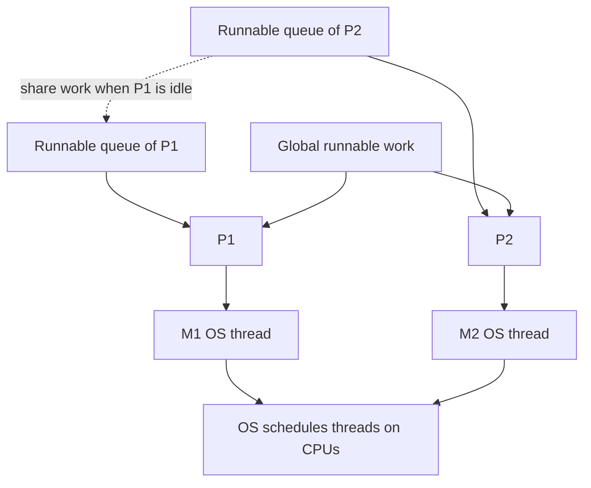
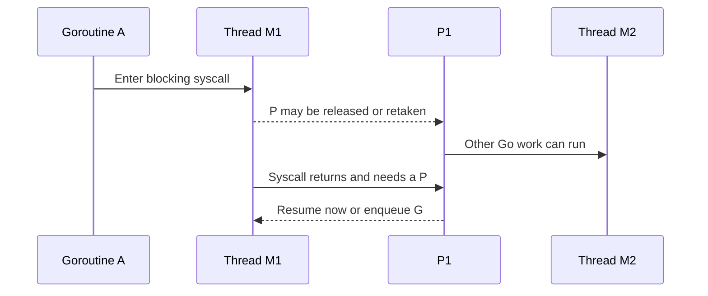

# Go scheduler: vì sao 100000 goroutine có thể chia sẻ 8 core

## Bài toán trước các chữ G, M, P

Một server có 8 logical CPU và 100000 connection. Phần lớn connection đang chờ dữ liệu; chỉ một số ít request cần tính toán. Nếu mỗi connection buộc giữ một OS thread để chờ, hệ điều hành phải quản lý rất nhiều thread dù CPU không có việc hữu ích tương ứng. Go muốn giữ code tuần tự dễ đọc cho mỗi request nhưng vẫn sử dụng hiệu quả tài nguyên thực thi.

Scheduler của Go chọn goroutine có thể tiến triển để chạy trên thread. OS tiếp tục quyết định khi nào thread đó được chạy trên CPU thật. Vì vậy có hai tầng lập lịch: runtime biết các goroutine và điểm chờ của Go; hệ điều hành biết thread, core và giới hạn tài nguyên của process hoặc container.

## Ví dụ đơn giản để đọc trạng thái

Giả sử có ba goroutine: A tính nén dữ liệu, B chờ socket và C đã có dữ liệu sẵn để parse. Với một P, A hoặc C có thể chạy Go code ở một thời điểm; B chưa cần CPU vì dữ liệu chưa đến. Khi A nhường hoặc bị preempt, C có cơ hội chạy. Nếu socket của B ready, B được đưa vào nhóm runnable rồi đợi lượt.

Runnable nghĩa là sẵn sàng làm việc nhưng chưa được chạy. Running nghĩa là đang thực thi. Waiting nghĩa là đang chờ điều kiện mà cấp CPU thêm cũng chưa giúp tiến triển. Độ trễ từ lúc B runnable đến lúc B running là scheduler latency; nó khác với thời gian B chờ network trước đó.

## G, M và lý do cần P

G biểu diễn goroutine: runtime cần biết stack, vị trí tiếp tục và trạng thái của công việc. M biểu diễn OS thread: đây là tài nguyên thực thi do hệ điều hành quản lý. P là tài nguyên runtime mà một M phải có để chạy Go code thông thường. P giữ các cấu trúc cục bộ, gồm hàng đợi runnable work và tài nguyên phục vụ runtime, để không phải tranh chấp một cấu trúc toàn cục cho mọi thao tác.

Nếu chỉ có một queue chung cho tất cả thread, mỗi lần lấy công việc đều có thể tranh cùng lock hoặc cache line. Nếu chỉ gắn mọi queue với M, khi M bị giữ trong syscall, việc chuyển tài nguyên phục vụ Go work sẽ khó tổ chức. Tách P khỏi M giúp runtime chuyển quyền chạy và tài nguyên cục bộ sang thread có thể tiếp tục làm việc.

GOMAXPROCS giới hạn số P và do đó số thread thực thi Go code đồng thời theo cơ chế này. Nó không giới hạn tổng số M: một số M có thể đang trong syscall, cgo hoặc trạng thái khác. P cũng không được gắn vĩnh viễn với một physical core. Mô hình này là chi tiết implementation, không phải một cấu trúc mà language specification yêu cầu mọi Go implementation phải có.



### Cách đọc diagram

Hai queue phía trên chứa công việc có thể chạy. P1 và P2 cấp tài nguyên để M1 và M2 thực thi Go code; mũi tên xuống CPU nhắc rằng OS vẫn lập lịch các thread. Queue global cho phép chia sẻ công việc ngoài một P. Mũi tên nét đứt mô tả work stealing: P thiếu việc có thể lấy runnable work từ P khác. Nó không có nghĩa lấy một goroutine đang chạy ra khỏi giữa critical section.

## Từ câu lệnh go tới một lượt chạy

Khi tạo goroutine, runtime chuẩn bị trạng thái và đưa nó vào nơi có thể được scheduler chọn, thường liên quan queue cục bộ hoặc vị trí ưu tiên của P hiện tại. Khi local queue không đủ chỗ, công việc có thể được chia sẻ qua global queue. Đừng dựa vào kích thước queue, thứ tự quét hoặc việc goroutine mới luôn chạy ngay; các chi tiết đó có thể đổi theo release.

Scheduler không chỉ lấy local work mãi. Nó còn xem công việc global, sự kiện timer/network và tìm việc ở P khác để tránh để CPU rảnh khi vẫn có việc runnable. Work stealing giảm mất cân bằng khi một P tạo nhiều job hơn P khác. Chuyển một nhóm job có thể giảm số lần đồng bộ so với lấy từng job, nhưng chi tiết batch không phải API để ứng dụng tune.

## Network wait và blocking syscall khác nhau

Với socket do runtime quản lý, read có thể thử trên descriptor nonblocking. Nếu chưa có dữ liệu, runtime đăng ký/chờ thông báo phù hợp và park G. Park nghĩa là ngừng cấp CPU cho G đó cho đến khi có sự kiện; M và P có thể chạy G khác. Netpoller là cầu nối giữa sự kiện I/O từ OS và runnable goroutine. Readiness chỉ nói operation có thể tiến thêm, không hứa đã có toàn bộ message ứng dụng.

Với blocking syscall hoặc một số cgo call, M có thể bị giữ ở bên ngoài Go. P có thể được tách hoặc được runtime lấy lại để M khác chạy Go work. Khi syscall return, M phải có P phù hợp trước khi tiếp tục Go code; nếu chưa có, G có thể phải vào queue. Không phải syscall nào cũng lập tức tạo thread mới: runtime có thể dùng thread nhàn rỗi và có nhiều đường xử lý.



### Cách đọc diagram

Đọc từ trên xuống. A đang chạy trên M1 rồi vào syscall giữ thread. Dòng “may” thể hiện có nhiều đường runtime, không khẳng định chuyển P ngay với mọi syscall. Khi P1 sang M2, công việc Go khác tiếp tục dù M1 vẫn chờ. Lúc M1 quay lại, có thể phải đợi P. Vì vậy M count có thể lớn hơn P count mà GOMAXPROCS vẫn được tuân thủ.

## Preemption và sysmon

Preemption là việc tạm lấy lượt chạy của một goroutine để công việc khác có cơ hội. Go dùng các điểm có thể dừng an toàn và cơ chế asynchronous preemption trên nền tảng hỗ trợ. Nhờ đó vòng CPU dài không nhất thiết độc chiếm lượt chạy cho tới lúc tự gọi hàm blocking. Điều này không tạo cam kết hard real-time: không có đảm bảo mỗi goroutine luôn được phục vụ trong đúng một số microsecond.

Sysmon là phần giám sát runtime hỗ trợ những việc như theo dõi tiến triển, preemption và lấy lại P trong tình huống phù hợp. Nó không phải một dispatcher trung tâm duy nhất mà mọi goroutine phải đi qua. Vùng runtime nhạy cảm, cgo và code giữ lock vẫn tạo các giới hạn mà scheduler không thể tự biến thành parallelism.

## Quan sát bằng một lab có sẵn

```bash
cd golang/examples
go test -run TestPoolCancellation -trace=trace.out ./...
go tool trace trace.out
```

### Giải thích lệnh và kết quả

Lệnh test chạy lab worker cancellation và ghi execution trace. `go tool trace` mở công cụ xem timeline: tìm lúc goroutine chờ channel, được đánh thức rồi thực sự chạy. Đây là ví dụ nhỏ để học cách đọc trạng thái, không phải benchmark production. Trace có overhead và workload quá ngắn có thể không thể hiện mất cân bằng queue đáng kể; muốn kết luận về service phải thu một cửa sổ đại diện của service đó.

## Production: đọc triệu chứng trước khi chỉnh GOMAXPROCS

Giả sử P99 tăng trong khi CPU của process chỉ 30%. Goroutine profile cho thấy phần lớn G waiting ở SQL pool. Tăng P không tạo thêm connection hay làm query nhanh hơn. Ngược lại, nếu CPU sát quota, runnable delay tăng và profile cho thấy parse JSON chiếm phần lớn thời gian, giảm allocation hoặc công việc parse có thể có ích.

Trong container, CPU quota là quyền dùng CPU theo chính sách của hệ điều hành, không đồng nhất với số core nhìn thấy. Throttling nghĩa là process bị ngừng chạy khi dùng hết quota trong chu kỳ. Một GOMAXPROCS không phù hợp có thể làm burst dùng hết quota sớm và tăng latency đuôi. Hành vi default liên quan container phụ thuộc phiên bản/config; đo GOMAXPROCS thực tế và quota trước khi thay đổi.

Nếu thread count tăng mạnh với CPU thấp, xem cgo và syscall stacks. Nếu goroutine count tăng nhưng thread ổn định, xem các điểm chờ và dữ liệu bị giữ. Nếu một mutex làm hàng nghìn goroutine waiting, work stealing không giúp vì chúng chưa runnable; phải giảm critical section hoặc thay đổi cách chia state.

## Trade-off và tổng kết

Nhiều goroutine hữu ích để che thời gian chờ I/O, nhưng quá nhiều công việc đang tồn tại vẫn dùng bộ nhớ và gây hàng đợi. Nhiều P có thể tăng parallelism cho CPU work, nhưng cũng làm tăng tranh chấp và áp lực quota. Ứng dụng nên kiểm soát số job, kích thước queue và dependency concurrency trước khi cố điều chỉnh scheduler. Luôn theo dấu công việc đang chờ gì, thread có bị giữ không và P có đang được dùng hữu ích không.

## Đọc tiếp

- [goroutine](goroutine.md)
- [netpoller](netpoller.md)
- [gomaxprocs](gomaxprocs.md)
- [trace](../16-performance/trace.md)

## Nguồn đối chiếu

- [Runtime source for Go 1.26.4](https://github.com/golang/go/blob/go1.26.4/src/runtime/proc.go)
- [Container-aware GOMAXPROCS](https://go.dev/doc/go1.25#runtime)
