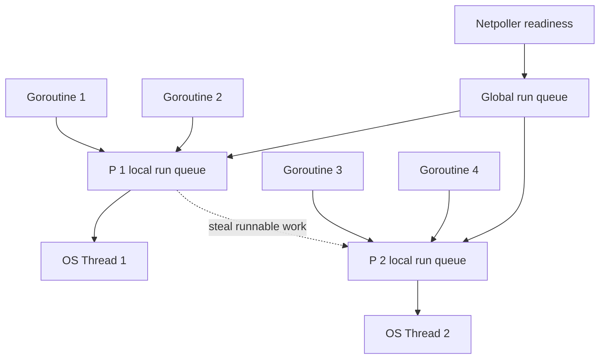
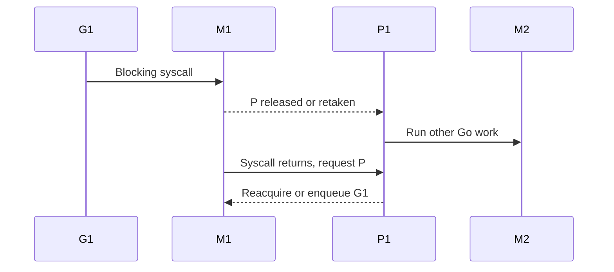

# Go scheduler: G, M, P và các đường blocking

**P0 · Must know**

## Concept

Scheduler phân phối runnable goroutines lên OS threads. G giữ execution state/stack; M là OS thread; P là runtime execution resource cần để M chạy Go code. OS tiếp tục schedule M trên CPU thật; P không phải một CPU core được pin cố định.

## Mental Model

G = work; M = thread; P = permission + local runtime resources. **Implementation detail, subject to change between Go releases.** Mô tả dưới đây đối chiếu Go 1.26.4, không phải language specification.



## Why và How

Mỗi OS thread có chi phí kernel stack, scheduling và limits. Multiplexing nhiều G lên ít executing M giúp lượng lớn tác vụ chờ I/O không cần một thread mỗi request. P giữ local runnable queue và tài nguyên allocation để giảm contention trên state toàn cục.

G mới có thể được đưa vào local queue/runnext; overflow chia sẻ qua global queue. Scheduler lấy work local, định kỳ xét global work để tránh starvation, kiểm tra timers/netpoll và tìm work từ P khác khi thiếu. Work stealing thường chuyển một phần runnable G để amortize cost; exact queue size, scan order và quota không phải API. Nó không di chuyển một G đang chạy khỏi CPU theo ý người dùng.

## Internals và runtime behavior

- **Blocking syscall:** G/M vào syscall. P có thể tách khỏi M hoặc bị sysmon retake nếu syscall kéo dài; không phải mọi syscall đều ngay lập tức tạo M mới. P được M khác dùng để tiếp tục chạy Go. Khi syscall return, M cố reacquire P; nếu không có P thì G được enqueue và M có thể park.
- **Network I/O:** với FD được runtime netpoller hỗ trợ, nonblocking syscall báo chưa ready thì park G, giữ M/P sẵn sàng chạy G khác. epoll/kqueue/IOCP tùy OS báo readiness rồi làm G runnable. Disk I/O và cgo không mặc nhiên đi qua cùng cơ chế.
- **sysmon:** runtime monitor hỗ trợ retake P, preemption và các kiểm tra runtime. Không đóng vai một dispatcher duy nhất cho mọi G.
- **Preemption:** cooperative safe points và async preemption trên nền tảng hỗ trợ giúp vòng lặp CPU dài nhường execution; không có hard real-time guarantee. Runtime critical regions vẫn có giới hạn preemption.
- **M mới:** runtime tái dùng/wake idle M khi có thể; tạo thread khi runnable work/P cần executor mà không có M phù hợp. M có thể nhiều hơn P do syscall/cgo/locked threads. GOMAXPROCS không giới hạn số M hoặc G.



## Code Example

Tại thư mục `golang/examples`, chạy lab test cancellation rồi thu trace:

```bash
go test -run TestPoolCancellation -trace=trace.out ./...
go tool trace trace.out
GODEBUG=schedtrace=1000,scheddetail=1 go test -run TestPoolCancellation ./...
```

Đây là lệnh quan sát, không phải benchmark công bằng: race/trace/debug output thay đổi overhead. Đọc số idle P, runnable work, syscall và thread state cùng timestamp.

## Production Use Case

API 20k RPS chờ downstream: phần lớn G có thể waiting, CPU không đầy. Nếu downstream chậm, số G và live request buffers tăng; scheduler không áp admission control cho application. Bounded concurrency, pool limits và deadline mới giới hạn tài nguyên.

## Failure Scenarios

CPU quota thấp nhưng runnable queue dài; cgo blocking tăng M; spin loop làm CPU 95%; long lock hold park nhiều G; tăng GOMAXPROCS trong container gây throttling thay vì tăng throughput.

## Trade-offs

| Quyết định | Lợi ích | Chi phí |
|---|---|---|
| Nhiều runnable G | Che I/O latency | Scheduling, stacks, retained state |
| Tăng P | Parallel CPU work | Contention, quota throttling |
| Bounded workers | Capacity rõ | Queue delay hoặc reject |

## Common Misconceptions

P không bị buộc block cùng M. Network wait không đồng nghĩa một OS thread bị giữ cho mỗi socket. GOMAXPROCS không phải giới hạn concurrency. Work stealing không bảo đảm fairness ở mức business job.

## When NOT to use

Không tune scheduler flags trước khi biết bottleneck. Không tạo goroutine cho hàm CPU rất nhỏ nếu scheduling cost lớn hơn work. Không dùng LockOSThread trừ API thật sự đòi thread affinity.

## How I would debug this in production

Đầu tiên xem CPU quota/throttling, CPU profile và goroutine states. Thu execution trace ngắn để phân biệt runnable delay với network/lock waits. So sánh thread count với cgo/syscall stacks. Xem runtime metric scheduler latency và GOMAXPROCS thực tế; từ Go 1.25 default trên Linux có thể xét cgroup CPU limit tùy config/version. Thử một thay đổi concurrency trong canary, so RPS, P99, errors và throttling cùng tải.

## Key Takeaways

Theo dấu **G đang chờ gì, M có bị giữ không, P đang ở đâu**. Ba câu này giải thích blocking chính xác hơn câu “goroutine nhẹ”.

## Interview Questions

### Basic / Mid — 10

1. What is G?
2. What is M?
3. What is P?
4. Does P represent a physical CPU?
5. What is a local run queue?
6. What is the global run queue?
7. What does GOMAXPROCS control?
8. What is work stealing?
9. What does the netpoller report?
10. What does sysmon help with?

### Senior — 10

1. What happens when G enters a blocking syscall?
2. Must P stay attached to a blocked M?
3. What happens when a syscall returns without a free P?
4. How does network waiting differ from disk I/O?
5. When does the runtime create another M?
6. How can M count exceed GOMAXPROCS?
7. Why are local queues useful?
8. How does preemption affect CPU-heavy code?
9. Why is scheduler fairness not business fairness?
10. How can container quotas affect scheduler latency?

### Production scenarios — 5

1. How would you debug 20000 waiting goroutines with low CPU?
2. Why did more P increase throttling?
3. Why did a cgo client increase thread count?
4. How would you distinguish runnable delay from mutex wait?
5. Why does one hot loop hurt request P99?

### Senior Follow-ups — 5

1. Which state is G in?
2. Is M occupied by kernel work?
3. Can P run another G?
4. What event makes the waiting G runnable?
5. Which trace evidence validates that sequence?

Chuỗi follow-up: trả lời lần lượt 5 câu cuối; mỗi câu cần một invariant, bằng chứng runtime hoặc trade-off cụ thể.


## See also

- [goroutine](goroutine.md)
- [netpoller](netpoller.md)
- [gomaxprocs](gomaxprocs.md)
- [trace](../16-performance/trace.md)

## Nguồn đối chiếu

- [Runtime source for Go 1.26.4](https://github.com/golang/go/blob/go1.26.4/src/runtime/proc.go)
- [Container-aware GOMAXPROCS](https://go.dev/doc/go1.25#runtime)
