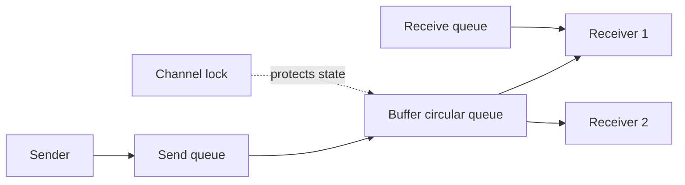

# Channel internals và synchronization

## Bài toán và ví dụ đầu tiên

Hai goroutine cùng tham gia xử lý ảnh: một bên đọc file, một bên resize. Nếu dùng chung một biến image, ta phải biết lúc nào biến đã có dữ liệu, bên nào được sửa và khi nào kết thúc. Channel gom việc trao đổi giá trị cùng điều kiện chờ vào một API có kiểu: channel int chỉ chuyển int, channel Job chuyển Job.

Hãy bắt đầu với `make(chan int)`. Đây là channel không có buffer: send cần gặp receive thì mới hoàn tất. Nếu main gửi trước khi tạo người nhận, main có thể chờ mãi. `make(chan int, 2)` thêm hai vị trí lưu tạm: hai lần gửi đầu có thể hoàn tất khi chưa có receiver; lần thứ ba cần chờ có chỗ. Buffer giúp hai bên lệch nhịp trong phạm vi hữu hạn, không làm consumer xử lý nhanh hơn.

## Đi từng bước qua một tình huống

Giả sử channel có capacity 2. Producer gửi A rồi B, queue chứa [A, B]. Nó gửi C và phải chờ vì đầy. Consumer nhận A, giải phóng một chỗ; producer có thể hoàn tất gửi C. Consumer chưa chắc đã xử lý xong A khi producer tiếp tục: receive và business processing là hai thời điểm khác nhau. Nếu producer cần biết dữ liệu đã được ghi vào DB, cần acknowledgement riêng sau commit.

Đóng channel nghĩa là phía gửi thông báo không còn giá trị mới. Receiver vẫn nhận được A, B còn trong buffer, rồi nhận zero value với ok=false. Range channel kết thúc ở lúc đã drain hết channel đóng. Nil channel thì khác: send và receive chờ vô hạn; nó chưa có một thực thể channel để giao tiếp. Trong select, case dùng nil channel bị vô hiệu hóa nên có thể dùng để tắt một nhánh có chủ đích.

## Hiểu cơ chế từ kết quả quan sát

Chỉ sau khi hiểu hành vi trên mới cần nhìn runtime. `hchan` là tên cấu trúc implementation lưu trạng thái channel. Buffered channel cần vùng lưu và vị trí đọc/ghi quay vòng, gọi là ring buffer: tới cuối vùng thì quay lại đầu. Khi buffer đầy, sender phải đăng ký chờ; khi buffer rỗng, receiver có thể phải chờ. `sendq` và `recvq` là các hàng đợi waiter tương ứng, không phải hai queue message độc lập.

`sudog` là metadata runtime dùng để nối một goroutine với thao tác đồng bộ đang chờ. Goroutine chờ không có một thread riêng quay vòng kiểm tra channel. Runtime bảo vệ trạng thái bằng lock nội bộ, sắp xếp việc chờ/đánh thức rồi cho thread làm việc khác. Có receiver đang chờ thì một số đường send có thể chuyển trực tiếp, nên sơ đồ buffer là mô hình khái niệm chứ không phải mọi giá trị đều phải đi đủ mọi node.

Channel có thể được nhiều goroutine send/receive an toàn, nhưng dữ liệu được gửi vẫn tuân theo kiểu của nó. Gửi slice sao chép slice header chứ không copy backing array. Nếu sender tiếp tục sửa array trong khi receiver đọc, vẫn có data race. Giao thức ownership phải quy định bên gửi ngừng sửa sau khi chuyển hoặc tạo bản sao độc lập.

## Khái niệm và vấn đề cần giải quyết

Channel là typed communication primitive có blocking và synchronization semantics. Nó giúp chuyển work/ownership theo protocol; bản thân channel không bảo vệ mọi object được gửi bằng pointer.

## Mô hình làm việc



### Cách đọc diagram

Sender, buffer và receivers mô tả đường dữ liệu; send queue/receive queue mô tả goroutines chưa thể hoàn tất operation. Lock nội bộ bảo vệ trạng thái channel. Không đọc các mũi tên như mọi send đều phải qua send queue rồi buffer: có receiver chờ thì có thể handoff trực tiếp, còn unbuffered channel không có vùng chứa message như buffered channel. Waiters được park rồi wake khi có điều kiện tiến triển.

## Cơ chế bên trong

**Implementation detail, subject to change between Go releases.** Runtime hiện tại dùng `hchan`: buffer pointer/capacity/count; `sendx` và `recvx` là ring indices; `sendq`/`recvq` giữ waiters; lock bảo vệ channel state. Waiter có liên kết tới G cần wake, không phải một thread riêng. Direct handoff có thể copy tới receiver đang chờ mà không đi vòng qua buffer. Runtime park G khi không tiến triển được, nhả lock rồi schedule work khác.

| Channel state | `ch <- v` | `v, ok := <-ch` | close |
|---|---|---|---|
| Unbuffered open | Chờ matching receiver | Chờ matching sender, ok=true | Đánh thức waiters |
| Buffered còn chỗ | Enqueue hoặc handoff | Nhận nếu có dữ liệu, nếu rỗng thì chờ | Dữ liệu còn lại được drain |
| Buffered đầy | Chờ chỗ/receiver | Lấy phần tử, có thể unblock sender | Sender bị unblock rồi panic |
| Closed | Panic | Drain rồi zero,false | Panic khi close lần hai |
| Nil | Block mãi | Block mãi | Panic |

FIFO nói về thứ tự values theo send order đã xác định, không hứa thứ tự giữa concurrent producers. Send publish writes trước đó cho corresponding receive; với unbuffered channel còn handshake nhận trước completion send. Với buffered channel, sender không biết consumer đã xử lý chỉ vì send xong. Ack riêng nếu cần completion.

## Ví dụ code

```go
package main
import "fmt"
func main() {
    ch := make(chan int, 1)
    ch <- 42
    close(ch)
    a, ok1 := <-ch
    b, ok2 := <-ch
    fmt.Println(a, ok1, b, ok2) // 42 true 0 false
}
```

### Giải thích code và kết quả

Capacity1 cho phép send42 hoàn tất trước khi có receiver. Close cấm send mới nhưng không xóa42; receive đầu trả42,true. Lần receive sau thấy channel đóng và đã hết dữ liệu nên trả zero int0,false ngay, không block. Nếu tiếp tục range, nó kết thúc; nếu tự loop nhận mà bỏ ok, code có thể quay mãi nhận zero.

Production sender/receiver phải dùng select với ctx khi có thể block. Chỉ coordinator biết mọi sender đã dừng mới close; receiver thường không close input do mình không sở hữu. Không cần close mọi channel để GC thu hồi; close mang protocol “không còn values”.

## Áp dụng vào hệ thống thật

Bounded jobs queue hấp thụ burst nhỏ. Buffer capacity phải dựa trên memory và maximum queue wait, không là cách chữa producer chạy nhanh hơn consumer mãi. Chuyển *Payload cần quy ước sender không mutate sau send hoặc clone trước.

## Những đường lỗi cần hiểu

Send vào closed channel khi shutdown tranh chấp; consumer exit khiến producer block mãi; closed channel select loop nhận zero vô hạn; buffer lớn che overload đến khi hết memory.

## Đánh đổi

| Primitive | Best for | Weakness |
|---|---|---|
| Channel | Communication, ownership handoff | Blocking/lifecycle phức tạp |
| Mutex | Shared state invariant | Contention và lock order |
| Atomic | Counter/state nhỏ | Khó mở rộng nhiều field |

## Những cách hiểu dễ sai

Buffered send không chứng minh processing hoàn tất. Channel không tự deep copy slice/map/pointer. Channel an toàn concurrent operations không làm user object tự thread-safe.

## When NOT to use channels

Counter đơn giản hoặc map nhiều operations dưới cùng invariant thường dễ đọc hơn bằng mutex/atomic. Không dùng channel như unbounded in-memory broker bằng cách liên tục spawn goroutine gửi.

## Lần theo bằng chứng khi có sự cố

Group goroutine stacks theo chan send/receive và creation site. Xác định owner close, số producer/consumer còn sống và ctx exit path. Đo queue depth/age, arrival và completion rate. Dùng race detector cho object đi qua channel; dùng deterministic completion signals trong test close/cancel, không sleep phỏng đoán.

## Thực hành, debugging và kết luận

Trong ví dụ bên dưới, lần receive đầu đọc 42 với ok=true dù channel đã đóng; lần sau trả 0,false vì buffer hết. Close không phải lệnh xóa dữ liệu. Với nhiều producer, coordinator phải chờ tất cả producer hoàn tất rồi mới close; một consumer không được tùy tiện close chỉ vì nó không muốn nhận nữa.

Ở production, một queue 1000 job mỗi job giữ payload 1 MB có thể giữ khoảng 1 GB chỉ cho payload. Count và bytes phải cùng được đo. Khi consumer chậm lâu dài, tăng buffer kéo dài thời gian tới lúc đầy và tăng tuổi job; cần giới hạn đầu vào hoặc lưu queue bền nếu chấp nhận xử lý sau.

Để debug shutdown treo, liệt kê ai còn gửi, ai còn nhận và ai có quyền close. Lấy stack cho biết goroutine đang chờ send hay receive; đối chiếu context ở cả hai phía. Test buffer 0, buffer 1, buffer đầy, consumer bỏ cuộc và cancellation trước khi bắt đầu. Khi invariant chỉ là cập nhật một counter, mutex hoặc atomic thường dễ đọc hơn một goroutine riêng nhận mọi increment.


## Đọc tiếp

- [select](select.md)
- [worker-pool](worker-pool.md)
- [Go memory model và happens-before](../02-memory-runtime/memory-model.md)

## Nguồn đối chiếu

- [Channel source](https://github.com/golang/go/blob/go1.26.4/src/runtime/chan.go)
- [Channel specification](https://go.dev/ref/spec#Channel_types)
