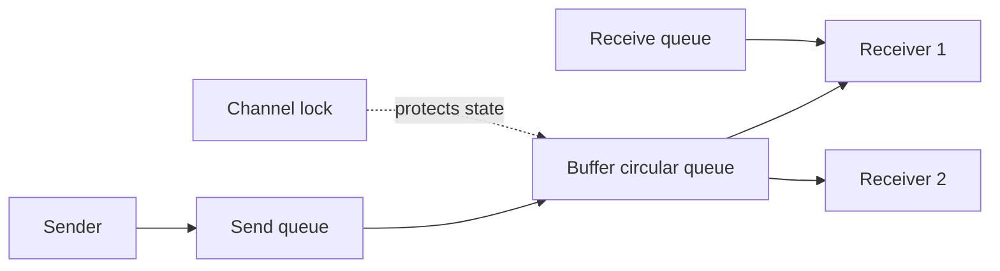

# Channel internals và synchronization

**P0 · Must know**

## Concept và Why

Channel là typed communication primitive có blocking và synchronization semantics. Nó giúp chuyển work/ownership theo protocol; bản thân channel không bảo vệ mọi object được gửi bằng pointer.

## Mental Model



## How và Internals

**Implementation detail, subject to change between Go releases.** Runtime hiện tại dùng `hchan`: buffer pointer/capacity/count; `sendx` và `recvx` là ring indices; `sendq`/`recvq` giữ waiters; lock bảo vệ channel state. Waiter có liên kết tới G cần wake, không phải một thread riêng. Direct handoff có thể copy tới receiver đang chờ mà không đi vòng qua buffer. Runtime park G khi không tiến triển được, nhả lock rồi schedule work khác.

| Channel state | `ch <- v` | `v, ok := <-ch` | close |
|---|---|---|---|
| Unbuffered open | Chờ matching receiver | Chờ matching sender, ok=true | Đánh thức waiters |
| Buffered còn chỗ | Enqueue hoặc handoff | Nhận nếu có dữ liệu, nếu rỗng thì chờ | Dữ liệu còn lại được drain |
| Buffered đầy | Chờ chỗ/receiver | Lấy phần tử, có thể unblock sender | Sender bị unblock rồi panic |
| Closed | Panic | Drain rồi zero,false | Panic khi close lần hai |
| Nil | Block mãi | Block mãi | Panic |

FIFO nói về thứ tự values theo send order đã xác định, không hứa thứ tự giữa concurrent producers. Send publish writes trước đó cho corresponding receive; với unbuffered channel còn handshake nhận trước completion send. Với buffered channel, sender không biết consumer đã xử lý chỉ vì send xong. Ack riêng nếu cần completion.

## Code Example

```go
package main
import "fmt"
func main() {
    ch := make(chan int, 1)
    ch <- 42
    close(ch)
    a, ok1 := <-ch
    b, ok2 := <-ch
    fmt.Println(a, ok1, b, ok2) // 42 true 0 false
}
```

Production sender/receiver phải dùng select với ctx khi có thể block. Chỉ coordinator biết mọi sender đã dừng mới close; receiver thường không close input do mình không sở hữu. Không cần close mọi channel để GC thu hồi; close mang protocol “không còn values”.

## Production Use Case

Bounded jobs queue hấp thụ burst nhỏ. Buffer capacity phải dựa trên memory và maximum queue wait, không là cách chữa producer chạy nhanh hơn consumer mãi. Chuyển *Payload cần quy ước sender không mutate sau send hoặc clone trước.

## Failure Scenarios

Send vào closed channel khi shutdown tranh chấp; consumer exit khiến producer block mãi; closed channel select loop nhận zero vô hạn; buffer lớn che overload đến khi hết memory.

## Trade-offs

| Primitive | Best for | Weakness |
|---|---|---|
| Channel | Communication, ownership handoff | Blocking/lifecycle phức tạp |
| Mutex | Shared state invariant | Contention và lock order |
| Atomic | Counter/state nhỏ | Khó mở rộng nhiều field |

## Common Misconceptions

Buffered send không chứng minh processing hoàn tất. Channel không tự deep copy slice/map/pointer. Channel an toàn concurrent operations không làm user object tự thread-safe.

## When NOT to use channels

Counter đơn giản hoặc map nhiều operations dưới cùng invariant thường dễ đọc hơn bằng mutex/atomic. Không dùng channel như unbounded in-memory broker bằng cách liên tục spawn goroutine gửi.

## How I would debug this in production

Group goroutine stacks theo chan send/receive và creation site. Xác định owner close, số producer/consumer còn sống và ctx exit path. Đo queue depth/age, arrival và completion rate. Dùng race detector cho object đi qua channel; dùng deterministic completion signals trong test close/cancel, không sleep phỏng đoán.

## Key Takeaways

Channel là data path cộng synchronization và lifecycle protocol. Cả ba cần được thiết kế.

## Interview Questions

### Basic / Mid — 10

1. What does a channel communicate?
2. What is hchan conceptually?
3. What does its buffer store?
4. What do sendx and recvx track?
5. What do sendq and recvq hold?
6. What happens on unbuffered send?
7. What happens when a buffer is full?
8. What happens when a closed channel is drained?
9. What happens on a nil channel?
10. Who should close a channel?

### Senior — 10

1. How does direct handoff avoid a buffer round trip?
2. Does blocking channel send block an OS thread?
3. What memory does send publish?
4. Does a buffered send acknowledge processing?
5. How can sending a pointer still race?
6. How should multiple producers coordinate close?
7. Why does a channel need an internal lock?
8. What ordering is guaranteed with concurrent producers?
9. How can capacity influence backpressure?
10. Is closing required for garbage collection?

### Production scenarios — 5

1. Why do senders remain blocked after a receiver exits?
2. Why did shutdown panic with send on closed channel?
3. Why does a consumer spin after input closes?
4. Why did enlarging a buffer only delay OOM?
5. Why are payloads corrupted despite using a channel?

### Senior Follow-ups — 5

1. Who owns the values?
2. Who owns channel closure?
3. Which operations can block?
4. Which cancellation path releases each waiter?
5. Which completion signal proves all producers stopped?

Chuỗi follow-up: trả lời lần lượt 5 câu cuối; mỗi câu cần một invariant, bằng chứng runtime hoặc trade-off cụ thể.


## See also

- [select](select.md)
- [worker-pool](worker-pool.md)
- [Go memory model và happens-before](../02-memory-runtime/memory-model.md)

## Nguồn đối chiếu

- [Channel source](https://github.com/golang/go/blob/go1.26.4/src/runtime/chan.go)
- [Channel specification](https://go.dev/ref/spec#Channel_types)
