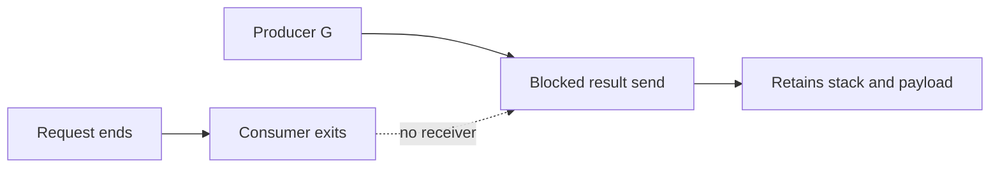

# Goroutine leaks: blocked work còn giữ tài nguyên

**P0 · Must know**

## Concept, Why và Mental Model

Leak là G vẫn sống sau lifetime hữu ích và không có đường hoàn tất hợp lệ. Một service có 20k long-lived connections hợp lệ có thể không leak; trend sau drain và stack ownership mới quyết định.



## Code Example

Ví dụ **cố ý sai**, chỉ đọc hoặc chạy isolated process rồi kết thúc:

```go
func leak() {
    ch := make(chan int)
    go func() { ch <- 1 }()
}
```

Caller return nhưng child đang send unbuffered; không ai có thể receive. G và channel wait state vẫn sống. Fix dùng owner + receive/join, hoặc context-aware send với cancel guaranteed, hoặc buffer 1 cho one-shot result khi đúng protocol. Buffer 1 không chữa producer gửi vô hạn.

## How và Internals

Các lifetime traps: channel không bao giờ receive; input không bao giờ send/close; context có cancel function nhưng owner không gọi; background loop không có stop branch; HTTP/DB không deadline; ticker loop range không exit; consumer blocked khi downstream bỏ đọc. `Ticker.Stop` không close ticker.C và không dừng goroutine đang range. Go 1.23+ có thể GC unreachable ticker, nhưng reachable worker loop vẫn phải tự dừng. `WithCancel` không nhất thiết tạo goroutine riêng, vì vậy “quên cancel” có thể leak resources/timers/tree references mà không trực tiếp thêm G.

## Runtime behavior và Production Use Case

GC thấy blocked G như live execution state; stack và payload references làm heap retention. Đặt service context cho background worker, request context cho request work; gọi cancel sau operation và join child trước khi owner đóng dependencies. HTTP call dùng shared client + timeout và close body.

## Failure Scenarios

Search fan-out chỉ lấy result đầu rồi bỏ các senders; ticker Stop nhưng loop vẫn đợi; producer cancellation không truyền tới DB; HTTP body đọc vô hạn; shutdown close DB trong khi worker chưa dừng.

## Trade-offs

| Fix | Hợp với | Giới hạn |
|---|---|---|
| Cancelable select | Channel wait | Work đã chạy phải honor ctx |
| Buffer 1 | One-shot delivery | Không bound stream dài |
| Join ownership | Task tree | Caller phải chờ cleanup |

## Common Misconceptions

GC không kill G blocked. Không phải mọi tăng NumGoroutine là leak. Cancel chỉ đóng tín hiệu, không ép library bỏ syscall hoặc callback bất kỳ.

## When NOT to use

Không chữa leak bằng tăng memory limit hoặc restart định kỳ như giải pháp cuối cùng. Không spawn watcher per request mà chính watcher không có exit.

## How I would debug this in production

1. So NumGoroutine trước, trong và sau tải; xét connection count.
2. Lấy goroutine profile vài thời điểm, group blocking stacks và creation site.
3. Xác định chan send/receive, net I/O, DB pool acquire hay mutex wait.
4. Tìm owner đã return, input/receiver đã mất hoặc context bị tách.
5. Kiểm tra timeout cho từng downstream call và bounds của workers/queue.
6. Reproduce cancellation tại blocking point; fix và verify done signals dưới race detector.
7. Sau canary, đợi drain rồi so G count, retained heap, FD và downstream latency.

## Key Takeaways

Mỗi `go` cần câu trả lời: ai dừng, điều gì unblock và ai đợi nó xong.

## Interview Questions

### Basic / Mid — 10

1. What makes a goroutine leaked?
2. Can GC kill a blocked goroutine?
3. Does cancel force a function to return?
4. What keeps a blocked sender alive?
5. Does closing an input end range?
6. Does Ticker.Stop close its channel?
7. Does every context create a goroutine?
8. What is a join signal?
9. Does a buffer always solve leaks?
10. Is a high goroutine count sufficient evidence?

### Senior — 10

1. How can one-shot results use a buffer safely?
2. Why can first-result-wins fan-out leak siblings?
3. How does a blocked stack retain payload memory?
4. What differs between timer retention and goroutine retention?
5. How should request and service lifetimes differ?
6. How do you test cancellation without relying on sleep?
7. Why can wrapping a noncancelable call worsen leaks?
8. What must every blocking send support?
9. How can a library ignore context?
10. How do you distinguish slow progress from permanent leakage?

### Production scenarios — 5

1. How would you investigate 20000 goroutines in production?
2. Why did stopping a ticker leave a worker alive?
3. Why did a canceled HTTP handler retain DB waiters?
4. Why are fan-out senders accumulating?
5. Why does memory stay high after traffic stops?

### Senior Follow-ups — 5

1. Who owns this G?
2. What is it waiting on?
3. Can that event still happen?
4. What alternative exit is available?
5. Who confirms it exited?

Chuỗi follow-up: trả lời lần lượt 5 câu cuối; mỗi câu cần một invariant, bằng chứng runtime hoặc trade-off cụ thể.


## See also

- [cancellation](../05-context/cancellation.md)
- [goroutine-profile](../16-performance/goroutine-profile.md)
- [http-client](../06-http-backend/http-client.md)

## Nguồn đối chiếu

- [Pipelines and cancellation](https://go.dev/blog/pipelines)
- [time.Ticker](https://pkg.go.dev/time#Ticker)
