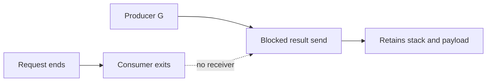

# Goroutine leaks: blocked work còn giữ tài nguyên

## Bài toán và ví dụ đầu tiên

Handler tạo goroutine tính giá và đợi tối đa 100 ms. Worker mất 200 ms rồi gửi kết quả vào unbuffered channel, nhưng handler đã return. Worker không còn receiver và chờ mãi. Mỗi request timeout để lại một goroutine; ban đầu service vẫn chạy, sau vài giờ memory tăng vì stack và dữ liệu của các worker cũ vẫn còn.

Một goroutine chờ lâu chưa tự động là leak. WebSocket reader có thể chờ hợp lệ suốt nhiều giờ nếu connection còn được sở hữu. Leak được xác định bằng việc công việc đã hết lifetime hữu ích mà không còn đường tiến triển hoặc giải phóng tài nguyên.

## Đi từng bước qua một tình huống

Lần theo timeline: t=0 handler tạo channel và worker; t=100 ms handler chọn nhánh timeout; t=200 ms worker tới send; không ai còn giữ trách nhiệm receive. Thêm buffer 1 giúp đúng trường hợp một worker chỉ gửi đúng một kết quả, nhưng nếu worker gửi stream thì buffer lại đầy. Phải sửa giao thức theo số producer, số message và điều kiện người nhận có thể rời đi.

Cách tổng quát cho công việc được phép bỏ là gửi bằng select với ctx.Done, để sender có đường dừng. Caller vẫn cần join nếu worker còn dùng tài nguyên mà caller chuẩn bị đóng. Với công việc phải hoàn thành dù client rời đi, chuyển ownership sang job bền vững; không coi nó là một goroutine con vô chủ.

## Hiểu cơ chế từ kết quả quan sát

Goroutine bị park không đốt CPU liên tục, nhưng stack của nó là một phần tập root mà GC phải xét. Pointer trên stack có thể giữ backing array, request, client hoặc object graph lớn. Vì vậy leak có thể biểu hiện thành live heap tăng dù không có một vòng loop allocate liên tục ở worker bị kẹt.

Cancellation là tín hiệu tự nguyện: worker phải quan sát ở mọi điểm có thể chờ lâu, gồm receive input, send output và dependency call. WaitGroup chỉ chờ, không hủy; gọi Wait trước khi mở đường thoát cho worker có thể làm shutdown treo. Thứ tự đúng phụ thuộc protocol nhưng thường là ngừng nhận việc, yêu cầu dừng hoặc drain, rồi chờ hoàn tất và đóng dependency.

## Khái niệm và lý do tồn tại

Leak là G vẫn sống sau lifetime hữu ích và không có đường hoàn tất hợp lệ. Một service có 20k long-lived connections hợp lệ có thể không leak; trend sau drain và stack ownership mới quyết định.



### Cách đọc diagram

Nhánh trên cho thấy request kết thúc làm consumer rời đi. Nhánh dưới là producer vẫn tới send result rồi mắc vì không còn receiver, thể hiện bằng cạnh nét đứt. Node cuối chỉ tài nguyên bị giữ: stack và payload reachable. Sửa cần một đường thoát hoặc owner nhận/chờ rõ; chỉ request return không đi tới node kết thúc của producer.

## Ví dụ code

Ví dụ **cố ý sai**, chỉ đọc hoặc chạy isolated process rồi kết thúc:

```go
func leak() {
    ch := make(chan int)
    go func() { ch <- 1 }()
}
```

### Giải thích code và kết quả

Đây là ví dụ cố ý lỗi, không gọi lặp trong service. Leak tạo unbuffered channel rồi khởi chạy sender, nhưng không có receiver và không ai close/cancel để send tiến triển. Hàm leak return không hủy goroutine con; goroutine bị park ở send và còn giữ state. Compiler check chỉ kiểm tra syntax/type, không chạy function này. Sửa cần owner/receive hoặc send có cancellation theo contract.

Caller return nhưng child đang send unbuffered; không ai có thể receive. G và channel wait state vẫn sống. Fix dùng owner + receive/join, hoặc context-aware send với cancel guaranteed, hoặc buffer 1 cho one-shot result khi đúng protocol. Buffer 1 không chữa producer gửi vô hạn.

## Cơ chế bên trong

Các lifetime traps: channel không bao giờ receive; input không bao giờ send/close; context có cancel function nhưng owner không gọi; background loop không có stop branch; HTTP/DB không deadline; ticker loop range không exit; consumer blocked khi downstream bỏ đọc. `Ticker.Stop` không close ticker.C và không dừng goroutine đang range. Go 1.23+ có thể GC unreachable ticker, nhưng reachable worker loop vẫn phải tự dừng. `WithCancel` không nhất thiết tạo goroutine riêng, vì vậy “quên cancel” có thể leak resources/timers/tree references mà không trực tiếp thêm G.

## Từ runtime đến production

GC thấy blocked G như live execution state; stack và payload references làm heap retention. Đặt service context cho background worker, request context cho request work; gọi cancel sau operation và join child trước khi owner đóng dependencies. HTTP call dùng shared client + timeout và close body.

## Những đường lỗi cần hiểu

Search fan-out chỉ lấy result đầu rồi bỏ các senders; ticker Stop nhưng loop vẫn đợi; producer cancellation không truyền tới DB; HTTP body đọc vô hạn; shutdown close DB trong khi worker chưa dừng.

## Đánh đổi

| Fix | Hợp với | Giới hạn |
|---|---|---|
| Cancelable select | Channel wait | Work đã chạy phải honor ctx |
| Buffer 1 | One-shot delivery | Không bound stream dài |
| Join ownership | Task tree | Caller phải chờ cleanup |

## Những cách hiểu dễ sai

GC không kill G blocked. Không phải mọi tăng NumGoroutine là leak. Cancel chỉ đóng tín hiệu, không ép library bỏ syscall hoặc callback bất kỳ.

## Khi nên chọn cách khác

Không chữa leak bằng tăng memory limit hoặc restart định kỳ như giải pháp cuối cùng. Không spawn watcher per request mà chính watcher không có exit.

## Lần theo bằng chứng khi có sự cố

1. So NumGoroutine trước, trong và sau tải; xét connection count.
2. Lấy goroutine profile vài thời điểm, group blocking stacks và creation site.
3. Xác định chan send/receive, net I/O, DB pool acquire hay mutex wait.
4. Tìm owner đã return, input/receiver đã mất hoặc context bị tách.
5. Kiểm tra timeout cho từng downstream call và bounds của workers/queue.
6. Reproduce cancellation tại blocking point; fix và verify done signals dưới race detector.
7. Sau canary, đợi drain rồi so G count, retained heap, FD và downstream latency.

## Thực hành, debugging và kết luận

Để debug, ghi số goroutine ở tải ổn định, sau burst và sau drain. Nếu không trở lại gần baseline, lấy nhiều profile cách nhau một khoảng và nhóm stack giống nhau cùng nơi tạo goroutine. Một stack cố định ở send result phù hợp giả thuyết người nhận rời đi; một stack ở SQL pool cần kiểm tra connection ownership và query latency trước.

Bài có ví dụ cố ý leak để đọc, không chạy nó lặp vô hạn trong process thật. Regression test cho bản sửa phải chủ động làm consumer rời đi, cancel và đợi worker báo kết thúc. Chỉ so runtime.NumGoroutine bằng một số tuyệt đối dễ flaky vì runtime/test framework có goroutine riêng. Ưu tiên kiểm tra những worker do test sở hữu qua tín hiệu cụ thể.


## Đọc tiếp

- [cancellation](../05-context/cancellation.md)
- [goroutine-profile](../16-performance/goroutine-profile.md)
- [http-client](../06-http-backend/http-client.md)

## Nguồn đối chiếu

- [Pipelines and cancellation](https://go.dev/blog/pipelines)
- [time.Ticker](https://pkg.go.dev/time#Ticker)
