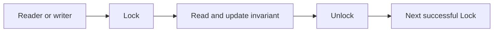

# Mutex: invariants, contention và lock ownership

## Bài toán và ví dụ đầu tiên

Hai request tăng một counter cùng lúc. `counter++` trông như một dòng duy nhất nhưng về ý nghĩa gồm đọc giá trị cũ, cộng một rồi ghi lại. Nếu A và B cùng đọc 10, cả hai đều có thể ghi 11; hai lần tăng chỉ tăng một đơn vị. Khi các thao tác truy cập bộ nhớ không được đồng bộ, đây còn là data race, không chỉ một kết quả thống kê không chính xác.

Mutex cho phép đánh dấu một đoạn code mà chỉ một goroutine được vào tại một thời điểm. Đoạn đó gọi là critical section. Điều ta muốn bảo vệ là invariant — điều kiện dữ liệu phải luôn đúng ở các điểm quan sát hợp lệ — ví dụ mọi lần tăng counter phải được phản ánh đúng một lần.

## Đi từng bước qua một tình huống

```go
package main

import (
    "fmt"
    "sync"
)

func main() {
    var mu sync.Mutex
    var wg sync.WaitGroup
    counter := 0
    for i := 0; i < 2; i++ {
        wg.Add(1)
        go func() {
            defer wg.Done()
            mu.Lock()
            counter++
            mu.Unlock()
        }()
    }
    wg.Wait()
    fmt.Println(counter)
}
```

### Giải thích code từng bước

Mutex có zero value dùng được, không cần hàm khởi tạo. Add xảy ra trước go để main không thấy bộ đếm task bằng zero quá sớm. Mỗi worker Lock trước khi đọc/cộng/ghi counter; worker thứ hai chỉ được vào sau khi worker thứ nhất Unlock. WaitGroup chờ cả hai hoàn tất, nên dòng in ở cuối quan sát kết quả 2 mà không đọc đồng thời với một worker đang ghi.

Nếu cần đọc counter trong lúc worker còn hoạt động, reader cũng phải dùng cùng mutex. Chỉ lock writer không tự bảo vệ một reader không lock. Nếu chuyển Lock/Unlock vào một hàm ngắn, defer Unlock ngay sau Lock giúp các đường return lỗi không quên mở khóa. Tuy nhiên defer trong một hàm dài giữ lock đến cuối hàm, nên phải thiết kế phạm vi hàm phù hợp.

## Hiểu cơ chế từ kết quả quan sát

Khi gặp mutex đang bị giữ, runtime có thể thử chờ ngắn trong điều kiện phù hợp hoặc đưa goroutine vào trạng thái chờ. Đây là chi tiết tối ưu implementation; code không được dựa vào việc goroutine nào chắc chắn lấy lock tiếp theo. Lock thiết lập quyền truy cập độc quyền, còn Unlock và Lock sau đó tạo quan hệ đồng bộ để dữ liệu đã ghi được công bố đúng cho người lấy lock.

Khóa không gắn ma thuật với tên biến. Nếu hai mutex khác nhau cùng “bảo vệ” một map thì chúng không ngăn hai bên truy cập map đồng thời. Nếu copy struct chứa mutex và map, có thể tạo hai lock riêng nhưng map bên trong vẫn chung storage. Vì vậy type chứa mutex dùng pointer receiver và không được copy sau khi bắt đầu dùng.

Mutex không reentrant: goroutine đang giữ lock không được gọi Lock lần nữa trên cùng mutex và kỳ vọng runtime nhận ra “cùng chủ”. Nó sẽ tự chờ thứ mà chính nó phải trả. Một lời gọi gián tiếp vào hàm cũng Lock cùng mutex là nguồn deadlock khó nhìn nếu chỉ đọc từng hàm rời.

## Khái niệm và mô hình làm việc

Mutex bảo vệ critical section mà nhiều goroutines không được thực hiện đồng thời. Khóa bảo vệ **invariant**, không phải tên biến; mọi access liên quan phải theo cùng protocol.



### Cách đọc diagram

Reader hoặc writer đều đi qua cùng Lock trước khi đọc/cập nhật invariant. Unlock mở đường cho Lock thành công tiếp theo, đồng thời tạo quan hệ đồng bộ phù hợp. Mũi tên không hứa fairness theo thứ tự business request; nó biểu diễn quy tắc mọi access liên quan phải tuân cùng critical section. I/O dài bên trong node giữa sẽ kéo dài thời gian các bên khác phải chờ.

## Why, How và Internals

Zero value sync.Mutex dùng được. `Unlock` tạo synchronization với `Lock` thành công sau đó. Mutex không reentrant và không gắn ownership với G theo API; unlock từ G khác có thể hợp lệ nhưng thường làm protocol khó review. Không copy mutex sau first use; struct có mutex thường được dùng qua pointer. Runtime có spin/park và contention modes tùy release: không hứa fairness hay FIFO cho application.

Giữ lock ngắn, không gọi network/DB hoặc callback không kiểm soát khi đang giữ. Nếu phải đọc state rồi I/O rồi cập nhật, chụp version, unlock, làm I/O và revalidate dưới lock; không đơn giản bỏ lock rồi giả định invariant giữ nguyên. Với nhiều locks đặt global order và document.

## Ví dụ code

```go
package main
import ("fmt"; "sync")
type Inventory struct { mu sync.Mutex; available int }
func (i *Inventory) Reserve(n int) bool {
    i.mu.Lock()
    defer i.mu.Unlock()
    if n <= 0 || i.available < n { return false }
    i.available -= n
    return true
}
func main() { i := &Inventory{available: 1}; fmt.Println(i.Reserve(1), i.Reserve(1)) }
```

### Giải thích code và kết quả

Reserve Lock trước cả kiểm tra available và trừ số lượng, nên hai bước là một critical section. N<=0 hoặc thiếu hàng trả false nhưng defer vẫn Unlock. Hai lần gọi với available 1 cho true rồi false. Pointer receiver giữ cùng mutex/state; mutex local này bảo vệ trong một process, không thay constraint DB khi nhiều replicas cùng reserve cùng kho.

Read-check-write cùng critical section tránh oversell trong process. Nhiều instances vẫn cần DB atomic update/transaction; mutex chỉ có phạm vi một process.

## Áp dụng vào hệ thống thật

Cache local bảo vệ map + LRU list như một invariant. Không trả mutable pointer rồi mutate ngoài lock. Contention cao có thể shard theo key nhưng operation nhiều shards phải lock theo thứ tự.

## Những đường lỗi cần hiểu

Recursive call cố Lock lại cùng mutex; lock order đảo; copy lock bảo vệ cùng underlying map; callback dưới lock gọi ngược lại service; thêm RWMutex nhưng readers giữ lock lâu làm writer latency tăng.

## Đánh đổi

| Option | Lợi ích | Hạn chế |
|---|---|---|
| Mutex | Invariant nhiều fields rõ | Serialization |
| RWMutex | Readers song song | Bookkeeping, writer latency |
| Sharded locks | Giảm contention theo key | Cross-shard invariants |
| Atomic | Operation nhỏ | Không thay transaction |

## Những cách hiểu dễ sai

Mutex không tự bảo vệ state nếu có path bỏ qua. `TryLock` thất bại không tạo memory synchronization edge để đọc state an toàn. Data-race-free không chứng minh business invariant giữa nhiều processes.

## Khi nên chọn cách khác

Không giữ mutex suốt external I/O. Không lock chỉ để bảo vệ counter đơn giản nếu atomic contract đã đủ, nhưng tránh tối ưu khi chưa đo.

## Lần theo bằng chứng khi có sự cố

Bật mutex/block profiling với sampling có budget. Mutex profile chỉ ra stack liên quan contention thường tại unlock/holder path; block profile cho waiter blocking site. Vẽ lock graph từ stacks, kiểm tra hold duration và callbacks. Run race/vet cho missing lock/copylocks; load-test hot key để phân biệt skew với global contention.

## Thực hành, debugging và kết luận

Một cache lưu balance và version phải cập nhật hai field cùng nhau. Hai atomic riêng lẻ chưa chắc đủ vì reader có thể nhìn balance mới với version cũ. Một mutex quanh toàn invariant làm quy tắc này rõ hơn. Khi muốn làm I/O từ cache state, thường copy phần dữ liệu cần dưới lock rồi thả lock trước khi gọi network; nếu kết quả cần ghi lại, kiểm tra version khi lấy lock lại để phát hiện state đã đổi.

Giả sử P99 tăng nhưng CPU thấp, nhiều goroutine chờ mutex giữ qua HTTP call. Mutex profile và stack của holder giúp xác định critical section dài. Đo thời gian giữ lock, không chỉ số lần Lock. Sharding state thành nhiều lock có thể giảm contention — tranh chấp cùng tài nguyên — nhưng làm những thao tác xuyên shard phức tạp hơn. Chỉ chia khi có bằng chứng bottleneck và giữ lock order thống nhất.


## Đọc tiếp

- [rwmutex](rwmutex.md)
- [deadlock](deadlock.md)
- [mutex-profile](../16-performance/mutex-profile.md)

## Nguồn đối chiếu

- [sync.Mutex](https://pkg.go.dev/sync#Mutex)
