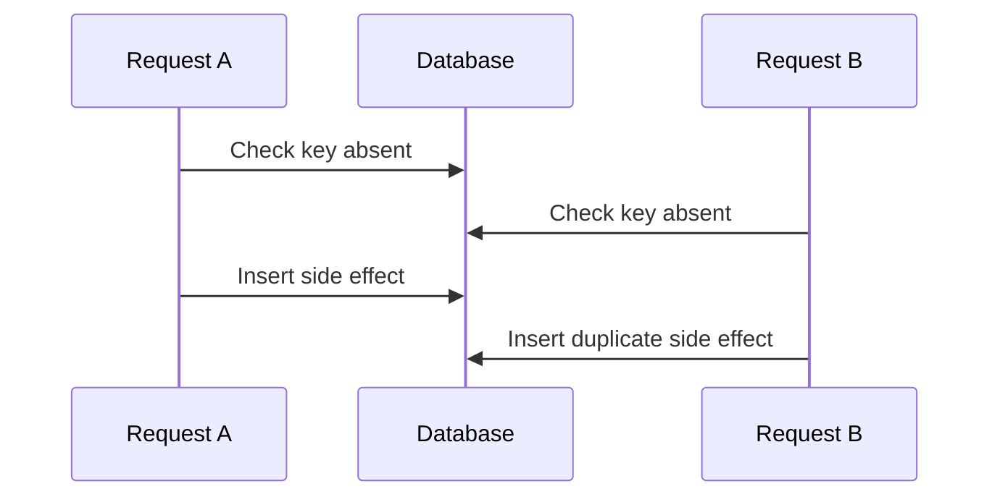

# Race condition versus data race

**P0 · Must know**

## Concept, Why và Mental Model

Data race là accesses cùng memory location, ít nhất một write, không có synchronization thích hợp. Race condition là kết quả đúng/sai phụ thuộc interleaving; có thể xảy ra giữa các processes hoặc transactions dù không có Go data race.



## How và Internals

Race detector instrument memory accesses trên paths được chạy; report read/write stacks và goroutine creation. Nó không exhaustively khám phá schedules hay hiểu business invariants trong DB. Fix data race bằng happens-before/ownership; fix duplicate business action bằng unique constraint + transaction + idempotency.

## Code Example

Đoạn **cố ý race**, không dùng trong production:

```go
var n int
var wg sync.WaitGroup
wg.Add(2)
for i := 0; i < 2; i++ {
    go func() { defer wg.Done(); n++ }()
}
wg.Wait()
```

WaitGroup chỉ đồng bộ completion với caller, không đồng bộ hai `n++`. Dùng mutex bao increment hoặc atomic.Int64.Add. Ví dụ executable âm tính tách build tag tại [examples/race_demo_test.go](../examples/race_demo_test.go): `go test -race -tags racedemo -run TestIntentionalRace` **phải thất bại**, chứng minh detector quan sát race. Suite mặc định chỉ chứa code an toàn.

## Runtime behavior và Production Use Case

Race build tăng CPU/memory đáng kể; dùng tests/staging hoặc canary có capacity. Race trên slice/string/interface nhiều-word representation đặc biệt không được reasoning như “đọc cũ cũng được”. Một pair atomic Load rồi Store vẫn có thể lost-update logic; dùng Add/CAS hoặc lock cho whole transition.

## Failure Scenarios

Map read/write; shared response buffer; cache pointer mutation sau unlock; DB check-then-insert; bank balance read-modify-write trong nhiều requests. Không phải mọi case bị runtime concurrent-map check bắt.

## Trade-offs

| Cách | Giải quyết | Giới hạn |
|---|---|---|
| -race | Memory races đã chạy | Không proof hoàn chỉnh |
| Mutex/atomic | In-process synchronization | Không xuyên process |
| DB constraint/transaction | Durable invariant | Lock/retry/cost |

## Common Misconceptions

Test pass không chứng minh không race. WaitGroup không serialize workers. Atomic field không làm compound workflow atomic. “Không crash” không chứng minh correctness.

## When NOT to use

Không dùng sleeps để né race. Không bỏ race test vì quá chậm mà không có targeted suite phù hợp. Không dùng local lock làm substitute cho DB uniqueness.

## How I would debug this in production

Giữ crash/data-corruption evidence, xác định shared object hoặc business key. Reproduce dưới race detector; đọc cả access stacks, không chỉ nơi crash. Nếu detector im lặng, kiểm tra transactional timeline và constraints. Thêm stress test có synchronization tạo interleaving nguy hiểm; verify invariant sau nhiều runs. Đo contention sau fix để tránh chuyển corruption thành timeout.

## Key Takeaways

Correctness cần cả memory synchronization lẫn business atomicity. Chọn công cụ theo tầng invariant.

## Interview Questions

### Basic / Mid — 10

1. What is a data race?
2. What is a race condition?
3. Can they occur independently?
4. What does the race detector instrument?
5. How do you enable it?
6. Does WaitGroup serialize workers?
7. Is n++ atomic?
8. Does a clean race run prove safety?
9. Does concurrent map checking catch all races?
10. Can atomics still permit logical races?

### Senior — 10

1. How do you reason about happens-before?
2. Why can a race on an interface be especially unsafe?
3. How would you distinguish local memory races from distributed duplicates?
4. What does a unique constraint guarantee?
5. Why does check-then-insert need a transaction or constraint?
6. How can a returned pointer bypass a lock?
7. How should a regression test control interleaving?
8. What overhead affects race deployments?
9. How can race fixes introduce deadlock?
10. Why is sleeping an invalid correctness argument?

### Production scenarios — 5

1. Why does a counter lose increments?
2. Why are responses mixing user data?
3. Why do two pods process the same payment with no race report?
4. Why does a race vanish under logging?
5. Why does a locked cache still race on stored values?

### Senior Follow-ups — 5

1. Which invariant failed?
2. Which operations conflict?
3. Is the conflict in one address space?
4. Which synchronization or durable constraint applies?
5. What test proves the full invariant?

Chuỗi follow-up: trả lời lần lượt 5 câu cuối; mỗi câu cần một invariant, bằng chứng runtime hoặc trade-off cụ thể.


## See also

- [Go memory model và happens-before](../02-memory-runtime/memory-model.md)
- [race-detector](../18-testing/race-detector.md)
- [idempotency](../07-api-design/idempotency.md)

## Nguồn đối chiếu

- [Race detector](https://go.dev/doc/articles/race_detector)
