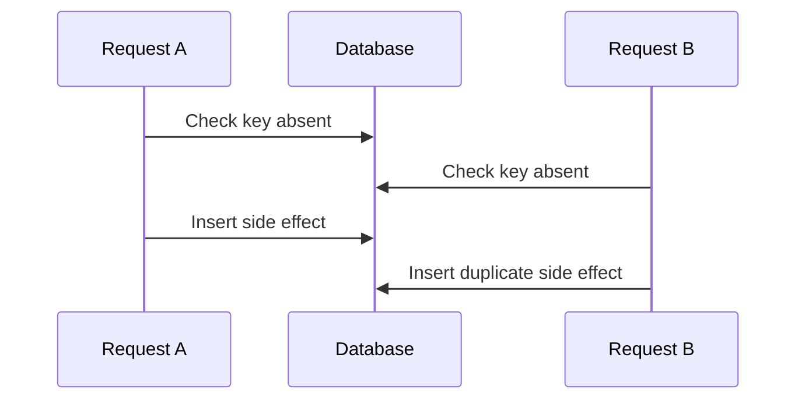

# Race condition versus data race

## Bài toán và ví dụ đầu tiên

Hai request cùng thấy mã giảm giá còn một lượt rồi đều tạo đơn được giảm. Dù mỗi request là một goroutine tuần tự và driver database hoàn toàn thread-safe, nghiệp vụ vẫn sai vì bước kiểm tra và cập nhật không nguyên tử. Đây là race condition: kết quả phụ thuộc cách các bước của nhiều actor xen kẽ.

Data race hẹp hơn: hai goroutine truy cập cùng vị trí memory, ít nhất một bên ghi, thiếu đồng bộ phù hợp. Counter++ đồng thời là ví dụ data race. Hai transaction cùng thực hiện check-then-insert có thể không có Go data race nhưng vẫn tạo race condition ở database.

## Đi từng bước qua một tình huống

Hãy viết timeline A đọc remaining=1, B đọc remaining=1, A ghi 0 và tạo đơn, B ghi 0 và tạo đơn. Lock một map cục bộ trong một replica không bảo vệ replica khác. Ở database, dùng conditional update có điều kiện remaining>0 trong transaction và kiểm tra affected rows, hoặc constraint/locking phù hợp theo invariant.

Ngược lại với counter nằm trong cùng process, mutex quanh toàn bộ read-modify-write hoặc atomic.Add có thể đủ. Atomic Load rồi Store riêng không biến cặp thao tác thành một increment nguyên tử. Hai worker vẫn có thể cùng đọc một giá trị và ghi cùng kết quả mới.

## Hiểu cơ chế từ kết quả quan sát

Race detector chèn kiểm tra vào chương trình để theo dõi truy cập và quan hệ đồng bộ trên những đường thực sự chạy. Báo cáo chỉ ra stack đọc/ghi và nơi goroutine được tạo, giúp tìm những access phải dùng cùng protocol. Nó không biết quy tắc “mỗi coupon chỉ dùng một lần” của sản phẩm, cũng không chạy mọi lịch xen kẽ có thể có.

Mutex và channel tạo quan hệ đồng bộ cho memory trong process. Transaction, unique constraint và compare-and-set ở kho dữ liệu bảo vệ invariant bền vững qua nhiều process. Chọn công cụ ở đúng nơi state được sở hữu. Kiểm tra lỗi duplicate key là một phần luồng hợp lệ khi nhiều client cạnh tranh, không nên chỉ log rồi vẫn báo success.

## Khái niệm và lý do tồn tại

Data race là accesses cùng memory location, ít nhất một write, không có synchronization thích hợp. Race condition là kết quả đúng/sai phụ thuộc interleaving; có thể xảy ra giữa các processes hoặc transactions dù không có Go data race.



### Cách đọc diagram

Đọc từ trên xuống: A và B cùng kiểm tra key trước khi ai insert. Cả hai thấy absent rồi cùng tạo side effect. Các participant là hai requests và một database; không cần có data race trong memory Go để timeline này sai nghiệp vụ. Unique constraint/atomic claim hoặc transaction đúng invariant phải chặn một nhánh trước duplicate effect.

## Cơ chế bên trong

Race detector instrument memory accesses trên paths được chạy; report read/write stacks và goroutine creation. Nó không exhaustively khám phá schedules hay hiểu business invariants trong DB. Fix data race bằng happens-before/ownership; fix duplicate business action bằng unique constraint + transaction + idempotency.

## Ví dụ code

Đoạn **cố ý race**, không dùng trong production:

```go
var n int
var wg sync.WaitGroup
wg.Add(2)
for i := 0; i < 2; i++ {
    go func() { defer wg.Done(); n++ }()
}
wg.Wait()
```

### Giải thích code và kết quả

Đoạn này cố ý có data race: WaitGroup chỉ giúp caller chờ hai workers return, không đồng bộ hai lần n++ với nhau. Mỗi increment có đọc/cộng/ghi shared n và có thể đua; kết quả không phải bằng chứng an toàn nếu tình cờ là 2. Lab riêng có build tag racedemo để chạy -race và nhận failure mong đợi; snippets checker chỉ compile để không thực thi lỗi có chủ đích.

WaitGroup chỉ đồng bộ completion với caller, không đồng bộ hai `n++`. Dùng mutex bao increment hoặc atomic.Int64.Add. Ví dụ executable âm tính tách build tag tại [examples/race_demo_test.go](../examples/race_demo_test.go): `go test -race -tags racedemo -run TestIntentionalRace` **phải thất bại**, chứng minh detector quan sát race. Suite mặc định chỉ chứa code an toàn.

## Từ runtime đến production

Race build tăng CPU/memory đáng kể; dùng tests/staging hoặc canary có capacity. Race trên slice/string/interface nhiều-word representation đặc biệt không được reasoning như “đọc cũ cũng được”. Một pair atomic Load rồi Store vẫn có thể lost-update logic; dùng Add/CAS hoặc lock cho whole transition.

## Những đường lỗi cần hiểu

Map read/write; shared response buffer; cache pointer mutation sau unlock; DB check-then-insert; bank balance read-modify-write trong nhiều requests. Không phải mọi case bị runtime concurrent-map check bắt.

## Đánh đổi

| Cách | Giải quyết | Giới hạn |
|---|---|---|
| -race | Memory races đã chạy | Không proof hoàn chỉnh |
| Mutex/atomic | In-process synchronization | Không xuyên process |
| DB constraint/transaction | Durable invariant | Lock/retry/cost |

## Những cách hiểu dễ sai

Test pass không chứng minh không race. WaitGroup không serialize workers. Atomic field không làm compound workflow atomic. “Không crash” không chứng minh correctness.

## Khi nên chọn cách khác

Không dùng sleeps để né race. Không bỏ race test vì quá chậm mà không có targeted suite phù hợp. Không dùng local lock làm substitute cho DB uniqueness.

## Lần theo bằng chứng khi có sự cố

Giữ crash/data-corruption evidence, xác định shared object hoặc business key. Reproduce dưới race detector; đọc cả access stacks, không chỉ nơi crash. Nếu detector im lặng, kiểm tra transactional timeline và constraints. Thêm stress test có synchronization tạo interleaving nguy hiểm; verify invariant sau nhiều runs. Đo contention sau fix để tránh chuyển corruption thành timeout.

## Thực hành, debugging và kết luận

Lab [race_demo_test.go](../examples/race_demo_test.go) được gắn build tag riêng vì cố ý sai. Nó minh họa data race để học cách đọc báo cáo; test thường của repository không bật tag này. Đối với race nghiệp vụ, tạo integration test điều phối hai transaction tới cùng barrier rồi cho chúng tiếp tục, kiểm tra invariant cuối thay vì hy vọng load test tình cờ va chạm.

Production có thể xuất hiện lỗi hiếm dù test chạy hàng nghìn lần không thấy. Ghi operation ID, version state và durable outcome đủ để dựng timeline, tránh log dữ liệu nhạy cảm. Một bản sửa đúng cần bảo vệ toàn operation hoặc constraint, không chỉ đặt lock quanh một dòng đọc và một dòng ghi rời nhau.


## Đọc tiếp

- [Go memory model và happens-before](../02-memory-runtime/memory-model.md)
- [race-detector](../18-testing/race-detector.md)
- [idempotency](../07-api-design/idempotency.md)

## Nguồn đối chiếu

- [Race detector](https://go.dev/doc/articles/race_detector)
