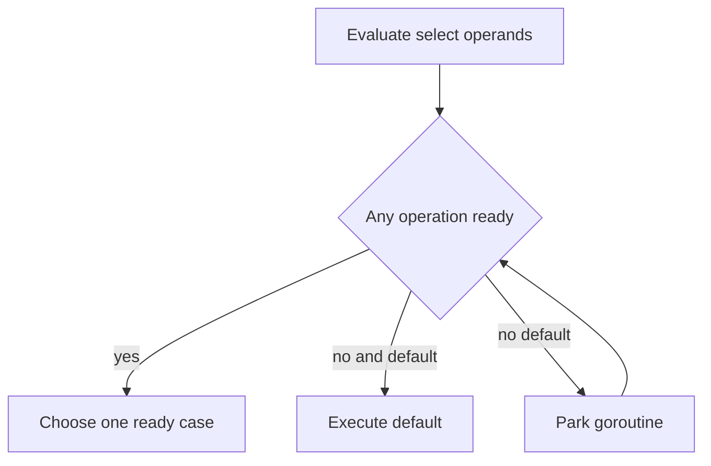

# Select: readiness, cancellation và fairness

**P0 · Must know**

## Concept, Why và Mental Model

Select chờ một trong các channel operations có thể tiến triển. Nó kết hợp data path với stop signal mà không cần một goroutine watcher cho mỗi receive.



## How và Internals

Các channel operands và send RHS được evaluate khi vào select, theo source order, kể cả case không được chọn. Khi nhiều cases ready, lựa chọn uniform pseudo-random theo spec; không có strict priority, deadline guarantee hoặc FIFO theo business importance. Default chỉ chạy khi không có communication ready. Nil channel case bị vô hiệu hóa; nếu tất cả nil và không default thì block mãi.

Runtime đăng ký waiters trên các channels, park G rồi dọn các registrations không thắng khi wake. Exact lock order/polling implementation phụ thuộc version. Closed receive luôn ready, nên cần xử lý `ok` hoặc set channel về nil sau khi drained. Send closed channel có thể được chọn và panic, không được “bảo vệ” chỉ bằng select.

## Code Example

Function cần imports context và io; hoàn chỉnh trong package:

```go
func Next(ctx context.Context, jobs <-chan int) (int, error) {
    select {
    case msg, ok := <-jobs:
        if !ok { return 0, io.EOF }
        return msg, nil
    case <-ctx.Done():
        return 0, ctx.Err()
    }
}
```

Cancel có thể cùng ready với jobs nên thêm check ctx trước xử lý có thể giảm work thừa, nhưng vẫn không tạo atomic priority với external side effect. Invariant “không commit sau deadline” cần transaction/protocol tại boundary, không chỉ select. CPU work đã bắt đầu cần tự check cancel hoặc chia chunks.

## Production Use Case

Worker loop nhận jobs hoặc exit theo service context. Outbound result send cũng cần ctx case khi consumer có thể ngừng đọc. Timeout dùng context.WithTimeout hoặc timer có owner; không tạo time.After vô hạn trong hot loop. Go 1.23+ cho phép GC thu hồi timer/ticker unreachable theo semantics/version settings, nhưng worker loop còn reachable vẫn cần exit/Stop rõ ràng.

## Failure Scenarios

Default làm busy loop; canceled ctx không có priority nên vẫn nhận một job; chỉ receive nghe cancel nhưng send result không nghe; closed source chiếm CPU; send RHS có expensive call dù case không chọn.

## Trade-offs

| Pattern | Dùng khi | Chi phí |
|---|---|---|
| Blocking select | Chờ work/cancel | Phải có exit mọi case |
| Default | Try-send/drop có policy | Spin nếu loop thiếu chờ |
| Timer/deadline | Bound wait | Timer lifetime và budget |

## Common Misconceptions

Case ở trên không được ưu tiên. Context không kill goroutine. Default không làm operations thành background tasks.

## When NOT to use

Không thêm default chỉ để tránh block nếu không có work có ích để làm. Không dùng select để thay admission control hoặc transaction ordering.

## How I would debug this in production

CPU profile tìm loop select-default; goroutine profile xác định send/receive không cancelable. Test khi jobs và Done cùng ready, assert acceptable outcomes chứ không yêu cầu scheduler chọn một case cố định. Kiểm tra timer churn và xử lý channel closed; test producer/consumer exit theo cả hai thứ tự.

## Key Takeaways

Readiness khác priority. Cancellation phải đi đến mọi blocking point, đồng thời lifecycle vẫn cần join.

## Interview Questions

### Basic / Mid — 10

1. What does select wait for?
2. When does default run?
3. What happens when all cases block?
4. How are multiple ready cases chosen?
5. What does a nil channel do in select?
6. Is a closed receive ready?
7. When are send expressions evaluated?
8. Does case order define priority?
9. What does ctx.Done return?
10. What happens in an empty select?

### Senior — 10

1. Why does random selection not imply bounded fairness?
2. How do you disable a closed input?
3. Can select prevent sending on a closed channel?
4. Why can cancellation race with job selection?
5. How should result sending handle cancellation?
6. How can a send RHS cause unexpected work?
7. How should timers be owned in loops?
8. What changed for unreachable timers in newer Go releases?
9. Why can a pre-check not guarantee no side effect after cancel?
10. How would you design an explicit priority policy?

### Production scenarios — 5

1. Why is a worker using 100 percent CPU with no jobs?
2. Why was a job picked after cancellation?
3. Why do workers leak while sending results?
4. Why does one closed source dominate a fan-in loop?
5. Why did timeout allocation increase GC pressure?

### Senior Follow-ups — 5

1. Which cases are ready?
2. Which cases are disabled?
3. What if readiness changes simultaneously?
4. What happens after the chosen case?
5. How is the entire worker joined?

Chuỗi follow-up: trả lời lần lượt 5 câu cuối; mỗi câu cần một invariant, bằng chứng runtime hoặc trade-off cụ thể.


## See also

- [cancellation](../05-context/cancellation.md)
- [Channel internals và synchronization](channels.md)
- [pipeline](pipeline.md)

## Nguồn đối chiếu

- [Select specification](https://go.dev/ref/spec#Select_statements)
- [Timer semantics](https://pkg.go.dev/time)
