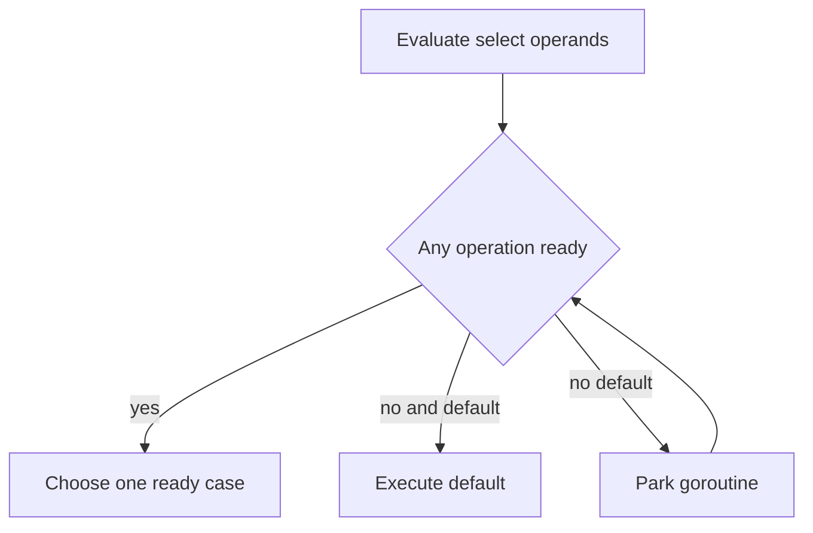

# Select: readiness, cancellation và fairness

## Bài toán và ví dụ đầu tiên

Một worker chờ job, nhưng còn phải dừng khi request hết hạn. Nếu chỉ `<-jobs`, nó không nhận biết cancellation. Nếu chỉ kiểm tra ctx.Err trước receive, cancellation vẫn có thể đến sau kiểm tra rồi worker mắc ở receive. Select mô tả việc chờ một trong nhiều channel operation có thể tiến triển ngay tại cùng điểm chờ.

## Đi từng bước qua một tình huống

```go
func Next(ctx context.Context, jobs <-chan int) (int, bool, error) {
    select {
    case <-ctx.Done():
        return 0, false, ctx.Err()
    case job, ok := <-jobs:
        return job, ok, nil
    }
}
```

### Giải thích code từng bước

Nếu chưa có job và ctx chưa bị hủy, goroutine chờ mà không chiếm CPU để polling. Khi jobs đóng, receive sẵn sàng và trả ok=false nếu đã hết dữ liệu. Khi Done đóng, nhánh cancellation sẵn sàng. Khi cả hai cùng sẵn sàng, một nhánh được chọn theo quy tắc giả ngẫu nhiên của select; đặt Done ở trên không cấp ưu tiên tuyệt đối.

Hàm trả riêng ok để caller phân biệt kết thúc stream với job có giá trị zero. Một vòng lặp gọi Next phải thoát khi ok=false; nếu cứ tiếp tục đọc channel đóng, receive luôn sẵn sàng và vòng lặp có thể ăn CPU. Có thể gán một channel đã drain thành nil để tắt nhánh đó khi vẫn còn các input khác cần xử lý.

## Hiểu cơ chế từ kết quả quan sát

Select đánh giá channel operand và giá trị cần gửi khi đi vào, trước khi biết case nào thắng. Vì vậy `case out <- expensive()` có thể gọi expensive ngay cả khi nhánh cancellation cuối cùng được chọn. Nếu công việc tính toán cần giới hạn tài nguyên, tách rõ bước tính và bước send, truyền context vào bước tính thay vì trông chờ select tự bỏ mọi công việc của nhánh không được chọn.

Default nghĩa là không chờ nếu hiện tại không có case nào sẵn sàng. Nó hữu ích cho try-send có chính sách drop được định nghĩa, nhưng đặt default rỗng trong for tạo busy loop. Busy loop là vòng quay không ngừng kiểm tra mà không chờ sự kiện hay làm công việc hữu ích; nó khiến CPU cao trong lúc hệ thống tưởng như nhàn.

Select không tạo một goroutine hoặc OS thread cho mỗi case. Runtime đăng ký các khả năng chờ phù hợp rồi đánh thức khi một operation có thể được chọn; implementation phải dọn trạng thái chờ của những nhánh không thắng. Chi tiết lock ordering của channel thuộc runtime, còn ứng dụng dựa vào semantics sẵn sàng và chỉ thực thi một case.

## Khái niệm và lý do tồn tại

Select chờ một trong các channel operations có thể tiến triển. Nó kết hợp data path với stop signal mà không cần một goroutine watcher cho mỗi receive.



### Cách đọc diagram

Select đánh giá operands trước, rồi xét operation nào ready. Nếu có, chọn một nhánh ready; nếu không có nhưng có default, chạy default ngay. Không có default thì park goroutine và chỉ trở lại khả năng lựa chọn khi có sự kiện. Vòng quay biểu diễn chờ/đánh thức, không phải CPU busy polling; busy loop xuất hiện khi code bên ngoài liên tục gọi select có default không làm việc hữu ích.

## Cơ chế bên trong

Các channel operands và send RHS được evaluate khi vào select, theo source order, kể cả case không được chọn. Khi nhiều cases ready, lựa chọn uniform pseudo-random theo spec; không có strict priority, deadline guarantee hoặc FIFO theo business importance. Default chỉ chạy khi không có communication ready. Nil channel case bị vô hiệu hóa; nếu tất cả nil và không default thì block mãi.

Runtime đăng ký waiters trên các channels, park G rồi dọn các registrations không thắng khi wake. Exact lock order/polling implementation phụ thuộc version. Closed receive luôn ready, nên cần xử lý `ok` hoặc set channel về nil sau khi drained. Send closed channel có thể được chọn và panic, không được “bảo vệ” chỉ bằng select.

## Ví dụ code

Function cần imports context và io; hoàn chỉnh trong package:

```go
func Next(ctx context.Context, jobs <-chan int) (int, error) {
    select {
    case msg, ok := <-jobs:
        if !ok { return 0, io.EOF }
        return msg, nil
    case <-ctx.Done():
        return 0, ctx.Err()
    }
}
```

### Giải thích code và kết quả

Một nhánh nhận job rồi kiểm tra ok để chuyển channel đã drain thành io.EOF; nhánh kia trả ctx.Err khi Done đóng. Khi không nhánh nào ready, goroutine chờ; khi cả hai ready, select không ưu tiên cancellation. Ví dụ này dùng EOF cho stream completion, khác variant trả bool ở đầu bài; caller phải chọn một contract nhất quán thay vì trộn hai kiểu kết quả.

Cancel có thể cùng ready với jobs nên thêm check ctx trước xử lý có thể giảm work thừa, nhưng vẫn không tạo atomic priority với external side effect. Invariant “không commit sau deadline” cần transaction/protocol tại boundary, không chỉ select. CPU work đã bắt đầu cần tự check cancel hoặc chia chunks.

## Áp dụng vào hệ thống thật

Worker loop nhận jobs hoặc exit theo service context. Outbound result send cũng cần ctx case khi consumer có thể ngừng đọc. Timeout dùng context.WithTimeout hoặc timer có owner; không tạo time.After vô hạn trong hot loop. Go 1.23+ cho phép GC thu hồi timer/ticker unreachable theo semantics/version settings, nhưng worker loop còn reachable vẫn cần exit/Stop rõ ràng.

## Những đường lỗi cần hiểu

Default làm busy loop; canceled ctx không có priority nên vẫn nhận một job; chỉ receive nghe cancel nhưng send result không nghe; closed source chiếm CPU; send RHS có expensive call dù case không chọn.

## Đánh đổi

| Pattern | Dùng khi | Chi phí |
|---|---|---|
| Blocking select | Chờ work/cancel | Phải có exit mọi case |
| Default | Try-send/drop có policy | Spin nếu loop thiếu chờ |
| Timer/deadline | Bound wait | Timer lifetime và budget |

## Những cách hiểu dễ sai

Case ở trên không được ưu tiên. Context không kill goroutine. Default không làm operations thành background tasks.

## Khi nên chọn cách khác

Không thêm default chỉ để tránh block nếu không có work có ích để làm. Không dùng select để thay admission control hoặc transaction ordering.

## Lần theo bằng chứng khi có sự cố

CPU profile tìm loop select-default; goroutine profile xác định send/receive không cancelable. Test khi jobs và Done cùng ready, assert acceptable outcomes chứ không yêu cầu scheduler chọn một case cố định. Kiểm tra timer churn và xử lý channel closed; test producer/consumer exit theo cả hai thứ tự.

## Thực hành, debugging và kết luận

Ở production, fan-in từ nhiều nguồn cần theo dõi nguồn đã đóng để tránh quay vòng trên nguồn đó. Một telemetry queue có thể try-send và đếm dropped events, nhưng payment job thường không được drop khi queue đầy. Cùng cú pháp select có thể đúng hay sai tùy contract dữ liệu.

Để kiểm chứng, tạo test riêng cho không có dữ liệu, dữ liệu sẵn, channel đóng, context đã hủy và cả hai cùng ready. Trong trường hợp cuối test phải chấp nhận các kết quả hợp lệ hoặc thêm giao thức ưu tiên ở tầng cao hơn; không viết test dựa vào một thứ tự ngẫu nhiên tình cờ. Đo số vòng lặp, CPU và completion rate khi nghi busy loop, rồi xem default có thực sự cần thiết không.


## Đọc tiếp

- [cancellation](../05-context/cancellation.md)
- [Channel internals và synchronization](channels.md)
- [pipeline](pipeline.md)

## Nguồn đối chiếu

- [Select specification](https://go.dev/ref/spec#Select_statements)
- [Timer semantics](https://pkg.go.dev/time)
