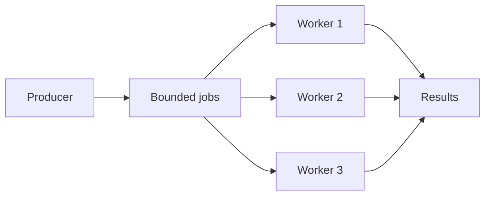

# Worker pool và bounded concurrency

## Bài toán và ví dụ đầu tiên

Một dịch vụ nhận 10000 ảnh cần resize. Tạo một goroutine cho mỗi ảnh làm code ngắn, nhưng mỗi goroutine có thể giữ ảnh đã decode hàng megabyte. Máy hết bộ nhớ trước khi CPU xử lý xong. Worker pool tách số job tồn tại khỏi số job được thực thi: một nhóm worker hữu hạn lấy job lần lượt từ một queue.

Bắt đầu với 4 worker và queue 8 job. Tối đa 4 job đang xử lý; thêm tối đa 8 job đang chờ trong queue. Producer phải đợi hoặc bị từ chối khi queue đầy. Nếu producer còn lưu toàn bộ ảnh trong slice trước khi enqueue thì tổng memory chưa được giới hạn bởi queue: phải xem cả nguồn dữ liệu và payload ownership.

## Đi từng bước qua một tình huống

Giả sử một job mất trung bình 50 ms và 4 worker không tranh tài nguyên nào khác. Capacity lý tưởng khoảng 4 / 0,05 = 80 job/s. Khi đầu vào 60 job/s, queue thường có thể ổn định; khi đầu vào 120 job/s kéo dài, backlog tăng khoảng 40 job/s cho đến khi hết chỗ. Đây chỉ là ước lượng để thấy quan hệ, không phải cam kết throughput vì DB, CPU và phân bố thời gian job còn ảnh hưởng.

Xem implementation chạy được tại [pool.go](../examples/pool.go). RunPool kiểm tra số worker, tạo child context, khởi chạy đúng số worker rồi chờ chúng kết thúc. Worker select giữa jobs và cancellation trước khi gọi callback. Lỗi đầu được giữ để trả về, đồng thời owner cancel nhóm. Callback phải dùng ctx; pool không thể cưỡng bức dừng callback đang treo trong API không hủy được.

Producer sở hữu đầu vào. Nếu producer gửi bằng một goroutine ngoài pool mà không quan sát cùng lifetime, RunPool return vẫn có thể để producer kẹt send. Vì vậy caller phải phối hợp producer cancellation và join ngoài việc quản lý worker. Pool không close input channel mà nó không sở hữu.

## Hiểu cơ chế từ kết quả quan sát

Có hai giới hạn khác nhau: concurrency là số job cùng thực thi, capacity queue là số job được nhận nhưng chưa thực thi. Semaphore chỉ giới hạn concurrency có thể vẫn để hàng triệu goroutine chờ slot nếu tạo chúng trước khi acquire. Fixed worker pool tránh vấn đề đó ở phía worker, nhưng queue trước pool và handler đang chờ enqueue vẫn cần trần riêng.

Backpressure là cơ chế truyền áp lực xử lý ngược về bên tạo việc. Trong ví dụ, queue đầy làm producer chậm lại. Ở HTTP boundary, có thể trả 429 hoặc 503 theo contract thay vì giữ connection vô hạn. Trong hệ thống batch, có thể đọc nguồn chậm hơn. Nếu phải chấp nhận mọi job qua restart, dùng queue bền vững và trạng thái retry thay vì chỉ channel trong memory.

Khi thứ tự quan trọng, hoàn thành song song làm kết quả có thể đảo thứ tự. Gắn sequence và reorder được, nhưng một job chậm có thể giữ nhiều kết quả sau nó trong buffer. Cần giới hạn phần reorder, xử lý job timeout và xác định nghiệp vụ cần thứ tự theo key hay toàn bộ stream.

## Khái niệm và lý do tồn tại

Worker pool bound số tasks thực thi cùng lúc. Queue có bound riêng; nếu producer nhanh hơn completion lâu dài thì phải block, reject, drop có policy hoặc chuyển sang durable queue.



### Cách đọc diagram

Producer đưa job vào một queue hữu hạn, ba workers cùng lấy work và gửi kết quả về owner phía Results. Các nhánh thể hiện concurrency bị chặn ở số workers, còn Jobs có capacity riêng. Diagram chưa tự cấp quyền close: producer/coordinator phải biết khi nào mọi sender dừng; Results cần consumer hoặc cancellation để workers không mắc send khi caller rời đi.

## Cơ chế bên trong

Acquire capacity trước khi launch giúp bound cả số goroutines, không chỉ số calls. CPU-bound workers bắt đầu quanh effective CPU capacity rồi benchmark; I/O-bound count dựa service time và downstream concurrency budget. Không chọn 1000 workers chỉ vì G rẻ. Queue delay là một phần deadline; expired job phải bị loại trước side effect.

Một coordinator sở hữu close jobs sau mọi producer xong. Workers không tự close channel chung. Shutdown chọn drain hoặc abort: drain dừng intake rồi hoàn tất queued/in-flight jobs trong budget; abort cancel, bỏ pending work có cơ chế replay và join workers. Context-aware send trên results ngăn leak khi caller không đọc nữa.

## Ví dụ code

Bản executable, cancellation-aware và tests nằm ở [examples/pool.go](../examples/pool.go). API `RunPool(ctx, workers, jobs, fn)` trả error; caller cấp input và function phải honor context. Pool cố định G, join trước return, cancel khi worker error. Không tạo G cho từng queued job.

```bash
cd golang/examples
go test -race -run 'TestPool' ./...
```

### Giải thích code và kết quả

Chuyển vào module examples rồi chạy các tests tên TestPool với race detector. Tests kiểm tra completion, lỗi/cancel và input workers, dùng signals để điều phối. Race detector chỉ quan sát paths đã chạy; pass không chứng minh callback tùy ý sẽ honor ctx. Đọc RunPool và producer contract cùng test để biết phần lifecycle nào caller còn sở hữu.

## Từ runtime đến production

10k events/s vào, 5k/s xử lý: backlog tăng 5k/s. Payload trung bình 2 KiB giữ thêm khoảng 9.8 MiB/s chưa tính overhead. Queue 10k entries đầy sau khoảng 2 s nếu bắt đầu rỗng; một job ở cuối có thể chờ khoảng 2 s tại service rate 5k/s. Tăng buffer không tạo thêm processing capacity. Autoscale chỉ hiệu quả nếu partition/downstream còn capacity.

## Những đường lỗi cần hiểu

Result consumer exit; worker không kiểm tra cancel trong DB/HTTP call; task panic bỏ join; queue payload outlier gây OOM dù số entries bounded; retries chiếm hết slots và starve fresh work.

## Đánh đổi

| Policy | Dùng khi | Chi phí |
|---|---|---|
| Block producer | Upstream chịu backpressure | Request waits |
| Reject | API cần latency bound | Caller xử lý 429/503 |
| Drop | Telemetry best effort | Mất dữ liệu có đo |
| Durable queue | Work phải recover | Broker/lag/duplicate complexity |

## Những cách hiểu dễ sai

N worker không bảo đảm N RPS; throughput phụ thuộc service time. Bounded queue count không bound bytes nếu payload vô hạn. Cancel không join tự động.

## Khi nên chọn cách khác

Không thêm pool khi synchronous call đã nằm trong admission boundary đủ tốt. Không dùng in-memory queue cho payment accepted nhưng cần sống qua process crash.

## Lần theo bằng chứng khi có sự cố

Đo arrival, accepted, rejected, completed, failed, retry rates; active workers, queue depth/oldest age và downstream latency. Group stacks khi workers chờ pool khác. Load-test overload và shutdown; verify no accepted durable job lost và G về steady state sau cancel. Capacity change phải xem DB max connections tổng across pods.

## Thực hành, debugging và kết luận

Chạy [pool_test.go](../examples/pool_test.go) để xem test dùng channel điều phối worker đã bắt đầu trước cancellation. Nó kiểm tra kết quả, lỗi, cancellation và số worker không hợp lệ. Test không dùng sleep để giả định worker đã chạy; điều đó giúp lỗi lifecycle tái hiện rõ hơn.

Production cần đo accepted, rejected, queued và completed jobs riêng. Queue depth thấp chưa chắc tốt nếu producer đã bị từ chối hàng loạt; queue depth cao có thể là burst ngắn hợp lệ nếu tuổi job vẫn dưới mục tiêu. Đo thêm queue age, thời gian xử lý và số worker đang bận. Khi downstream chậm, tăng worker có thể làm nó chậm hơn; giảm nhận việc và phục hồi dependency có thể là cách đưa completion rate lên lại.

CPU-bound work nên thử số worker gần quyền dùng CPU thực tế rồi benchmark. I/O-bound work có thể cần nhiều worker hơn, nhưng phải theo connection budget và khả năng dependency. Không dùng một con số chung cho parse CPU, upload network và transaction DB chỉ vì chúng cùng nằm trong một pipeline.


## Đọc tiếp

- [backpressure](../10-messaging/backpressure.md)
- [graceful-shutdown](../06-http-backend/graceful-shutdown.md)
- [README](../examples/README.md)

## Nguồn đối chiếu

- [Go pipelines](https://go.dev/blog/pipelines)
