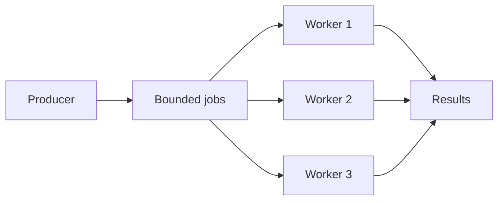

# Worker pool và bounded concurrency

**P0 · Must know**

## Concept, Why và Mental Model

Worker pool bound số tasks thực thi cùng lúc. Queue có bound riêng; nếu producer nhanh hơn completion lâu dài thì phải block, reject, drop có policy hoặc chuyển sang durable queue.



## How và Internals

Acquire capacity trước khi launch giúp bound cả số goroutines, không chỉ số calls. CPU-bound workers bắt đầu quanh effective CPU capacity rồi benchmark; I/O-bound count dựa service time và downstream concurrency budget. Không chọn 1000 workers chỉ vì G rẻ. Queue delay là một phần deadline; expired job phải bị loại trước side effect.

Một coordinator sở hữu close jobs sau mọi producer xong. Workers không tự close channel chung. Shutdown chọn drain hoặc abort: drain dừng intake rồi hoàn tất queued/in-flight jobs trong budget; abort cancel, bỏ pending work có cơ chế replay và join workers. Context-aware send trên results ngăn leak khi caller không đọc nữa.

## Code Example

Bản executable, cancellation-aware và tests nằm ở [examples/pool.go](../examples/pool.go). API `RunPool(ctx, workers, jobs, fn)` trả error; caller cấp input và function phải honor context. Pool cố định G, join trước return, cancel khi worker error. Không tạo G cho từng queued job.

```bash
cd golang/examples
go test -race -run 'TestPool' ./...
```

## Runtime behavior và Production Use Case

10k events/s vào, 5k/s xử lý: backlog tăng 5k/s. Payload trung bình 2 KiB giữ thêm khoảng 9.8 MiB/s chưa tính overhead. Queue 10k entries đầy sau khoảng 2 s nếu bắt đầu rỗng; một job ở cuối có thể chờ khoảng 2 s tại service rate 5k/s. Tăng buffer không tạo thêm processing capacity. Autoscale chỉ hiệu quả nếu partition/downstream còn capacity.

## Failure Scenarios

Result consumer exit; worker không kiểm tra cancel trong DB/HTTP call; task panic bỏ join; queue payload outlier gây OOM dù số entries bounded; retries chiếm hết slots và starve fresh work.

## Trade-offs

| Policy | Dùng khi | Chi phí |
|---|---|---|
| Block producer | Upstream chịu backpressure | Request waits |
| Reject | API cần latency bound | Caller xử lý 429/503 |
| Drop | Telemetry best effort | Mất dữ liệu có đo |
| Durable queue | Work phải recover | Broker/lag/duplicate complexity |

## Common Misconceptions

N worker không bảo đảm N RPS; throughput phụ thuộc service time. Bounded queue count không bound bytes nếu payload vô hạn. Cancel không join tự động.

## When NOT to use

Không thêm pool khi synchronous call đã nằm trong admission boundary đủ tốt. Không dùng in-memory queue cho payment accepted nhưng cần sống qua process crash.

## How I would debug this in production

Đo arrival, accepted, rejected, completed, failed, retry rates; active workers, queue depth/oldest age và downstream latency. Group stacks khi workers chờ pool khác. Load-test overload và shutdown; verify no accepted durable job lost và G về steady state sau cancel. Capacity change phải xem DB max connections tổng across pods.

## Key Takeaways

Bound execution, queue, payload size và lifetime. Định nghĩa overload cùng delivery guarantee trước chọn worker count.

## Interview Questions

### Basic / Mid — 10

1. What does a worker pool bound?
2. What does queue capacity bound?
3. Who closes the jobs channel?
4. How do workers report errors?
5. What is backpressure?
6. What is drain shutdown?
7. What is abort shutdown?
8. Why should sends observe context?
9. What is a CPU-bound workload?
10. What is an I/O-bound workload?

### Senior — 10

1. How do you choose worker count from downstream capacity?
2. Why can bounded active work still leave unbounded goroutines?
3. How does queue wait affect deadlines?
4. How would you bound payload memory?
5. How should one worker failure affect siblings?
6. How can retries starve fresh jobs?
7. How would you preserve ordering?
8. When is a durable broker necessary?
9. Why can autoscaling fail to reduce backlog?
10. How would you implement a join guarantee?

### Production scenarios — 5

1. What happens at 10k arrivals and 5k completions per second?
2. Why do workers leak after the results reader exits?
3. Why does doubling workers exhaust DB connections?
4. Why does a bounded queue still OOM?
5. How would you handle SIGTERM with a nonempty queue?

### Senior Follow-ups — 5

1. What work has been accepted?
2. Where is it durably recorded?
3. What limits concurrency?
4. What happens when that limit is reached?
5. How do you prove accepted work is completed or replayable?

Chuỗi follow-up: trả lời lần lượt 5 câu cuối; mỗi câu cần một invariant, bằng chứng runtime hoặc trade-off cụ thể.


## See also

- [backpressure](../10-messaging/backpressure.md)
- [graceful-shutdown](../06-http-backend/graceful-shutdown.md)
- [README](../examples/README.md)

## Nguồn đối chiếu

- [Go pipelines](https://go.dev/blog/pipelines)
