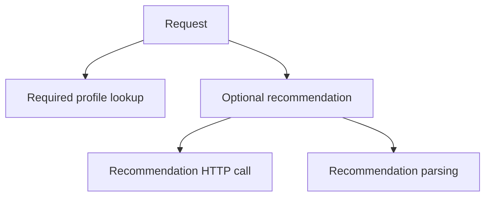

# Cancellation: từ tín hiệu dừng đến công việc thực sự kết thúc

## Bài toán: request đã hủy nhưng worker vẫn còn

Một handler tạo worker đọc các phần của báo cáo từ channel. Client đóng kết nối, context của request bị hủy, nhưng worker vẫn chờ ở dòng `item := <-items`. Không có item mới và producer cũng không đóng channel. Request đã kết thúc về mặt HTTP, còn goroutine vẫn tồn tại cùng bộ nhớ nó giữ.

Điểm thiếu nằm ở câu lệnh receive: nó chỉ quan tâm đến items, không quan tâm context. Truyền ctx vào một hàm không tự thay đổi hành vi của mọi blocking operation bên trong. Blocking nghĩa là lời gọi chưa thể tiến tiếp vì đang chờ một điều kiện; ở đây điều kiện là có dữ liệu hoặc channel đóng.

## Ví dụ đầu tiên: chờ một trong hai sự kiện

```go
func Receive(ctx context.Context, items <-chan int) (int, error) {
    select {
    case <-ctx.Done():
        return 0, ctx.Err()
    case item, ok := <-items:
        if !ok {
            return 0, io.EOF
        }
        return item, nil
    }
}
```

### Giải thích code từng bước

Hai case mô tả hai điều kiện cho phép hàm hoàn thành: cancellation hoặc một receive từ items. Nếu chưa điều kiện nào sẵn sàng, goroutine được park, nghĩa là runtime đưa nó vào trạng thái chờ và có thể dùng thread cho goroutine khác. Select này không tạo hai thread, không tạo một goroutine riêng cho mỗi case và không kiểm tra bằng một vòng quay tiêu thụ CPU.

Khi Done đóng, case đầu có thể thực hiện receive ngay; hàm trả lỗi cancellation. Khi items có giá trị, case sau nhận giá trị rồi return. Biến ok phân biệt dữ liệu thật có giá trị 0 với trạng thái channel đóng và đã hết dữ liệu. io.EOF ở đây là quy ước API của ví dụ: không còn item để đọc.

Nếu cả hai case cùng sẵn sàng, select chọn một case sẵn sàng theo cơ chế chọn giả ngẫu nhiên; nó không ưu tiên case viết đầu. Vì vậy sau khi cancel, hàm vẫn có thể nhận một item khi hai sự kiện đua nhau. Nếu nghiệp vụ cần ngăn một lần commit sau mốc nào đó, select không thay thế được kiểm tra trạng thái và đồng bộ ở đúng biên commit.

## Hủy và join là hai giai đoạn

```go
package main

import (
    "context"
    "fmt"
)

func main() {
    ctx, cancel := context.WithCancel(context.Background())
    items := make(chan int)
    finished := make(chan struct{})
    go func() {
        defer close(finished)
        for {
            select {
            case <-ctx.Done():
                return
            case _, ok := <-items:
                if !ok {
                    return
                }
            }
        }
    }()
    cancel()
    <-finished
    fmt.Println("all worker cleanup has completed")
}
```

### Giải thích code từng bước

Main là owner của worker: nó tạo context, khởi chạy worker, phát tín hiệu dừng rồi chờ finished. Worker không có producer trong ví dụ nên sẽ chờ ở select nếu chưa bị cancel. Sau cancel, nó có đường return ngay cả khi items không có dữ liệu. Defer đóng finished ở cuối vòng đời worker, giúp main biết worker đã thoát khỏi hàm.

Không đóng items để ép worker kết thúc vì trong hệ thống thật có thể còn producer gửi vào đó; đóng channel sai owner có thể làm producer panic. Finished chỉ do worker đóng và chỉ báo sự kết thúc của worker. Nếu worker có cleanup khác, đăng ký hoặc thực hiện cleanup trước khi đóng finished để thông báo hoàn tất phản ánh đúng việc cần chờ.

Thay `<-finished` bằng `time.Sleep(100*time.Millisecond)` sẽ chỉ trì hoãn main chứ không chứng minh worker đã xong. Máy chậm, CI bận hoặc cleanup mạng kéo dài đều phá giả định đó. Với nhiều worker, dùng WaitGroup: Add trước khi khởi chạy, Done ở đường thoát, Wait tại owner. Nó vẫn không tự gửi cancellation.

## Cây cancellation và ranh giới giữa các nhánh



### Cách đọc diagram

R tạo hai nhánh A và B. Mũi tên là quan hệ parent–child, không phải trình tự chạy. Cancel R lan đến tất cả node. Cancel B chỉ lan đến C và D: profile lookup A có thể vẫn cần hoàn thành để trả trang không có recommendation. Nếu sản phẩm yêu cầu mọi kết quả hoặc không kết quả nào, owner có thể chủ động cancel parent chung khi một nhánh bắt buộc lỗi; đó là quyết định của ứng dụng, không phải tác dụng tự động của cancel child.

## CPU loop cũng phải hợp tác

Một goroutine tính checksum trên một danh sách rất dài không chờ channel hay network. Context không buộc vòng lặp đó return. Runtime có thể preempt goroutine, tức tạm lấy quyền chạy để goroutine khác có cơ hội, nhưng sau đó vòng lặp vẫn tiếp tục công việc cũ. Preemption giải quyết việc chia CPU; cancellation giải quyết yêu cầu dừng công việc.

```go
func Sum(ctx context.Context, values []int) (int, error) {
    total := 0
    for i, value := range values {
        if i%1024 == 0 {
            if err := ctx.Err(); err != nil {
                return 0, err
            }
        }
        total += value
    }
    if err := ctx.Err(); err != nil {
        return 0, err
    }
    return total, nil
}
```

### Giải thích code từng bước

Mỗi 1024 phần tử, hàm kiểm tra cancellation. Con số này minh họa cách chia công việc thành chunk, không phải cấu hình dùng được cho mọi phép tính. Chunk lớn giảm số lần kiểm tra nhưng tăng độ trễ phản ứng; nếu một phần tử mất nhiều giây thì kiểm tra mỗi 1024 phần tử là quá thưa. Kiểm tra cuối còn bắt trường hợp đầu vào rỗng hoặc cancellation đến trong chunk cuối. Kết quả cộng dùng int và có giới hạn số học của int; ví dụ không dùng để tính tiền.

Vẫn tồn tại khoảng đua giữa kiểm tra cuối và return. Không có cam kết tuyệt đối “không bao giờ trả thành công sau thời điểm cancel”. Muốn điều phối một trạng thái nghiệp vụ dùng state machine, transaction hoặc lock thích hợp; kiểm tra Err chỉ là quan sát tín hiệu tại thời điểm gọi.

## Truyền xuống HTTP, database và gRPC

HTTP outbound phải tạo request với `http.NewRequestWithContext`. database/sql có các API như QueryContext, ExecContext và BeginTx; driver phải hỗ trợ hành vi cancellation cần dùng. Một thư viện nhận ctx nhưng bỏ qua nó không có tính hợp tác chỉ nhờ chữ ký hàm. Với gRPC, context của RPC cần được truyền xuống các lời gọi phụ và tác vụ trong handler; deadline không tự chấm dứt đoạn tính toán tùy ý.

Đối với send kết quả, cũng phải có đường dừng. Worker đã chọn được một item vẫn có thể kẹt ở `results <- result` khi người nhận rời đi. Cả đầu vào, xử lý lẫn đầu ra cần có quyết định lifetime. Với dữ liệu bắt buộc phải lưu, chuyển sang lưu bền rồi xác nhận; không dùng cancellation để âm thầm bỏ một tác vụ đã nhận trách nhiệm xử lý.

## Production: không suy luận rollback từ timeout

Giả sử payment service gửi charge, ngân hàng ghi thành công nhưng response bị mất. Client hết deadline và cancel. Cancel giúp giải phóng việc chờ ở client, không đi ngược thời gian để hoàn tác giao dịch ngân hàng. Trạng thái đúng lúc này có thể là unknown outcome: chưa biết kết quả từ góc nhìn caller.

Caller lưu operation ID trước khi gửi, retry với cùng idempotency key nếu đối tác hỗ trợ, hoặc query trạng thái theo reference rồi reconciliation — đối chiếu và sửa trạng thái hai bên. Tự tạo key mới sau mỗi timeout sẽ biến một yêu cầu thành nhiều lần charge. Đây là lý do cancellation và tính đúng của thao tác phân tán cần được thiết kế cùng nhau.

## Debugging theo thứ tự

Trước hết chứng minh context đã bị hủy: ghi deadline, thời điểm nhận Done và nhóm lỗi, tránh log token hay toàn bộ payload. Tiếp theo chứng minh worker có quan sát: nhìn stack nơi nó đang chờ; plain receive, send hoặc API không có context thường là điểm đứt. Sau đó kiểm tra owner có chờ hay không: một handler return sớm không đảm bảo goroutine con đã return.

Trong test, điều phối bằng channel báo worker đã bắt đầu, gọi cancel rồi đợi finished với một timeout bảo vệ test. Timeout trong test chỉ ngăn test treo vô hạn, không phải cơ chế đồng bộ để test “có vẻ chạy đúng”. Kiểm tra thêm cancel trước khi worker chạy, channel đóng trước cancellation và đường xử lý lỗi. Cuối cùng kiểm tra remote state nếu công việc có side effect.

## Trade-off và thực hành tốt

Cancellation sớm giảm lãng phí nhưng cleanup và commit có thể cần một phạm vi thời gian riêng. Khi shutdown, có thể ngừng nhận việc mới rồi dành một deadline hữu hạn để hoàn thành việc đã nhận. Không tách khỏi parent bằng Background một cách vô thức: hãy đặt owner rõ, thời hạn rõ và cơ chế chờ rõ.

`WithCancelCause` hữu ích khi cần giữ nguyên nhân chi tiết; `Err` vẫn phục vụ phân loại cancellation cơ bản, còn `context.Cause` cho phép đọc cause đã ghi. Cause không thay thế log nghiệp vụ hay bằng chứng durable về commit. Lời giải đúng phải đồng thời trả lời được ai phát tín hiệu, nơi nào quan sát, ai chờ kết thúc và ai đối soát tác dụng đã xảy ra.

## Đọc tiếp

- [Context: cây lifetime và cooperative cancellation](context-basics.md)
- [Goroutine leaks: blocked work còn giữ tài nguyên](../04-concurrency/goroutine-leak.md)
- [graceful-shutdown](../06-http-backend/graceful-shutdown.md)

## Nguồn đối chiếu

- [Tài liệu chính thức](https://pkg.go.dev/context)
