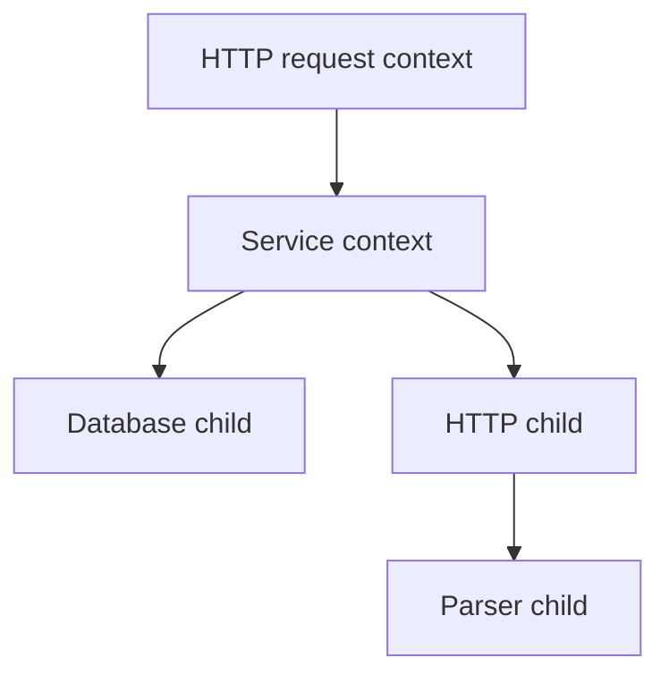

# Context: truyền thời hạn và tín hiệu dừng qua một request

## Bài toán bắt đầu từ một người dùng rời trang

Một request lấy báo cáo đi qua HTTP handler, service tính báo cáo, truy vấn PostgreSQL rồi gọi dịch vụ tỷ giá. Sau 100 ms, người dùng đóng tab. Nếu các tầng vẫn tiếp tục làm việc trong 20 giây, kết quả cuối cùng không còn người nhận, nhưng database connection, bộ nhớ và CPU vẫn bị chiếm. Khi hàng nghìn request cùng bỏ cuộc, phần việc thừa này có thể làm chậm cả những người dùng còn đang chờ.

Ta cần truyền một thông điệp xuyên suốt chuỗi gọi: “công việc thuộc request này không còn cần thiết” hoặc “ngân sách thời gian của nó đã hết”. `context.Context` là giao diện chuẩn để mang tín hiệu đó. Nó còn mang deadline — thời điểm phải ngừng chờ — và một số thông tin gắn với request, như trace ID. Context không chứa code để cưỡng bức dừng bất kỳ hàm nào.

## Bắt đầu bằng Background, WithCancel, Done và Err

`context.Background()` tạo context gốc không có thời hạn và không tự bị hủy. Đây là điểm xuất phát phù hợp ở `main` khi chương trình chưa có parent lifetime. `context.TODO()` cũng không tự bị hủy; tên của nó diễn đạt rằng người viết chưa xác định context đúng để truyền vào. Trong handler đã có `r.Context()`, thay nó bằng TODO sẽ làm mất thông tin của request.

`context.WithCancel(parent)` tạo một context con cùng hàm `cancel`. Người tạo child giữ quyền gọi cancel; người thực hiện công việc nhận child. `ctx.Done()` trả về channel dùng để báo hủy. Với context có khả năng hủy, channel này được đóng khi việc hủy có hiệu lực. Đóng channel cho phép nhiều goroutine cùng nhận được một tín hiệu mà không cần gửi từng message. `ctx.Err()` trả về nil trước khi hủy, rồi trả về lỗi mô tả nhóm nguyên nhân hủy.

```go
package main

import (
    "context"
    "fmt"
)

func main() {
    ctx, cancel := context.WithCancel(context.Background())
    finished := make(chan struct{})
    go func() {
        defer close(finished)
        <-ctx.Done()
        fmt.Println(ctx.Err())
    }()
    cancel()
    <-finished
    fmt.Println("worker finished")
}
```

### Giải thích code từng bước

`WithCancel` chưa khởi chạy công việc của ứng dụng. `go func()` mới tạo goroutine thực hiện phần việc độc lập. Nếu goroutine chạy trước cancel, nó dừng chờ ở `<-ctx.Done()`. Nếu cancel xảy ra trước, channel đã đóng nên receive trả về ngay khi goroutine được chạy. Không cần `Sleep` để đoán thứ tự hai bên.

`cancel()` phát tín hiệu nhưng không đợi dòng `fmt.Println` bên trong hoàn thành. Vì vậy main chờ thêm `<-finished`. Worker đóng finished bằng defer khi hàm sắp return; main chỉ in dòng cuối sau điểm đó. Đây là sự khác nhau giữa cancellation và join: cancellation yêu cầu dừng, còn join là chờ công việc đã kết thúc. Một chương trình quản lý worker thường cần cả hai.

`ctx.Err()` trong ví dụ là `context.Canceled`. Nếu dùng một deadline thực sự hết hạn, lỗi thường là `context.DeadlineExceeded`. Chỉ riêng hai giá trị này không giải thích mọi lỗi nghiệp vụ: thanh toán bị từ chối là lỗi nghiệp vụ, không phải mặc nhiên là context bị hủy.

## Mental model: một cây phạm vi công việc

Một request có thể tạo hai công việc con, ví dụ lấy hồ sơ và tính giá. Mỗi child có thể có thời hạn riêng ngắn hơn request. Hủy request làm cả hai công việc mất lý do tiếp tục; hủy riêng việc tính giá không có nghĩa hồ sơ cũng phải bị hủy.



### Cách đọc diagram

Đọc từ trên xuống: request là parent của service; service là parent chung của database và HTTP call. Các mũi tên chỉ quan hệ tạo context con, cũng là chiều lan truyền hủy. Nếu R bị hủy, S, D, H và P đều nhận hủy. Nếu chỉ H bị hủy, P bị hủy theo nhưng D và S không tự bị hủy. Diagram không nói rằng từng node là một goroutine; một goroutine có thể lần lượt dùng nhiều context, và nhiều goroutine có thể cùng dùng một context.

## Cơ chế: cooperative cancellation

“Cooperative” nghĩa là bên làm việc phải hợp tác quan sát tín hiệu. Context không thể tự chen một lệnh return vào hàm của bạn. Một hàm đang chờ channel thường dùng select để chờ cả dữ liệu và Done. Một vòng tính toán dài phải kiểm tra Err ở những điểm phù hợp. Một HTTP client phải nhận context qua request để thư viện biết lúc nào nên ngừng chờ I/O.

Khi goroutine chờ receive trên channel, runtime có thể park nó: lưu trạng thái chờ và ngừng cấp CPU cho nó cho đến khi có sự kiện phù hợp. Đây không phải một vòng lặp liên tục đọc trạng thái. Vì thế chờ `<-ctx.Done()` không đốt CPU trong lúc chưa có cancellation. Ngược lại, vòng `for` có `select default` mà không thực hiện công việc hay nghỉ có thể quay liên tục.

Bên trong standard library có các implementation context khác nhau: context gốc, context chứa value, context có cancellation và context có deadline. Chúng có thể liên kết để truyền cancellation và giải phóng đăng ký/timer khi cancel được gọi. Không nên suy ra “mỗi context tạo một goroutine”: đó không phải hợp đồng của API. Phần chi tiết cấu trúc thuộc phiên bản Go, còn code ứng dụng dựa vào Done, Err, Deadline và Value.

## Thêm timeout sau khi đã hiểu cancellation

`WithTimeout(parent, d)` tạo thời hạn tương đối từ lúc gọi; `WithDeadline(parent, t)` nhận thời điểm cụ thể. Child không thể kéo dài quyền thực thi vượt deadline sớm hơn của parent. Nếu request còn 80 ms nhưng repository xin timeout 500 ms, việc chờ vẫn bị giới hạn bởi request còn 80 ms.

```go
func CountUsers(ctx context.Context, db *sql.DB) (int, error) {
    queryCtx, cancel := context.WithTimeout(ctx, 200*time.Millisecond)
    defer cancel()
    var count int
    err := db.QueryRowContext(queryCtx, "SELECT count(*) FROM users").Scan(&count)
    if err != nil {
        return 0, fmt.Errorf("count users: %w", err)
    }
    return count, nil
}
```

### Giải thích code từng bước

Hàm nhận context ở tham số đầu để caller quyết định lifetime. Dòng WithTimeout đặt trần chờ cho riêng truy vấn; 200 ms là con số minh họa, cần chọn theo latency thực tế và ngân sách request. `defer cancel()` đảm bảo tài nguyên gắn với child được thu hồi sớm cả khi truy vấn trả kết quả trước deadline. Cancel sau thành công không biến kết quả đã trả thành thất bại.

`QueryRowContext` truyền context cho lớp database/sql và driver; lỗi của truy vấn có thể xuất hiện lúc Scan. `%w` giữ error chain để tầng trên còn phân loại bằng `errors.Is` hoặc `errors.As`. Khả năng dừng truy vấn ở server còn phụ thuộc driver và database. Với một lệnh ghi, việc client nhận timeout không chứng minh server chưa commit.

## Context trong production

Handler bắt đầu từ `r.Context()`, rồi truyền cùng lifetime vào service, repository và các outbound call. Context đi qua lời gọi Go trong cùng process; qua mạng, protocol hoặc thư viện phải truyền deadline/cancellation thích hợp. Một HTTP header tùy ý không tự biến thành context ở dịch vụ nhận. gRPC có hỗ trợ deadline, nhưng handler phía server vẫn phải truyền context xuống công việc của mình.

Nếu người dùng yêu cầu tạo báo cáo chạy nhiều phút, lifetime của báo cáo có thể dài hơn HTTP response. Hãy ghi job bền vững, trả job ID, rồi để worker có service/job context riêng xử lý. Chỉ thay `r.Context()` bằng Background trong một goroutine không tạo độ bền: process chết thì công việc và trạng thái có thể mất.

## Failure, debugging và trade-off

Khi client đã rời đi mà DB vẫn có nhiều truy vấn, theo dấu request từ handler đến repository. Kiểm tra nơi tạo context mới, deadline còn lại khi bắt đầu query và API có thực sự dùng biến ctx đó không. Sau đó so sánh thời điểm Done đóng với thời điểm worker kết thúc. Nếu worker vẫn còn, goroutine profile cho biết nó đang mắc ở receive, send, lock hay syscall. Profile là ảnh chụp stack tại một thời điểm; lấy thêm mẫu sau cancellation giúp biết trạng thái có đang tiến triển.

Đừng xử lý mọi timeout bằng cách tăng timeout. Thời hạn dài hơn giữ tài nguyên lâu hơn và có thể tăng hàng đợi. Thời hạn quá ngắn lại khiến công việc có ích bị bỏ dở, làm client retry nhiều hơn. Chọn ngân sách dựa trên mục tiêu latency, đo từng dependency và dành thời gian trả response hoặc cleanup.

Không để transaction outcome bị suy luận từ context một cách đơn giản. Nếu server đã ghi tiền nhưng response bị mất, retry cần cùng idempotency key — mã nhận diện cùng một thao tác nghiệp vụ — để không tạo một lần ghi tiền thứ hai. Context giải quyết lifetime cục bộ; dữ liệu bền vững mới giúp đối soát kết quả từ xa.

## Tổng kết

Hãy hình dung context như thông tin về quyền tiếp tục làm việc: ai sở hữu công việc, nó còn bao lâu, và lúc nào nên dừng. Người tạo child chịu trách nhiệm gọi cancel; worker chịu trách nhiệm quan sát; người quản lý goroutine chịu trách nhiệm chờ kết thúc. Ba trách nhiệm đó phải hiện diện trong code nếu muốn request thực sự trả lại tài nguyên sau khi bỏ cuộc.

## Đọc tiếp

- [cancellation](cancellation.md)
- [production-patterns](production-patterns.md)
- [http-client](../06-http-backend/http-client.md)
- [database-sql](../08-database/database-sql.md)

## Nguồn đối chiếu

- [Context package](https://pkg.go.dev/context)
