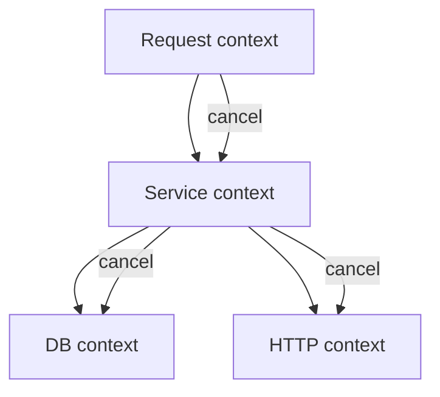

# Context: cây lifetime và cooperative cancellation

**P0 · Must know**

## Concept, Why và Mental Model

Context mang cancellation, deadline và request-scoped values qua API boundaries. Nó không là dependency container và không kill goroutine. Parent hết lifetime thì công việc con không nên tiếp tục dùng tài nguyên vô hạn.



## How và Internals

Background là empty root đã biết mục đích; TODO là root API chính thức khi chưa xác định propagation, không dùng trong request path đã rõ. Với Background/TODO, Done là nil, Err là nil, không deadline. WithCancel tạo child và cancel function; WithTimeout/WithDeadline thêm thời hạn nhưng child không vượt parent deadline. WithValue tạo derived context chứa key/value, không thêm timeout.

Done đóng khi canceled/deadline; Err trả Canceled hoặc DeadlineExceeded sau đó. Cancel idempotent; cancel child không cancel parent/sibling. Context methods an toàn concurrent; values chứa mutable map/pointer không tự an toàn. Implementation có cancellation tree/timer registration tùy concrete parent; không phải mỗi node có một watcher goroutine.

## Code Example

Function cần imports context, database/sql, fmt và time:

```go
func CountUsers(ctx context.Context, db *sql.DB) (int, error) {
    qctx, cancel := context.WithTimeout(ctx, 200*time.Millisecond)
    defer cancel()
    var n int
    if err := db.QueryRowContext(qctx, "SELECT count(*) FROM users").Scan(&n); err != nil {
        return 0, fmt.Errorf("count users: %w", err)
    }
    return n, nil
}
```

Timeout minh họa, phải đo query/budget thực. Driver quyết định cancellation thực thi query; return context error không chứng minh remote side effect chưa commit. HTTP outbound tạo NewRequestWithContext và dùng shared client.

## Runtime behavior và Production Use Case

Handler dùng r.Context; service nhận ctx ở argument đầu. Tạo child timeout cho từng dependency trong total budget, gọi cancel ngay khi xong để release registrations/timer sớm. Background durable job dùng service/job context riêng sau khi work đã ghi bền, không vô tình giữ request context đã canceled.

## Failure Scenarios

Thay ctx bằng Background trong repository làm query sống qua request; defer cancel trong loop giữ resources quá lâu; lưu secret/DB vào context values; stop signal không được join; HTTP request canceled nhưng remote transaction vẫn có thể hoàn tất.

## Trade-offs

| Context use | Lợi ích | Giới hạn |
|---|---|---|
| Parent propagation | Lifetime thống nhất | Child phải honor signal |
| Child deadline | Bound dependency wait | Deadline quá ngắn tăng retries |
| Values | Trace/auth metadata | Hidden API nếu dùng cho dependency |

## Common Misconceptions

Cancel không rollback mọi side effect và không đợi children. Err không lưu mọi business cause; Cause APIs có vai trò riêng. Truyền ctx không đủ nếu library không dùng nó.

## When NOT to use

Không truyền nil context. Không dùng values cho optional function parameters hoặc constructor dependencies. Không dùng request context để chạy background work cần sống sau response mà chưa có ownership/durability mới.

## How I would debug this in production

Trace deadline còn lại qua handler/service/DB/HTTP. Tìm Background/TODO ở request path, timeouts bị reset và operations không dùng Context API. Thu goroutine profile sau cancel rồi verify join. Phân biệt client disconnect, deadline budget và dependency failure trong metrics; kiểm tra remote outcome trước retry mutation.

## Key Takeaways

Context truyền lifetime; implementation phải cooperate, owner phải cancel và join, side effects cần idempotency.

## Interview Questions

### Basic / Mid — 10

1. What is a Context?
2. What is Background for?
3. What is TODO for?
4. What does WithCancel return?
5. What does WithTimeout add?
6. What does WithDeadline specify?
7. What does WithValue carry?
8. When does Done close?
9. What does Err return?
10. Does child cancellation cancel the parent?

### Senior — 10

1. Why is cancellation cooperative?
2. How does a child deadline relate to its parent?
3. Does every context allocate a goroutine?
4. Why should cancel be called after successful completion?
5. Why should context be the first argument?
6. Why are mutable context values not automatically safe?
7. How should database calls receive context?
8. How should outbound HTTP inherit context?
9. Does cancellation prove a mutation did not commit?
10. How do request and background job contexts differ?

### Production scenarios — 5

1. Why is a query running after the client disconnects?
2. Why are timers retained after fast calls?
3. Why do background jobs immediately fail after response?
4. Why does a canceled payment get charged twice on retry?
5. Why do child goroutines remain after Done closes?

### Senior Follow-ups — 5

1. Who owns the parent lifetime?
2. What is the remaining budget?
3. Which child operation can block?
4. How does it observe cancellation?
5. Who joins it and reconciles ambiguous side effects?

Chuỗi follow-up: trả lời lần lượt 5 câu cuối; mỗi câu cần một invariant, bằng chứng runtime hoặc trade-off cụ thể.


## See also

- [cancellation](cancellation.md)
- [production-patterns](production-patterns.md)
- [http-client](../06-http-backend/http-client.md)
- [database-sql](../08-database/database-sql.md)

## Nguồn đối chiếu

- [Context package](https://pkg.go.dev/context)
