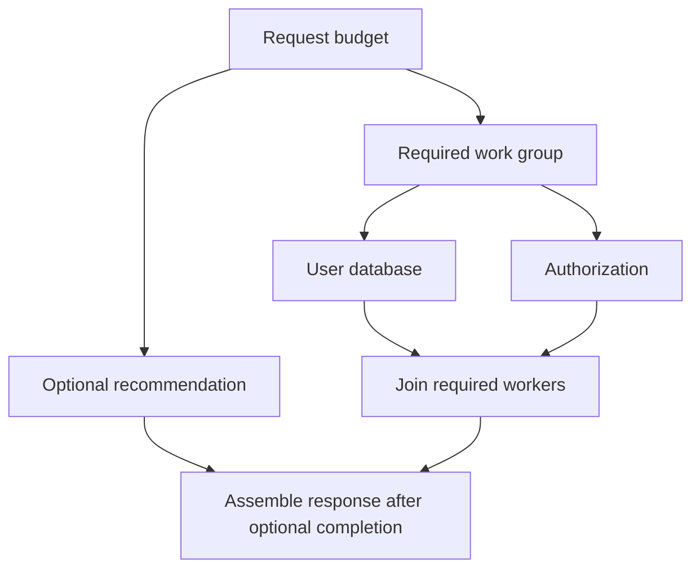

# Context trong production: request, fan-out và shutdown

## Bài toán: nhiều dependency có giá trị khác nhau

Endpoint hồ sơ gọi user database, dịch vụ quyền truy cập và recommendation. Nếu quyền truy cập thất bại, không thể trả dữ liệu. Nếu recommendation thất bại, sản phẩm cho phép trả hồ sơ thiếu gợi ý. Tạo cùng một cơ chế fail-fast cho mọi dependency sẽ biến một lỗi tùy chọn thành outage của cả endpoint.

Fail-fast nghĩa là khi một công việc bắt buộc thất bại, owner yêu cầu các công việc còn lại dừng để không tiêu tốn tài nguyên vô ích. Best-effort nghĩa là vẫn giữ những kết quả có ích khác và biểu diễn rõ phần thiếu. Context hỗ trợ phát tín hiệu trong cả hai chính sách; ứng dụng quyết định chính sách nào đúng.

## Ví dụ thiết kế lifetime trước khi viết goroutine

Request có deadline tổng 700 ms. Hai dependency bắt buộc dùng child chung để một lỗi có thể làm owner cancel cả nhóm. Recommendation có child riêng 100 ms và lỗi của nó được ghi nhận thành kết quả thiếu. Mọi goroutine vẫn phải báo hoàn tất cho owner trước khi owner giải phóng tài nguyên mà chúng dùng. Không để handler return trong khi goroutine còn ghi ResponseWriter.

### Cách đọc diagram

R là lifetime chung. M quản lý nhóm bắt buộc U và A; khi owner cancel M, cả hai nhận tín hiệu. O là nhánh tùy chọn nên lỗi của nó không tự cancel M. Các mũi tên vào J biểu diễn việc chờ worker kết thúc, không chỉ nhận lỗi đầu tiên. F chỉ assemble sau khi các producer kết quả đã dừng ghi để tránh race trên dữ liệu response.

## Cancellation phải đi cùng giới hạn concurrency

Nếu mỗi request tạo 100 goroutine gọi một downstream thì 1000 request có thể tạo 100000 lời gọi cùng lúc. Context giới hạn tuổi thọ của chúng nhưng không giới hạn số lượng. Semaphore hoặc worker pool đặt trần công việc đang chạy; phần chờ lấy slot cũng phải quan sát ctx để người dùng đã rời đi không giữ chỗ trong hàng đợi mãi.

Khi hàng đợi đầy, backpressure là cơ chế làm tốc độ nhận việc phản ánh khả năng xử lý: chờ có giới hạn, từ chối sớm hoặc giảm tốc producer. Không dùng một slice không giới hạn để “tạm giữ” mọi request vì nó chuyển lỗi quá tải thành memory growth và latency rất cao.

## Shutdown có một owner khác request

Khi nhận SIGTERM, server ngừng nhận việc mới rồi cho request đang chạy một khoảng drain hữu hạn. Context dùng cho drain nên được tạo từ root còn sống với deadline riêng; truyền context đã bị signal cancel vào Shutdown có thể khiến thời gian chờ kết thúc ngay. Đến hạn, owner yêu cầu đóng hoặc hủy phần còn lại và join các worker do ứng dụng quản lý.

HTTP Server.Shutdown không tự quản lý mọi goroutine tùy ý, consumer Kafka hay WebSocket đã hijack. Chương trình phải có registry hoặc owner cho các loại công việc đó. Đóng DB trước khi worker kết thúc có thể làm cleanup và transaction đang chạy thất bại không cần thiết.

## Production failure và debugging

Giả sử tỷ lệ timeout tăng khi recommendation chậm. Trace cho thấy hồ sơ và authorization xong trong 50 ms nhưng endpoint chờ recommendation tới 700 ms. Một child cap đúng giúp giới hạn phần tùy chọn, nhưng cần xác nhận recommendation goroutine cũng thoát sau 100 ms thay vì chỉ handler ngừng chờ nó.

Giả sử deploy mất nhiều phút vì drain không xong. Quan sát số request đang hoạt động, worker đang xử lý, queue depth và goroutine stack. Tìm công việc nào có lifetime tách khỏi service context hoặc đang ở API không hủy được. Log mốc stop-accepting, cancel và join-complete để biết kẹt ở giai đoạn nào.

## Trade-off và tổng kết

Trả kết quả một phần cải thiện availability nhưng API phải cho client biết dữ liệu nào thiếu hoặc cũ. Fail-fast giảm lãng phí khi kết quả toàn phần không còn khả thi, nhưng không thích hợp khi vẫn phải hoàn thành một side effect đã nhận trách nhiệm. Chọn lifetime theo ý nghĩa công việc rồi mới chọn context tree, giới hạn concurrency và cơ chế join tương ứng.

## Đọc tiếp

- [Context: cây lifetime và cooperative cancellation](context-basics.md)
- [Goroutine leaks: blocked work còn giữ tài nguyên](../04-concurrency/goroutine-leak.md)
- [graceful-shutdown](../06-http-backend/graceful-shutdown.md)

## Nguồn đối chiếu

- [Tài liệu chính thức](https://pkg.go.dev/context)
