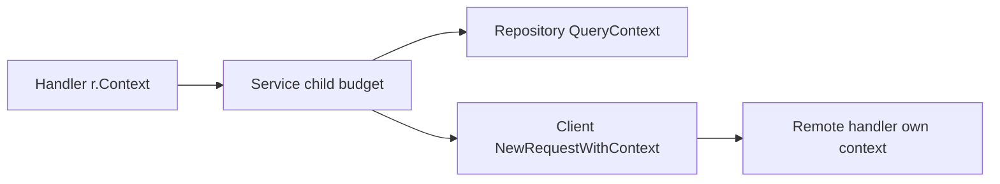

# Propagation: giữ nguyên lifetime qua các tầng ứng dụng

## Bài toán

Một handler nhận request rồi gọi service, repository và HTTP client. Cả bốn tầng đều có tham số ctx, nhưng repository gọi QueryContext với Background. Khi client ngắt kết nối, handler có thể return trong khi query vẫn chạy. Kiểu dữ liệu của chữ ký đúng, nhưng chuỗi lifetime đã bị cắt ở một dòng code.

Propagation nghĩa là truyền context từ người gọi xuống công việc thuộc về người gọi đó. Không nhất thiết phải truyền đúng một object ở mọi nơi: service có thể tạo child deadline ngắn hơn. Điều cần giữ là quan hệ parent–child và thông tin request mà tầng dưới thực sự cần.

## Ví dụ đi từ handler xuống repository

```go
package propagation

import (
    "context"
    "database/sql"
    "fmt"
    "net/http"
)

type Service struct { DB *sql.DB }

func (s *Service) Count(ctx context.Context) (int, error) {
    var n int
    err := s.DB.QueryRowContext(ctx, "SELECT count(*) FROM users").Scan(&n)
    return n, err
}

func (s *Service) ServeHTTP(w http.ResponseWriter, r *http.Request) {
    n, err := s.Count(r.Context())
    if err != nil {
        http.Error(w, "request failed", http.StatusInternalServerError)
        return
    }
    fmt.Fprintln(w, n)
}
```

### Giải thích code từng bước

DB được inject qua struct vì nó là dependency dùng chung lâu dài. Context được truyền theo từng lời gọi Count vì mỗi request có lifetime riêng. Handler lấy r.Context rồi truyền thẳng; Count dùng chính ctx với QueryRowContext. Không tạo context gốc mới và không lưu request context vào Service để request sau vô tình dùng lại.

Ví dụ rút gọn mọi lỗi thành 500 để tập trung vào propagation. Server thật cần phân loại lỗi, log đã khử dữ liệu nhạy cảm và không cố ghi response nếu client đã đi. Driver quyết định khả năng hủy query đang chạy; việc truyền ctx là điều kiện cần chứ không phải chứng minh server DB đã dừng.

## Một đường đi liên tục



### Cách đọc diagram

H tạo điểm bắt đầu từ request đến. S có thể thu hẹp deadline rồi truyền cho D và C. Mũi tên từ C sang R đi qua mạng: đây là biên protocol, không phải một con trỏ context được truyền sang process khác. HTTP disconnect hoặc gRPC deadline có cơ chế riêng; remote handler có context của nó và phải truyền tiếp xuống dependency phía remote.

## Goroutine con và công việc nền

Một goroutine gửi log đồng bộ với request có thể dùng request context nếu khi request hết thì log đó được phép bỏ. Một job xuất dữ liệu đã được người dùng chấp nhận cần có ownership bền vững khác: lưu job, trả ID, worker nhận lại rồi dùng job/service context. Nếu chỉ `go work(context.Background())`, process crash có thể làm mất job và không có trạng thái để retry.

Cũng không nên giữ toàn bộ request bằng closure lâu dài. Closure có thể giữ body, user metadata hoặc buffer; context values có thể giữ thêm object lớn. Dữ liệu cần cho job nên được chọn rõ và lưu đúng phạm vi thay vì mang theo mọi thứ có trong request.

## Debugging và trade-off trong production

Khi query sống lâu hơn request, đo ba mốc: request bị hủy, repository nhận biết hủy, query kết thúc ở DB. Mốc đầu và cuối cách xa nhau có thể do code bỏ ctx, driver không hỗ trợ, truy vấn không dễ ngắt hoặc server hoàn tất trước khi nhận tín hiệu. Kiểm tra source path trước khi kết luận lỗi runtime.

Context thuận tiện vì API có hình thức thống nhất, nhưng không phải container để truyền mọi dependency. Business input như tenant ID bắt buộc cho truy vấn nên hiện rõ trong tham số hoặc kiểu request đã xác thực. Metadata như trace ID có thể nằm trong values nếu package định nghĩa accessor và key riêng. Điều này giúp test biết thiếu thông tin nào và tránh runtime type assertion rải rác.

## Tổng kết

Propagation tốt là một chuỗi trách nhiệm liên tục từ owner đến thao tác cuối. Chỉ tách khỏi chuỗi khi công việc có owner mới, thời hạn mới và cách lưu hoặc chờ hoàn tất rõ ràng.

## Đọc tiếp

- [Context: cây lifetime và cooperative cancellation](context-basics.md)
- [Goroutine leaks: blocked work còn giữ tài nguyên](../04-concurrency/goroutine-leak.md)
- [graceful-shutdown](../06-http-backend/graceful-shutdown.md)

## Nguồn đối chiếu

- [Tài liệu chính thức](https://pkg.go.dev/context)
