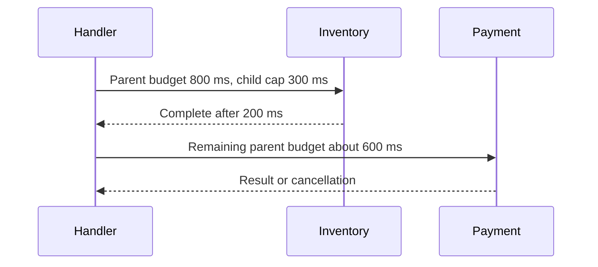

# Timeout và deadline: chia ngân sách thời gian của một request

## Bài toán và ví dụ đầu tiên

Một endpoint có mục tiêu trả lời trong 800 ms. Nó gọi inventory rồi payment. Nếu mỗi bước tự tạo timeout 800 ms từ Background, tổng thời gian có thể vượt 1,6 giây, chưa kể hàng đợi và encode response. Lỗi không nằm ở việc thiếu timeout, mà ở việc từng tầng tạo ngân sách độc lập.

Timeout là khoảng thời gian được phép chờ tính từ lúc bắt đầu một phạm vi. Deadline là thời điểm tuyệt đối phạm vi đó hết hạn. Nếu request bắt đầu lúc 10:00:00.000 và có 800 ms, deadline là 10:00:00.800. Bước inventory kết thúc lúc .300 thì payment chỉ còn tối đa 500 ms trong ngân sách chung.

```go
func CallWithinBudget(ctx context.Context, work func(context.Context) error) error {
    child, cancel := context.WithTimeout(ctx, 200*time.Millisecond)
    defer cancel()
    return work(child)
}
```

### Giải thích code từng bước

Hàm áp một giới hạn con 200 ms cho work. Nếu parent còn 70 ms thì child cũng phải dừng theo parent sau khoảng 70 ms; WithTimeout không kéo dài deadline cũ. Nếu work trả về sau 5 ms, defer cancel giải phóng đăng ký/timer sớm. Nếu work phớt lờ ctx và block mãi thì hàm vẫn không return: timeout là tín hiệu mà work phải sử dụng. Dùng goroutine để return sớm chỉ che thời gian chờ của caller, không chữa công việc bị bỏ lại.

## Cơ chế và cách đọc timeline



### Cách đọc diagram

Đọc từ trên xuống theo thời gian. H là owner của deadline toàn request. Mũi tên đầu truyền một child có trần riêng cho inventory. Sau khi I trả về, thời gian đã dùng không được hoàn lại; payment nhận phần còn lại của parent. Hai con số 300 và 600 mô tả trần thời gian chờ, không cam kết latency hay thời gian CPU. Cần dành một phần cho serialize và ghi response.

## Deadline trong các lớp I/O

Một HTTP request có thể mất thời gian ở DNS, TCP dial, TLS handshake, chờ connection, gửi body, chờ headers và đọc body. Timeout cho riêng dial không giới hạn việc đọc body mãi. Context toàn operation và các timeout từng pha có mục đích khác nhau; dùng chúng có chủ đích để nhận diện pha chậm và chặn việc giữ tài nguyên quá lâu.

Với database, thời gian chờ pool cũng tiêu tốn budget dù query chưa tới server. Nếu 200 ms đã hết trong hàng chờ lấy connection, tăng statement timeout của PostgreSQL không giải quyết việc đó. Trong nhiều hệ thống nên có giới hạn ở cả caller và server để caller rời đi không để query chạy không giới hạn khi việc hủy không được truyền như kỳ vọng.

## Khi retry và khi tải tăng

Mỗi attempt của retry phải dùng phần ngân sách còn lại. Ví dụ còn 150 ms thì không bắt đầu attempt có kỳ vọng 500 ms rồi đặt một deadline mới 1 giây. Backoff — khoảng nghỉ trước lần thử tiếp theo — cũng dùng ngân sách. Khoảng nghỉ cần có thể bị hủy, nếu không goroutine tiếp tục ngủ dù request đã bỏ cuộc.

Khi tải tăng, queueing thường là phần đầu tiên kéo dài. Tăng timeout sẽ cho phép nhiều request tồn tại cùng lúc hơn. Với tốc độ đến không đổi, thời gian tồn tại tăng có thể kéo theo số request đang giữ bộ nhớ tăng. Vì thế timeout phải đi cùng giới hạn concurrency và admission control, tức quyết định có nhận thêm việc hay trả lỗi quá tải ngay.

## Production, debugging và trade-off

Giả sử sau deploy tỷ lệ DeadlineExceeded tăng nhưng latency query ở DB vẫn bình thường. Hãy đo pool wait, thời gian ở middleware và thời điểm tạo child. Một deadline được tạo trước một bước CPU nặng có thể đã gần hết khi query bắt đầu. Trace cần thể hiện cả thời gian chờ lẫn thời gian dependency phục vụ, nếu không dễ đổ lỗi sai cho DB.

Timeout ngắn bảo vệ tài nguyên nhưng có thể từ chối những request vẫn đáng hoàn thành. Timeout dài giúp một số thao tác chậm thành công nhưng giữ connection lâu và tăng latency đuôi. Chọn từ phân bố latency và mục tiêu sản phẩm, kiểm tra cả tình huống tải cao. Khi mutation bị timeout, ghi nhận kết quả chưa rõ và đối soát; timeout không phải bằng chứng transaction đã rollback.

## Tổng kết

Deadline toàn request là ngân sách chung. Child timeout chỉ thu hẹp ngân sách, không đặt lại đồng hồ. Chỉ có hiệu quả khi từng thao tác quan sát context và hệ thống kiểm soát được thời gian chờ trước khi thao tác bắt đầu.

## Đọc tiếp

- [Context: cây lifetime và cooperative cancellation](context-basics.md)
- [Goroutine leaks: blocked work còn giữ tài nguyên](../04-concurrency/goroutine-leak.md)
- [graceful-shutdown](../06-http-backend/graceful-shutdown.md)

## Nguồn đối chiếu

- [Tài liệu chính thức](https://pkg.go.dev/context)
