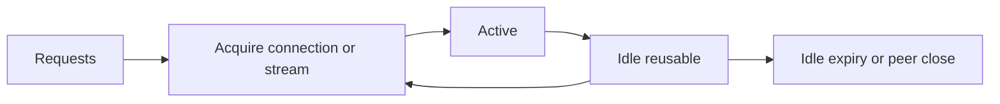

# HTTP connection pools và capacity budget

## Bài toán và ví dụ đầu tiên

Mỗi call HTTPS mới có thể tốn DNS, TCP handshake và TLS handshake trước khi server nhận request. Nếu có thể dùng connection còn sống từ call trước, ta tránh phần chi phí này. Connection pool là tập connection được quản lý để nhiều operation mượn rồi dùng lại theo protocol.

## Đi từng bước qua một tình huống

Giả sử một host có hai connection HTTP/1 đang bận và một connection idle. Request mới có thể lấy connection idle thay vì dial. Nếu MaxConnsPerHost đã đạt và không có connection sẵn, call có thể phải chờ trong budget của context. MaxIdleConnsPerHost chỉ giới hạn số connection idle được giữ cho host, không giới hạn mọi connection active.

MaxIdleConns là giới hạn idle toàn transport; IdleConnTimeout quy định thời gian connection idle có thể được giữ. MaxConnsPerHost là loại trần khác, có liên quan connection đang dial/active/idle theo contract Transport. Trộn các field như cùng một “pool size” khiến tune sai mục tiêu.

## Hiểu cơ chế từ kết quả quan sát

Pooling đổi chi phí reconnect lấy việc giữ socket và state. Connection không dùng tới vẫn tiêu descriptor và memory; idle quá ít gây churn, idle quá nhiều giữ tài nguyên không cần. Peer, proxy hoặc load balancer có thể đóng connection theo policy riêng, nên client cần xử lý lỗi và Transport có quy tắc retry giới hạn của nó.

HTTP/2 multiplex nhiều stream nên một connection có thể phục vụ nhiều request concurrent. Muốn bảo vệ partner chỉ nhận tối đa 50 call, không đặt MaxConnsPerHost=50 rồi cho rằng đã có request limit ở mọi protocol. Thêm semaphore/request admission theo dependency, đo acquisition wait và actual active operations.

Body ownership ảnh hưởng vòng đời mượn connection. Caller bỏ response mà không Close có thể giữ tài nguyên và làm pool hành xử như thiếu capacity. Đọc body lớn chậm cũng giữ operation lâu. Pool stats quan sát gián tiếp qua httptrace, metrics transport wrapper và socket state; stdlib HTTP không có DB.Stats tương đương cho mọi chi tiết.

## Khái niệm và lý do tồn tại

Pool tái sử dụng connections và giới hạn resource theo destination. Idle connections là sẵn sàng reuse; active connections đang phục vụ work; queued requests đang đợi capacity.

### Cách đọc diagram

Requests bắt đầu ở acquire connection hoặc stream, chuyển sang active khi được phục vụ. Connection đủ điều kiện reuse về idle rồi có thể được acquire lại, tạo vòng tái sử dụng. Nhánh idle expiry/peer close loại connection khỏi khả năng reuse. Với HTTP/2, stream và connection có lifetime khác nhau; sơ đồ gộp để thể hiện tài nguyên được mượn, không đồng nhất một request với một TCP connection.

## Cơ chế bên trong

MaxIdleConns giới hạn tổng idle connections; MaxIdleConnsPerHost giới hạn idle theo host; MaxConnsPerHost giới hạn tổng per-host connections gồm dialing/active/idle theo Transport contract. MaxIdleConnsPerHost không phải active concurrency cap. IdleConnTimeout áp idle lifetime. Dialer timeout, TLSHandshakeTimeout và ResponseHeaderTimeout điều khiển phases khác nhau.

HTTP/1 thường một active request mỗi connection; HTTP/2 nhiều streams chia socket với stream concurrency và flow control. Vì vậy 40 connections không có nghĩa 40 in-flight HTTP/2 requests. Dùng application semaphore khi cần bound calls độc lập protocol. Pool key/routing qua proxy/TLS có chi tiết riêng; không tính theo hostname string một cách tùy tiện khi nhiều transports tồn tại.

## Ví dụ code

Xem [NewClient](../examples/http.go) với MaxConnsPerHost=40 và MaxIdleConnsPerHost=20. Đây là điểm bắt đầu cho lab, không cấu hình tối ưu phổ quát. Một process tạo client một lần và CloseIdleConnections khi dependency/lifecycle kết thúc; không gọi sau mọi request.

## Từ runtime đến production

Ví dụ downstream 1000 calls/s, mean in-flight time 50 ms: Little's Law gợi ý khoảng 50 concurrent calls trong trạng thái ổn định. Tail/burst cần headroom và load test, không dùng P99 thay mean một cách máy móc. 10 pods mỗi pod cap 40 có thể tạo 400 connections tới cùng dependency; autoscaling phải nằm trong global budget.

## Những đường lỗi cần hiểu

Pool nhỏ gây queue wait/deadline; pool quá lớn vượt server/FD/NAT capacity; nhiều client transports nhân pools; body không đóng ngăn capacity reuse; LB idle timeout thấp hơn client idle lifetime gây stale reconnects.

## Đánh đổi

| Tune | Lợi ích | Rủi ro |
|---|---|---|
| Idle pool lớn | Ít handshakes | Idle FD và backend load |
| Active cap nhỏ | Bảo vệ dependency | Queue wait/reject |
| Nhiều pods | Thêm app capacity | Tổng connections tăng |

## Những cách hiểu dễ sai

Idle limit không bound requests. Pool không là rate limiter. HTTP/2 không làm capacity vô hạn. Tăng pool không sửa server query chậm.

## Khi nên chọn cách khác

Không tune pool theo số goroutines hoặc CPU cores đơn thuần. Không coi pool queue vô hạn là admission control: reject sớm khi không còn deadline budget.

## Lần theo bằng chứng khi có sự cố

Đo connection acquire wait bằng httptrace GetConn/GotConn, Reused/WasIdle, active sockets và downstream concurrency. So timeout phase với pool wait; kiểm tra body cleanup trước tăng cap. Capacity experiment tăng cap nhỏ trên canary, đo downstream saturation, P99 và error rate tổng. Kiểm tra aggregate max pods × pool caps.

## Thực hành, debugging và kết luận

Một ví dụ fleet có 40 replicas, mỗi replica cho tối đa 100 connections tới một host có thể tạo nhu cầu 4000 connections. Budget phải tính toàn fleet và số host, không chỉ một process. Autoscaling tăng replica cũng tăng tổng connection pressure. Khi dependency quá tải, giảm concurrency có thể giúp throughput ổn định hơn tăng pool.

Debug bằng tỷ lệ reused connection, dial rate, TLS duration, response-body lifetime và file descriptors. So cùng RPS và protocol trước/sau, không kết luận từ số established sockets đơn lẻ. Reuse là tối ưu có điều kiện; correct body cleanup, bounded time và giới hạn tải phải đứng trước việc cố giữ mọi connection.

## Đọc tiếp

- [HTTP client reuse và response ownership](http-client.md)
- [database-sql-pool](../08-database/database-sql-pool.md)
- [design-high-throughput-api](../13-system-design/design-high-throughput-api.md)

## Nguồn đối chiếu

- [Transport configuration](https://pkg.go.dev/net/http#Transport)
