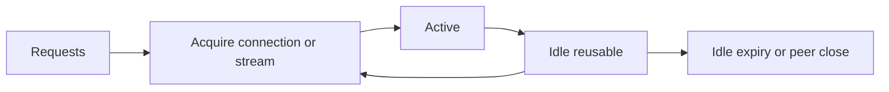

# HTTP connection pools và capacity budget

**P0 · Must know**

## Concept, Why và Mental Model

Pool tái sử dụng connections và giới hạn resource theo destination. Idle connections là sẵn sàng reuse; active connections đang phục vụ work; queued requests đang đợi capacity.

## How và Internals

MaxIdleConns giới hạn tổng idle connections; MaxIdleConnsPerHost giới hạn idle theo host; MaxConnsPerHost giới hạn tổng per-host connections gồm dialing/active/idle theo Transport contract. MaxIdleConnsPerHost không phải active concurrency cap. IdleConnTimeout áp idle lifetime. Dialer timeout, TLSHandshakeTimeout và ResponseHeaderTimeout điều khiển phases khác nhau.

HTTP/1 thường một active request mỗi connection; HTTP/2 nhiều streams chia socket với stream concurrency và flow control. Vì vậy 40 connections không có nghĩa 40 in-flight HTTP/2 requests. Dùng application semaphore khi cần bound calls độc lập protocol. Pool key/routing qua proxy/TLS có chi tiết riêng; không tính theo hostname string một cách tùy tiện khi nhiều transports tồn tại.

## Code Example

Xem [NewClient](../examples/http.go) với MaxConnsPerHost=40 và MaxIdleConnsPerHost=20. Đây là điểm bắt đầu cho lab, không cấu hình tối ưu phổ quát. Một process tạo client một lần và CloseIdleConnections khi dependency/lifecycle kết thúc; không gọi sau mọi request.

## Runtime behavior và Production Use Case

Ví dụ downstream 1000 calls/s, mean in-flight time 50ms: Little's Law gợi ý khoảng 50 concurrent calls trong trạng thái ổn định. Tail/burst cần headroom và load test, không dùng P99 thay mean một cách máy móc. 10 pods mỗi pod cap 40 có thể tạo 400 connections tới cùng dependency; autoscaling phải nằm trong global budget.

## Failure Scenarios

Pool nhỏ gây queue wait/deadline; pool quá lớn vượt server/FD/NAT capacity; nhiều client transports nhân pools; body không đóng ngăn capacity reuse; LB idle timeout thấp hơn client idle lifetime gây stale reconnects.

## Trade-offs

| Tune | Lợi ích | Rủi ro |
|---|---|---|
| Idle pool lớn | Ít handshakes | Idle FD và backend load |
| Active cap nhỏ | Bảo vệ dependency | Queue wait/reject |
| Nhiều pods | Thêm app capacity | Tổng connections tăng |

## Common Misconceptions

Idle limit không bound requests. Pool không là rate limiter. HTTP/2 không làm capacity vô hạn. Tăng pool không sửa server query chậm.

## When NOT to use

Không tune pool theo số goroutines hoặc CPU cores đơn thuần. Không coi pool queue vô hạn là admission control: reject sớm khi không còn deadline budget.

## How I would debug this in production

Đo connection acquire wait bằng httptrace GetConn/GotConn, Reused/WasIdle, active sockets và downstream concurrency. So timeout phase với pool wait; kiểm tra body cleanup trước tăng cap. Capacity experiment tăng cap nhỏ trên canary, đo downstream saturation, P99 và error rate tổng. Kiểm tra aggregate max pods × pool caps.

## Key Takeaways

Size pool theo workload/protocol và downstream budget. Pool wait là latency thật phải có deadline.

## Interview Questions

### Basic / Mid — 10

1. What is an idle connection?
2. What is an active connection?
3. What does MaxIdleConns control?
4. What does MaxIdleConnsPerHost control?
5. What does MaxConnsPerHost control?
6. What does IdleConnTimeout control?
7. Is an idle limit a concurrency limit?
8. Can HTTP/2 multiplex requests?
9. Does a pool limit request rate?
10. What is connection acquisition wait?

### Senior — 10

1. How do you apply Little's Law to outbound calls?
2. Why should mean latency be distinguished from P99?
3. How do pod counts multiply connection budgets?
4. How do separate Transports fragment reuse?
5. Why can an unclosed body look like pool exhaustion?
6. When do you need a semaphore above Transport?
7. How do proxy and destination boundaries affect pools?
8. How should LB idle timeouts influence client policy?
9. What makes a connection reusable?
10. How should scaling respect downstream capacity?

### Production scenarios — 5

1. Why does a fast downstream still produce client timeouts?
2. Why did HPA overload a dependency?
3. Why did increasing idle capacity not increase throughput?
4. Why did an HTTP/2 service exceed expected concurrency?
5. Why are sockets churned after idle periods?

### Senior Follow-ups — 5

1. What is the actual destination budget?
2. Which protocol shares each socket?
3. How long does capacity stay occupied?
4. Where do excess requests wait?
5. Which metric proves the pool is the bottleneck?

Chuỗi follow-up: trả lời lần lượt 5 câu cuối; mỗi câu cần một invariant, bằng chứng runtime hoặc trade-off cụ thể.

## See also

- [HTTP client reuse và response ownership](http-client.md)
- [database-sql-pool](../08-database/database-sql-pool.md)
- [design-high-throughput-api](../13-system-design/design-high-throughput-api.md)

## Nguồn đối chiếu

- [Transport configuration](https://pkg.go.dev/net/http#Transport)
