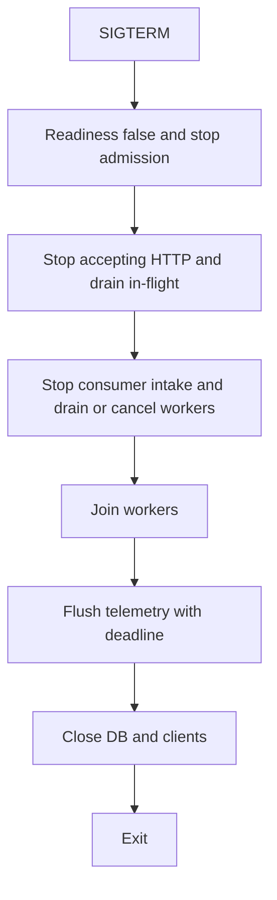

# Graceful shutdown và dependency order

**P0 · Must know**

## Concept, Why và Mental Model

Graceful shutdown ngừng nhận work mới rồi hoàn tất hoặc hủy có kiểm soát work đã nhận trong một budget. Mục tiêu là delivery/correctness, không chỉ process thoát sạch log.



## How và Internals

`signal.NotifyContext` nhận OS signals. Không dùng context đã canceled đó cho Server.Shutdown: tạo context Background với timeout mới. Shutdown đóng listeners, đóng idle connections và đợi active HTTP handlers về idle. Nó không tự quản lý hijacked/WebSocket connections hoặc arbitrary goroutines; application cần registry/stop/join. Timeout Shutdown không tự force-close mọi active work; policy có thể gọi Close và cancel owner contexts, rồi reconcile/replay.

Readiness/LB endpoint removal có propagation delay. Ngừng admission mới trước drain; Kubernetes terminationGracePeriod phải đủ cho preStop, LB propagation, application drain và flush. Nếu dùng signal ctx làm request base ctx, SIGTERM sẽ cancel in-flight ngay thay vì drain; tách hai lifetimes khi cần.

## Code Example

[cmd/server/main.go](../examples/cmd/server/main.go) là server chạy được với NotifyContext, Shutdown fresh timeout, xử lý ErrServerClosed, force Close khi hết budget và join serving goroutine. Ví dụ không có DB/consumer thật; khi thêm dependencies phải close chúng **sau** các workers sử dụng chúng đã join.

```bash
cd golang/examples
go run ./cmd/server
```

Gửi SIGTERM cho process thực hoặc Ctrl-C và quan sát response in-flight. `go run` có wrapper process nên smoke test tự động nên build binary trước khi signal.

## Runtime behavior và Production Use Case

Consumer dừng fetch trước khi đóng work queue. Khi drain xong, commit offsets chỉ cho contiguous completed records; work dở phải replay/idempotent. Flush telemetry có timeout riêng trong remaining budget. Restore signal handling sau first signal cho phép người vận hành force-exit bằng signal tiếp theo.

## Failure Scenarios

DB đóng trước handler; Shutdown nhận ctx canceled nên fail ngay; websocket giữ process; consumer ack trước durable commit làm mất work; grace period hết giữa drain; goroutine chạy sau main exit không flush.

## Trade-offs

| Policy | Lợi ích | Giá |
|---|---|---|
| Drain | Ít retry/duplicate | Chờ lâu |
| Abort và replay | Exit có bound | Cần idempotency/durable job |
| Force close sau deadline | Bảo đảm termination | Partial response/outcome ambiguous |

## Common Misconceptions

Readiness false không tức thì chặn mọi network traffic. Shutdown không đợi mọi G. Cancel signal không phải bằng chứng worker đã dừng.

## When NOT to use

Không shutdown vô hạn để “không mất request”. Không sleep cố định thay join; sleep không chứng minh completion. Không kéo drain vượt platform kill deadline.

## How I would debug this in production

Ghi timestamps từng phase, in-flight requests/jobs và remaining budget. Khi deadline gần hết thu goroutine dump, xem waits tới dependency đã đóng hoặc downstream không timeout. Test deploy dưới load và SIGTERM giữa DB commit/offset commit. Verify accepted work được completed hoặc replay, readiness chuyển đúng và không có sends vào closed queue.

## Key Takeaways

Stop admission → drain/abort → join → release dependencies. Thiết kế recovery cho thời điểm force kill vẫn có thể xảy ra.

## Interview Questions

### Basic / Mid — 10

1. What is graceful shutdown?
2. What does SIGTERM request?
3. What does NotifyContext provide?
4. What does Server.Shutdown close?
5. Does Shutdown manage WebSockets?
6. Why use a fresh shutdown context?
7. What is readiness for?
8. What is draining?
9. What is a join point?
10. When should DB be closed?

### Senior — 10

1. How does LB propagation affect shutdown?
2. Why can signal-based request contexts abort too early?
3. What happens after Shutdown times out?
4. How should consumer offsets be handled?
5. How do you size termination grace budget?
6. Why must telemetry flush be bounded?
7. How should a second signal behave?
8. How do you drain hijacked connections?
9. Why is fixed sleep not proof of completion?
10. How do you preserve work through forced termination?

### Production scenarios — 5

1. Why does Shutdown return immediately on SIGTERM?
2. Why do in-flight handlers report DB closed?
3. Why do rolling deployments cause 502 spikes?
4. Why do workers panic while sending during exit?
5. Why are accepted jobs lost after force kill?

### Senior Follow-ups — 5

1. What intake stops first?
2. Which accepted work remains?
3. Who owns each completion signal?
4. Which dependency may close next?
5. What is replayable if the remaining budget expires?

Chuỗi follow-up: trả lời lần lượt 5 câu cuối; mỗi câu cần một invariant, bằng chứng runtime hoặc trade-off cụ thể.


## See also

- [graceful-deployment](../15-docker-kubernetes/graceful-deployment.md)
- [Context trong production request tree](../05-context/production-patterns.md)
- [ordering](../10-messaging/ordering.md)

## Nguồn đối chiếu

- [Server.Shutdown](https://pkg.go.dev/net/http#Server.Shutdown)
- [signal.NotifyContext](https://pkg.go.dev/os/signal#NotifyContext)
