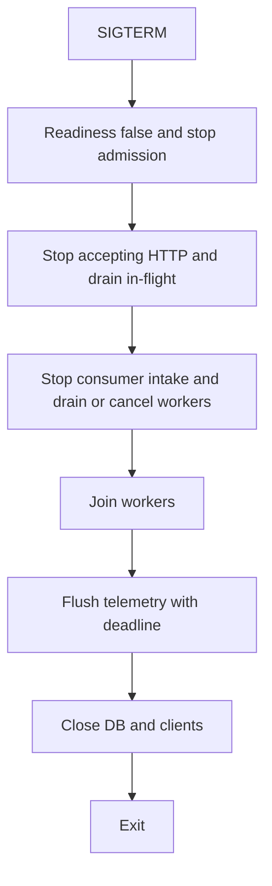

# Graceful shutdown và dependency order

## Bài toán và ví dụ đầu tiên

Deploy phiên bản mới làm process cũ nhận SIGTERM trong lúc đang xử lý payment. Nếu exit ngay, response bị mất và client không biết payment đã commit hay chưa. Graceful shutdown là quá trình ngừng nhận việc mới rồi dành thời gian hữu hạn cho việc đang sở hữu kết thúc hoặc chuyển sang trạng thái có thể phục hồi.

## Đi từng bước qua một tình huống

Đọc [server lab](../examples/cmd/server/main.go) theo thứ tự: tạo server và signal context, chạy Serve, chờ signal hoặc lỗi serve, tạo một context shutdown mới có deadline rồi gọi Shutdown. Context mới cần còn sống; lấy context vừa bị signal cancel để drain sẽ làm yêu cầu chờ hết hạn ngay. Sau drain, main còn chờ goroutine serve để không bỏ một đường lỗi.

Server.Shutdown đóng listeners và idle connections, chờ active HTTP connections theo contract; nếu hết budget, owner có thể Close như bước cưỡng bức cuối. Nó không tự biết worker pool riêng, Kafka consumer hay WebSocket đã hijack. Các thành phần đó cần stop/join riêng và phải được đưa vào thứ tự lifecycle.

## Hiểu cơ chế từ kết quả quan sát

Một thứ tự điển hình là đánh dấu không nhận traffic mới, ngừng ingress/admission, ngừng producer tạo job, drain hoặc cancel workers, chờ hoàn tất rồi Close DB/client cuối. Nếu đóng DB trước khi request đang chạy kết thúc, ta tự tạo lỗi trong cửa sổ vốn dành để drain. Nếu Wait worker trước khi close input hoặc cancel, worker có thể chờ việc mới mãi.

Drain không đảm bảo mọi job thành công. Deadline hữu hạn buộc hệ thống có cách retry/reconcile khi process phải kết thúc. Request đã commit nhưng mất response cần idempotency để client retry an toàn. Queue bền cần ack/checkpoint chỉ cho công việc đã hoàn thành; in-memory queue có contract mất việc khác.

Trong Kubernetes, readiness chuyển trạng thái không tức thì ngừng mọi connection ở mọi proxy. Cần tính thời gian propagation, keep-alive và termination grace period của môi trường. Chương trình nên xử lý một ít request còn tới trong cửa sổ đó theo policy rõ, không giả định một cờ readiness đồng bộ hóa toàn mạng.

## Khái niệm và lý do tồn tại

Graceful shutdown ngừng nhận work mới rồi hoàn tất hoặc hủy có kiểm soát work đã nhận trong một budget. Mục tiêu là delivery/correctness, không chỉ process thoát sạch log.



### Cách đọc diagram

Đi từ SIGTERM qua ngừng admission/readiness, drain HTTP và ngừng consumer nhận thêm, rồi join workers. Chỉ sau đó flush telemetry trong deadline và đóng DB/clients trước exit. Thứ tự nói về dependencies của cleanup: workers không nên bị đóng DB trong lúc còn sử dụng. Readiness propagation có độ trễ và budget hữu hạn cần một đường timeout/fallback ngoài normal flow trong hình.

## Cơ chế bên trong

`signal.NotifyContext` nhận OS signals. Không dùng context đã canceled đó cho Server.Shutdown: tạo context Background với timeout mới. Shutdown đóng listeners, đóng idle connections và đợi active HTTP handlers về idle. Nó không tự quản lý hijacked/WebSocket connections hoặc arbitrary goroutines; application cần registry/stop/join. Timeout Shutdown không tự force-close mọi active work; policy có thể gọi Close và cancel owner contexts, rồi reconcile/replay.

Readiness/LB endpoint removal có propagation delay. Ngừng admission mới trước drain; Kubernetes terminationGracePeriod phải đủ cho preStop, LB propagation, application drain và flush. Nếu dùng signal ctx làm request base ctx, SIGTERM sẽ cancel in-flight ngay thay vì drain; tách hai lifetimes khi cần.

## Ví dụ code

[cmd/server/main.go](../examples/cmd/server/main.go) là server chạy được với NotifyContext, Shutdown fresh timeout, xử lý ErrServerClosed, force Close khi hết budget và join serving goroutine. Ví dụ không có DB/consumer thật; khi thêm dependencies phải close chúng **sau** các workers sử dụng chúng đã join.

```bash
cd golang/examples
go run ./cmd/server
```

### Giải thích code và kết quả

Lệnh chạy server lab ở loopback. Nó chiếm terminal khi server còn sống; dùng terminal khác gọi health endpoint và gửi SIGTERM tới process binary theo cách quản lý process của môi trường để quan sát drain. Health200 rồi exit0 chỉ là smoke test đường nhàn; test request đang chạy cần điều phối riêng như phần walkthrough, không suy mọi WebSocket/consumer được Shutdown quản lý.

Gửi SIGTERM cho process thực hoặc Ctrl-C và quan sát response in-flight. `go run` có wrapper process nên smoke test tự động nên build binary trước khi signal.

## Từ runtime đến production

Consumer dừng fetch trước khi đóng work queue. Khi drain xong, commit offsets chỉ cho contiguous completed records; work dở phải replay/idempotent. Flush telemetry có timeout riêng trong remaining budget. Restore signal handling sau first signal cho phép người vận hành force-exit bằng signal tiếp theo.

## Những đường lỗi cần hiểu

DB đóng trước handler; Shutdown nhận ctx canceled nên fail ngay; websocket giữ process; consumer ack trước durable commit làm mất work; grace period hết giữa drain; goroutine chạy sau main exit không flush.

## Đánh đổi

| Policy | Lợi ích | Giá |
|---|---|---|
| Drain | Ít retry/duplicate | Chờ lâu |
| Abort và replay | Exit có bound | Cần idempotency/durable job |
| Force close sau deadline | Bảo đảm termination | Partial response/outcome ambiguous |

## Những cách hiểu dễ sai

Readiness false không tức thì chặn mọi network traffic. Shutdown không đợi mọi G. Cancel signal không phải bằng chứng worker đã dừng.

## Khi nên chọn cách khác

Không shutdown vô hạn để “không mất request”. Không sleep cố định thay join; sleep không chứng minh completion. Không kéo drain vượt platform kill deadline.

## Lần theo bằng chứng khi có sự cố

Ghi timestamps từng phase, in-flight requests/jobs và remaining budget. Khi deadline gần hết thu goroutine dump, xem waits tới dependency đã đóng hoặc downstream không timeout. Test deploy dưới load và SIGTERM giữa DB commit/offset commit. Verify accepted work được completed hoặc replay, readiness chuyển đúng và không có sends vào closed queue.

## Thực hành, debugging và kết luận

Test lifecycle có request đang xử lý: điều phối handler bằng channel, bắt đầu shutdown, xác minh request mới không được nhận theo listener behavior và request đang giữ có thể hoàn tất trước deadline. Test khác cố giữ operation quá lâu để xác minh timeout path. Smoke test health200 rồi SIGTERM exit0 chỉ kiểm tra đường nhàn, không chứng minh drain dưới tải.

Production log các mốc stop-accepting, active requests, worker remaining và dependencies closed. Nếu deploy treo, stack cho biết thành phần nào còn waiting. Tăng grace period có thể giúp workload hợp lệ dài hơn, nhưng không sửa goroutine thiếu đường thoát. Mục tiêu là trạng thái cuối có thể giải thích và phục hồi, không chỉ process có exit code đẹp.


## Đọc tiếp

- [graceful-deployment](../15-docker-kubernetes/graceful-deployment.md)
- [Context trong production request tree](../05-context/production-patterns.md)
- [ordering](../10-messaging/ordering.md)

## Nguồn đối chiếu

- [Server.Shutdown](https://pkg.go.dev/net/http#Server.Shutdown)
- [signal.NotifyContext](https://pkg.go.dev/os/signal#NotifyContext)
