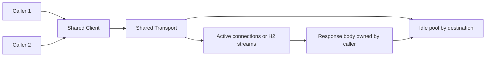

# HTTP client reuse và response ownership

**P0 · Must know**

## Concept, Why và Mental Model

Client áp policy như timeout/redirect/cookies; Transport thực hiện RoundTrip và giữ connection pools. Reuse cả hai giúp giữ TCP/TLS connections, giảm handshakes và tránh cấu hình rải rác.



## How và Internals

Client/Transport an toàn concurrent use khi cấu hình xong trước traffic; không mutate fields tùy request. `&http.Client{}` mỗi request với Transport nil vẫn dùng shared DefaultTransport nên không tự tạo pool mới. Vấn đề nghiêm trọng là tạo Transport mỗi request: mất reuse, TLS/FD/ports churn. Shared client vẫn tốt để nhất quán policy/cookies/timeout.

Client.Do chỉ trả error cho failure làm request, không coi HTTP 500 là error tự động. Sau Do success, caller phải Close body cả khi status không mong muốn. HTTP/1 reuse thường cần đọc tới EOF và Close; nếu body lớn/không tin cậy thì bound read rồi close, chấp nhận mất reuse thay vì drain vô hạn. HTTP/2 stream cleanup khác HTTP/1 socket reuse, vẫn phải close body.

## Code Example

[NewClient và Fetch](../examples/http.go) là code build/test được: Clone DefaultTransport, explicit pool/phase timeout, NewRequestWithContext, giới hạn body, kiểm tra status và preserve Close error bằng errors.Join.

```bash
cd golang/examples
go test -race -run TestFetch ./...
```

## Runtime behavior và Production Use Case

Client.Timeout bao gồm connect, redirects và đọc response body; context deadline nhỏ hơn có thể thắng. Transport ResponseHeaderTimeout không bound toàn body. DNS/dial/TLS/idle wait/first byte có latency khác nhau; reuse warm connections tránh một số phases nhưng không giải quyết server chậm.

## Failure Scenarios

Unclosed body giữ resource và cản reuse; no timeout giữ G/FD lâu; new Transport gây connection churn; MaxConnsPerHost nhỏ khiến requests chờ connection; retry mutation sau timeout có thể duplicate side effect.

## Trade-offs

| Cách | Lợi ích | Giá |
|---|---|---|
| Shared transport | Reuse và giới hạn chung | Shared contention theo host |
| Dedicated per dependency | Isolation/policy | Nhiều pools |
| Bound body and close | Memory/deadline an toàn | Có thể bỏ connection reuse |

## Common Misconceptions

Tạo Client mới không luôn tạo pool mới. Close body không bảo đảm HTTP/1 reuse nếu chưa đọc EOF. Idle timeout không là response timeout.

## When NOT to use

Không dùng default client không timeout cho unbounded untrusted calls. Không nhận arbitrary URLs rồi Fetch mà không SSRF/redirect/IP policy. Long streaming cần deadline strategy riêng thay vì total timeout ngắn.

## How I would debug this in production

Dùng httptrace DNSStart/ConnectStart/TLSHandshakeStart/GotConn/GotFirstResponseByte để tách phases và xem Reused. So FD count, connection churn, TLS CPU, goroutine waits và destination latency. Check tất cả body close paths. Test caller cancel, oversized response, non-2xx và server stall; reuse test dùng server local thật trong examples.

## Key Takeaways

Transport sở hữu pool; caller sở hữu response body; deadline sở hữu wait budget.

## Interview Questions

### Basic / Mid — 10

1. What does Client own?
2. What does Transport own?
3. Are they safe for concurrent use?
4. What does a nil Transport use?
5. Does HTTP 500 make Do return an error?
6. Who closes response bodies?
7. Why does EOF matter for HTTP/1 reuse?
8. What does Client.Timeout cover?
9. What does ResponseHeaderTimeout cover?
10. How does request context affect a call?

### Senior — 10

1. Why is a new Transport per request expensive?
2. Can new Clients still share connections?
3. Why can blindly draining a body be unsafe?
4. How does HTTP/2 change connection budgeting?
5. Why should clients be configured before sharing?
6. When should dependencies get separate transports?
7. How do redirects affect credentials and SSRF policy?
8. Why does a timeout not prove a mutation failed?
9. What should happen to Close errors?
10. How do you choose between reuse and bounded cleanup?

### Production scenarios — 5

1. Why are TLS handshakes dominating CPU?
2. Why are goroutines stuck after requests finish?
3. Why is the idle pool never populated?
4. Why do callers wait despite low downstream latency?
5. Why did retrying a timed-out POST create duplicates?

### Senior Follow-ups — 5

1. Who owns the Transport?
2. Who owns the body?
3. Which deadline bounds each phase?
4. What evidence proves reuse?
5. Which side effects are safe to retry?

Chuỗi follow-up: trả lời lần lượt 5 câu cuối; mỗi câu cần một invariant, bằng chứng runtime hoặc trade-off cụ thể.


## See also

- [connection-pooling](connection-pooling.md)
- [transport](transport.md)
- [api-security](../07-api-design/api-security.md)

## Nguồn đối chiếu

- [http.Client](https://pkg.go.dev/net/http#Client)
- [httptrace](https://pkg.go.dev/net/http/httptrace)
