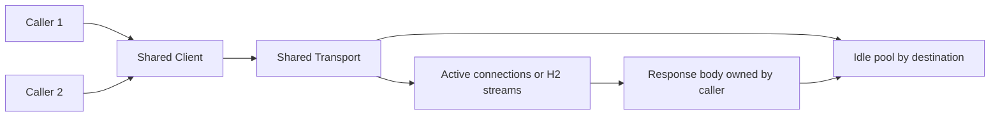

# HTTP client reuse và response ownership

## Bài toán và ví dụ đầu tiên

Một handler cần gọi inventory service. Cách gọi ngắn nhất có thể dùng http.Get, nhưng service production cần kiểm soát thời gian chờ, kích thước body, status và connection reuse. Một HTTP response nhận được thành công ở transport level vẫn có thể là status 500 của dependency.

## Đi từng bước qua một tình huống

Xem [http.go](../examples/http.go): NewClient tạo client dùng Transport clone từ DefaultTransport với các giới hạn minh họa. Fetch tạo request bằng context của caller, gọi client.Do, kiểm tra status, đọc body có giới hạn và Close body bằng cleanup. [http_test.go](../examples/http_test.go) dùng httptest server và httptrace để kiểm tra reuse connection cùng các đường lỗi.

Theo một lần Fetch: ctx hết hạn khi chờ connection cũng phải ngừng chờ; Do có thể lỗi trước khi có response; nếu có response, body thuộc trách nhiệm caller của Do. Đọc thành công headers chưa có nghĩa body sẽ đọc hết thành công. MaxBytes giới hạn response giữ trong memory; lỗi quá giới hạn cần được trả về thay vì cắt payload rồi coi là hợp lệ.

## Hiểu cơ chế từ kết quả quan sát

Client là lớp policy gồm redirect, cookie jar nếu có và timeout; Transport thực hiện RoundTrip cùng dialing/TLS/protocol/pool. Tạo một Client mới có Transport nil vẫn dùng DefaultTransport dùng chung, nên không phải mọi new Client đều mở pool mới. Nhưng tạo custom Transport mới mỗi request thường làm mất reuse và giữ nhiều pool riêng; nên xây ở startup rồi dùng concurrent theo contract.

Với HTTP/1, body đọc tới EOF và Close giúp connection đủ điều kiện reuse nếu các điều kiện khác cho phép. Chỉ Close khi body còn lớn chưa đọc có thể làm connection không reuse được; cố drain không giới hạn cũng nguy hiểm khi server gửi body vô hạn. Chọn bounded drain hoặc đóng bỏ theo policy, chấp nhận chi phí connection mới khi cần bảo vệ tài nguyên.

HTTP/2 có nhiều stream trên một TCP connection nên connection cap không đồng nghĩa cap số request in-flight. Giới hạn concurrency ứng dụng vẫn cần nếu downstream chỉ chịu được một số thao tác. Context cancellation dừng việc chờ theo client contract nhưng không chứng minh remote mutation chưa commit.

## Khái niệm và lý do tồn tại

Client áp policy như timeout/redirect/cookies; Transport thực hiện RoundTrip và giữ connection pools. Reuse cả hai giúp giữ TCP/TLS connections, giảm handshakes và tránh cấu hình rải rác.



### Cách đọc diagram

Hai callers dùng chung Client và Transport. Transport quản lý idle connections theo destination và active connections/HTTP2 streams. Body của response thuộc trách nhiệm caller của Do; hoàn tất body lifecycle mới giúp tài nguyên đủ điều kiện quay về reuse theo protocol. Mũi tên body→idle là đường có điều kiện, không hứa Close một body chưa đọc luôn giữ lại connection.

## Cơ chế bên trong

Client/Transport an toàn concurrent use khi cấu hình xong trước traffic; không mutate fields tùy request. `&http.Client{}` mỗi request với Transport nil vẫn dùng shared DefaultTransport nên không tự tạo pool mới. Vấn đề nghiêm trọng là tạo Transport mỗi request: mất reuse, TLS/FD/ports churn. Shared client vẫn tốt để nhất quán policy/cookies/timeout.

Client.Do chỉ trả error cho failure làm request, không coi HTTP 500 là error tự động. Sau Do success, caller phải Close body cả khi status không mong muốn. HTTP/1 reuse thường cần đọc tới EOF và Close; nếu body lớn/không tin cậy thì bound read rồi close, chấp nhận mất reuse thay vì drain vô hạn. HTTP/2 stream cleanup khác HTTP/1 socket reuse, vẫn phải close body.

## Ví dụ code

[NewClient và Fetch](../examples/http.go) là code build/test được: Clone DefaultTransport, explicit pool/phase timeout, NewRequestWithContext, giới hạn body, kiểm tra status và preserve Close error bằng errors.Join.

```bash
cd golang/examples
go test -race -run TestFetch ./...
```

### Giải thích code và kết quả

Chạy nhóm TestFetch qua httptest server thật với race detector. Các tests dùng response/body/context để kiểm tra success, size bound và cancellation; httptrace cho bằng chứng reuse HTTP/1 connection. Cần quyền bind loopback ở môi trường chạy. Không có call tới partner production và không phải benchmark HTTP2 concurrency.

## Từ runtime đến production

Client.Timeout bao gồm connect, redirects và đọc response body; context deadline nhỏ hơn có thể thắng. Transport ResponseHeaderTimeout không bound toàn body. DNS/dial/TLS/idle wait/first byte có latency khác nhau; reuse warm connections tránh một số phases nhưng không giải quyết server chậm.

## Những đường lỗi cần hiểu

Unclosed body giữ resource và cản reuse; no timeout giữ G/FD lâu; new Transport gây connection churn; MaxConnsPerHost nhỏ khiến requests chờ connection; retry mutation sau timeout có thể duplicate side effect.

## Đánh đổi

| Cách | Lợi ích | Giá |
|---|---|---|
| Shared transport | Reuse và giới hạn chung | Shared contention theo host |
| Dedicated per dependency | Isolation/policy | Nhiều pools |
| Bound body and close | Memory/deadline an toàn | Có thể bỏ connection reuse |

## Những cách hiểu dễ sai

Tạo Client mới không luôn tạo pool mới. Close body không bảo đảm HTTP/1 reuse nếu chưa đọc EOF. Idle timeout không là response timeout.

## Khi nên chọn cách khác

Không dùng default client không timeout cho unbounded untrusted calls. Không nhận arbitrary URLs rồi Fetch mà không SSRF/redirect/IP policy. Long streaming cần deadline strategy riêng thay vì total timeout ngắn.

## Lần theo bằng chứng khi có sự cố

Dùng httptrace DNSStart/ConnectStart/TLSHandshakeStart/GotConn/GotFirstResponseByte để tách phases và xem Reused. So FD count, connection churn, TLS CPU, goroutine waits và destination latency. Check tất cả body close paths. Test caller cancel, oversized response, non-2xx và server stall; reuse test dùng server local thật trong examples.

## Thực hành, debugging và kết luận

Production sau deploy có connect/TLS time tăng dù dependency processing không đổi: kiểm tra Transport có bị tạo per-call và body có được Close/consume đúng không. Nếu first-byte chậm, kiểm tra server và queue phía remote; tăng idle pool không sửa server query chậm. Gắn httptrace cho mẫu request để tách DNS/connect/TLS/reuse, không log toàn bộ URL chứa token.

Retry GET và retry payment POST có ý nghĩa khác. Với mutation, dùng operation identity và kiểm tra idempotency contract; status hay network error một mình không xác nhận retry an toàn. Client timeout tổng phù hợp nhiều request hữu hạn nhưng streaming dài cần deadline/idle policy riêng. Các giá trị trong lab chỉ để học cơ chế và cần đo lại khi triển khai.


## Đọc tiếp

- [connection-pooling](connection-pooling.md)
- [transport](transport.md)
- [api-security](../07-api-design/api-security.md)

## Nguồn đối chiếu

- [http.Client](https://pkg.go.dev/net/http#Client)
- [httptrace](https://pkg.go.dev/net/http/httptrace)
