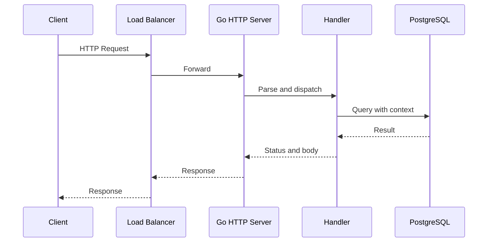

# net/http: server, handler và request lifetime

**P0 · Must know**

## Concept, Why và Mental Model

Server quản lý listener/connections và HTTP protocol; Handler xử lý request; ServeMux route tới handler. Request chứa metadata, body và context; ResponseWriter ghi headers/status/body. Tách các vai trò giúp kiểm soát lifetime và tài nguyên thay vì chỉ gọi ListenAndServe.



## How và Internals

Listener accept connection, protocol handling đọc/validate request rồi dispatch Handler. HTTP/1 thường có serving goroutine theo connection và requests tuần tự trên connection đó; HTTP/2 multiplex nhiều streams nên không có quy luật cố định “một request bằng một TCP connection”. Handler invocations có thể concurrent và shared dependencies phải safe. Exact serving goroutine layout tùy protocol/release.

WriteHeader commit status một lần; Write đầu tiên có thể tự gửi 200. Không dùng ResponseWriter sau ServeHTTP return hoặc ghi concurrent không có protocol rõ. Request context kết thúc khi client disconnect, request cancel hoặc handler return theo server semantics. Inbound body do server đóng; handler vẫn cần đọc có giới hạn và xử lý lỗi. `MaxBytesReader` chặn unbounded input; header/body timeouts xử lý các tầng khác nhau.

## Code Example

[Server executable](../examples/cmd/server/main.go) có explicit Server timeouts, method-aware ServeMux, signal và drain. Chạy từ examples:

```bash
go run ./cmd/server
curl --fail http://127.0.0.1:8080/healthz
```

Timeout values của lab là minh họa. JSON handler thực cần Content-Type validation, body size limit, decoder errors và business authorization, không chỉ decode rồi gọi DB.

## Runtime behavior và Production Use Case

Mỗi in-flight handler có thể giữ buffers, DB wait và outbound calls. Runtime netpoll giúp socket waits không chiếm dedicated executing M, nhưng không giới hạn số requests. Admission control bảo vệ downstream; middleware propagate context và quan sát status, latency, bytes.

## Failure Scenarios

Slow headers giữ connections; unlimited body OOM; write timeout bị nhầm là kill handler; handler dùng Background khiến DB tiếp tục khi request hết; panic sau header khiến response partial.

## Trade-offs

| Lựa chọn | Lợi ích | Hạn chế |
|---|---|---|
| stdlib Server | Control/lifecycle rõ | Cần cấu hình policy |
| Middleware chain | Tách concern | Ordering/wrapper interfaces |
| HTTP/2 | Multiplex streams | Stream limits/flow control |

## Common Misconceptions

Client.Timeout và Server.WriteTimeout không cùng nghĩa. Timeout trên socket không đảm bảo business function đã return. ServeMux routing behavior thay đổi theo version nên test patterns với toolchain đang dùng.

## When NOT to use

Không expose DefaultServeMux chứa debug endpoints ra public interface. Không đặt một WriteTimeout ngắn chung cho streaming endpoint mà chưa thiết kế streaming deadlines.

## How I would debug this in production

Tách LB latency, accept/queue delay, handler duration, DB wait và response write. Dùng trace IDs, ConnState/connection metrics có cardinality thấp, goroutine stacks và httptrace cho outbound. Kiểm tra LB/ingress timeout có nhỏ hơn service budget; test slow headers, oversized body và disconnect.

## Key Takeaways

Protocol, handler và dependencies có lifetime khác nhau; bound từng lớp và propagate context.

## Interview Questions

### Basic / Mid — 10

1. What does Server own?
2. What does Handler implement?
3. What does ServeMux do?
4. What is in Request?
5. What does ResponseWriter control?
6. When are response headers committed?
7. Who closes inbound request bodies?
8. Are handlers concurrent?
9. What does request context represent?
10. How does HTTP/2 differ from HTTP/1 connection use?

### Senior — 10

1. Why is one goroutine per request an incomplete model?
2. How should body size be limited?
3. Why does socket timeout not stop arbitrary handler code?
4. How can a middleware wrapper break streaming?
5. Why should timeouts be aligned with the load balancer?
6. How do you isolate profiling endpoints?
7. How does admission control protect a DB pool?
8. What happens if a handler writes after returning?
9. How should panic recovery handle committed headers?
10. Why must routing behavior be tested per Go version?

### Production scenarios — 5

1. Why are many connections idle while memory grows?
2. Why did a large request OOM the service?
3. Why does DB work continue after disconnect?
4. Why did streaming fail after setting WriteTimeout?
5. Why do clients receive partial successful responses after a panic?

### Senior Follow-ups — 5

1. Where did the request enter?
2. Which protocol and queue handled it?
3. Which context reaches the dependency?
4. When was the response committed?
5. Which resource remains after handler return?

Chuỗi follow-up: trả lời lần lượt 5 câu cuối; mỗi câu cần một invariant, bằng chứng runtime hoặc trade-off cụ thể.


## See also

- [request-lifecycle](request-lifecycle.md)
- [timeout](timeout.md)
- [graceful-shutdown](graceful-shutdown.md)

## Nguồn đối chiếu

- [net/http](https://pkg.go.dev/net/http)
