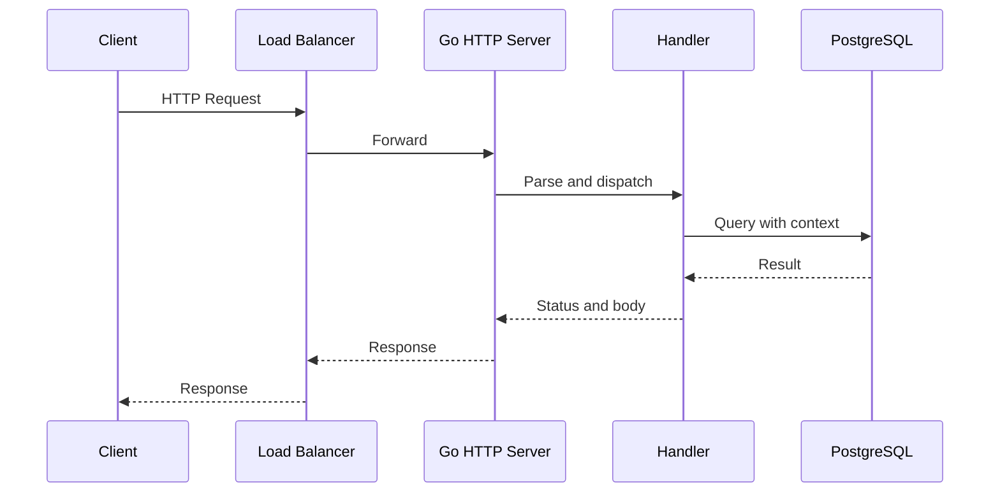

# net/http: server, handler và request lifetime

## Bài toán và ví dụ đầu tiên

Trình duyệt gửi GET /users/42, nhưng Go handler không nhận một lời gọi hàm trực tiếp từ trình duyệt. Dữ liệu đi qua network connection, được đọc và parse thành HTTP request, rồi server mới gọi code ứng dụng. Hiểu đường đi này giúp phân biệt chậm ở TCP, parser, handler hay lúc ghi response.

TCP là giao thức truyền byte có thứ tự giữa hai đầu kết nối. HTTP đặt cấu trúc request/response lên luồng byte đó; HTTPS thêm TLS để bảo vệ transport. net/http cung cấp server, client và các interface để ứng dụng xử lý request mà không tự viết parser HTTP.

## Đi từng bước qua một tình huống

```go
package main

import (
    "fmt"
    "log"
    "net/http"
    "time"
)

func main() {
    mux := http.NewServeMux()
    mux.HandleFunc("/hello", func(w http.ResponseWriter, r *http.Request) {
        if r.Method != http.MethodGet {
            w.Header().Set("Allow", http.MethodGet)
            http.Error(w, "method not allowed", http.StatusMethodNotAllowed)
            return
        }
        w.Header().Set("Content-Type", "text/plain; charset=utf-8")
        fmt.Fprintln(w, "hello")
    })
    server := &http.Server{
        Addr: "127.0.0.1:8080", Handler: mux,
        ReadHeaderTimeout: 2*time.Second,
        IdleTimeout: 30*time.Second,
    }
    log.Fatal(server.ListenAndServe())
}
```

### Giải thích code từng bước

Mux định tuyến path tới handler. Server listen trên loopback để lab chỉ nhận kết nối local. Khi request hợp lệ tới /hello, server gọi handler với Request chứa thông tin request và ResponseWriter dùng để tạo response. Kiểm tra method trả 405 kèm Allow cho phương thức không được hỗ trợ. Set header trước Write; fmt.Fprintln thực hiện Write và nếu chưa có status rõ thì phản hồi thành công dùng status mặc định theo API.

Hai timeout minh họa giới hạn đọc headers và chờ request tiếp theo trên connection idle. Chúng không giới hạn mọi thời gian xử lý nghiệp vụ hoặc đọc body; server thật còn cần size limits, dependency deadlines và shutdown. Ví dụ log.Fatal phù hợp lab tối giản này, không là lifecycle production; chương trình hoàn chỉnh có drain tại [server example](../examples/cmd/server/main.go).

## Hiểu cơ chế từ kết quả quan sát

Một HTTP/1 connection có goroutine phục vụ chuỗi request của nó trong implementation net/http; nhiều connection có thể làm nhiều handler chạy đồng thời. HTTP/2 multiplex nhiều stream trên một connection và có mô hình concurrency khác. Vì vậy đừng lấy câu “một request bằng một thread” hoặc “một connection chỉ có một request active” áp cho mọi protocol.

Handler có thể chạy đồng thời với handler khác nên shared map/counter cần đồng bộ. ResponseWriter của một request không phải object để giữ lại rồi viết sau khi ServeHTTP return. Nếu handler tạo goroutine phụ, phải xác định chúng kết thúc lúc nào và ai assemble response; không để nhiều goroutine ghi response tùy ý.

Request body là luồng dữ liệu cần đọc theo giới hạn và xử lý lỗi. Context của incoming request phản ánh lifetime theo contract server; handler truyền nó xuống SQL/HTTP/gRPC. Đóng client connection không tự kill CPU loop trong handler. Với body chậm hoặc quá lớn, phải kiểm soát ở boundary để không dùng bộ nhớ và thời gian vô hạn.

Keep-alive HTTP cho phép tái sử dụng connection cho nhiều request, tiết kiệm dial và TLS handshake. Đây khác TCP keepalive, cơ chế probe ở tầng TCP. Ở phía client, Transport sở hữu việc dùng lại connection và protocol; Client thêm policy như redirects và timeout tổng. Reuse client/transport lâu dài là nền tảng trước khi tune các giới hạn.

## Khái niệm và lý do tồn tại

Server quản lý listener/connections và HTTP protocol; Handler xử lý request; ServeMux route tới handler. Request chứa metadata, body và context; ResponseWriter ghi headers/status/body. Tách các vai trò giúp kiểm soát lifetime và tài nguyên thay vì chỉ gọi ListenAndServe.



### Cách đọc diagram

Các participant là client, load balancer, Go server, handler và PostgreSQL. Mũi tên đi xuống theo thời gian: request được forward, server parse/dispatch, handler query với context rồi nhận result và ghi response qua các tầng về client. Diagram bỏ các pha handshake để tập trung request flow; lỗi/cancellation có thể xảy ra ở mỗi hop và không được suy DB chưa commit chỉ vì client thiếu response.

## Cơ chế bên trong

Listener accept connection, protocol handling đọc/validate request rồi dispatch Handler. HTTP/1 thường có serving goroutine theo connection và requests tuần tự trên connection đó; HTTP/2 multiplex nhiều streams nên không có quy luật cố định “một request bằng một TCP connection”. Handler invocations có thể concurrent và shared dependencies phải safe. Exact serving goroutine layout tùy protocol/release.

WriteHeader commit status một lần; Write đầu tiên có thể tự gửi 200. Không dùng ResponseWriter sau ServeHTTP return hoặc ghi concurrent không có protocol rõ. Request context kết thúc khi client disconnect, request cancel hoặc handler return theo server semantics. Inbound body do server đóng; handler vẫn cần đọc có giới hạn và xử lý lỗi. `MaxBytesReader` chặn unbounded input; header/body timeouts xử lý các tầng khác nhau.

## Ví dụ code

[Server executable](../examples/cmd/server/main.go) có explicit Server timeouts, method-aware ServeMux, signal và drain. Chạy từ examples:

```bash
go run ./cmd/server
curl --fail http://127.0.0.1:8080/healthz
```

### Giải thích code và kết quả

Chạy go run từ thư mục golang/examples, rồi dùng terminal thứ hai chạy curl vì server command đang giữ terminal đầu. Curl --fail báo exit khác0 với HTTP error status; health response thành công kiểm tra route/listener cơ bản. Khi dừng lab, xem graceful-shutdown để hiểu signal/drain; smoke test này chưa kiểm tra body limits, TLS hay load capacity.

Timeout values của lab là minh họa. JSON handler thực cần Content-Type validation, body size limit, decoder errors và business authorization, không chỉ decode rồi gọi DB.

## Từ runtime đến production

Mỗi in-flight handler có thể giữ buffers, DB wait và outbound calls. Runtime netpoll giúp socket waits không chiếm dedicated executing M, nhưng không giới hạn số requests. Admission control bảo vệ downstream; middleware propagate context và quan sát status, latency, bytes.

## Những đường lỗi cần hiểu

Slow headers giữ connections; unlimited body OOM; write timeout bị nhầm là kill handler; handler dùng Background khiến DB tiếp tục khi request hết; panic sau header khiến response partial.

## Đánh đổi

| Lựa chọn | Lợi ích | Hạn chế |
|---|---|---|
| stdlib Server | Control/lifecycle rõ | Cần cấu hình policy |
| Middleware chain | Tách concern | Ordering/wrapper interfaces |
| HTTP/2 | Multiplex streams | Stream limits/flow control |

## Những cách hiểu dễ sai

Client.Timeout và Server.WriteTimeout không cùng nghĩa. Timeout trên socket không đảm bảo business function đã return. ServeMux routing behavior thay đổi theo version nên test patterns với toolchain đang dùng.

## Khi nên chọn cách khác

Không expose DefaultServeMux chứa debug endpoints ra public interface. Không đặt một WriteTimeout ngắn chung cho streaming endpoint mà chưa thiết kế streaming deadlines.

## Lần theo bằng chứng khi có sự cố

Tách LB latency, accept/queue delay, handler duration, DB wait và response write. Dùng trace IDs, ConnState/connection metrics có cardinality thấp, goroutine stacks và httptrace cho outbound. Kiểm tra LB/ingress timeout có nhỏ hơn service budget; test slow headers, oversized body và disconnect.

## Thực hành, debugging và kết luận

Giả sử RPS giữ nguyên nhưng P99 tăng sau release. Đầu tiên chia timeline request: nhận connection, đọc request, middleware, handler, chờ dependency, encode và write response. CPU profile chỉ giải thích lúc có CPU work; thời gian chờ DB cần pool stats/trace. Client chậm đọc response có thể khiến server mất thời gian ở write dù logic nghiệp vụ xong nhanh.

Lab nên thử một request thành công, method sai và client cancel. Integration test với httptest có thể xác minh handler/status/body; reuse TCP cần test qua server thật thay vì chỉ ResponseRecorder. Server timeouts phải xét loại endpoint: một upload lớn hoặc streaming response cần chính sách khác GET JSON nhỏ. Không sao chép một bộ timeout duy nhất mà không hiểu mỗi field chặn pha nào.


## Đọc tiếp

- [request-lifecycle](request-lifecycle.md)
- [timeout](timeout.md)
- [graceful-shutdown](graceful-shutdown.md)

## Nguồn đối chiếu

- [net/http](https://pkg.go.dev/net/http)
