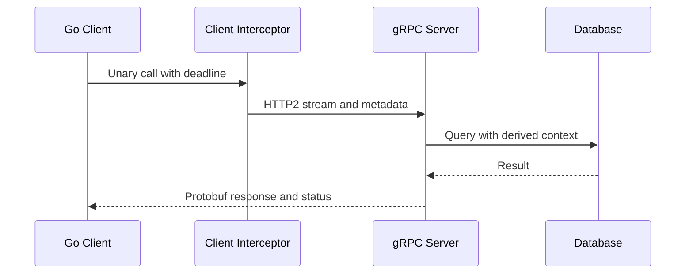

# gRPC: transport và call shapes

## Bài toán và ví dụ đầu tiên

Nhiều service nội bộ trao đổi dữ liệu có schema và cần code client/server đồng bộ. gRPC định nghĩa RPC service qua protocol schema, sinh stub và thường dùng HTTP/2 cho transport. Nó không loại bỏ timeout, retry hay ownership của handler.

## Đi từng bước qua một tình huống

Client gọi GetUser qua stub với context deadline. Server nhận RPC context, validate input, authorize rồi gọi repository bằng context đó. Nếu server tạo Background ở tầng dưới, deadline RPC không còn giới hạn query như mong muốn. Streaming cần quy định bên nào gửi/nhận và khi nào kết thúc.

## Hiểu cơ chế từ kết quả quan sát

Protobuf message có quy tắc schema evolution riêng, còn gRPC status biểu diễn nhóm lỗi transport/application theo contract. HTTP/2 multiplex streams nhưng flow control và slow consumer vẫn tạo backpressure. Max message size, concurrency và deadline cần cấu hình theo workload thay vì mặc định coi nội bộ là đáng tin.

## Khái niệm và mô hình làm việc

gRPC dùng service contract, thường protobuf trên HTTP/2, với unary và streaming RPCs.

## Cơ chế và những ranh giới cần giữ

Unary một request/response; server streaming nhiều responses; client streaming nhiều requests; bidirectional hai streams độc lập. Deadline qua context, metadata mang trace/auth, interceptors cho policy.

## Áp dụng vào hệ thống thật

Reuse ClientConn, bound streams và message size; Go handlers propagate ctx tới DB/HTTP, không spawn vô hạn trên mỗi streamed message.

## Những đường lỗi cần hiểu

Không deadline; stream consumer chậm làm flow-control blocking; reconnect/retry có thể replay mutation.

## Lần theo bằng chứng khi có sự cố

Đo RPC status, deadline remaining, active streams, message bytes và stream receive/send waits.

## Đánh đổi và giới hạn sử dụng

Typed contract tốt nội bộ; browser/public clients có compatibility/proxy constraints cần cân nhắc.

## Thực hành, debugging và kết luận

Dùng integration test qua transport để kiểm tra cancellation/status/stream closure. Quan sát active streams, message bytes và per-method latency. Retry mutation cần idempotency ở domain; code sinh type-safe không chứng minh remote effect chỉ xảy ra một lần.

## Đọc tiếp

- [HTTP client reuse và response ownership](../06-http-backend/http-client.md)
- [idempotency](../12-distributed-systems/idempotency.md)

## Nguồn đối chiếu

- [Tài liệu chính thức](https://grpc.io/docs/what-is-grpc/core-concepts/)

## RPC flow

### Cách đọc diagram

Client gọi stub với deadline, interceptor bổ sung policy/metadata rồi transport gửi HTTP2 stream tới server. Server tạo query từ context còn budget và trả protobuf response kèm status. Mũi tên biểu diễn flow một unary RPC; streaming có nhiều messages và lifecycle riêng. Interceptor không tự bảo đảm mutation retry-safe hoặc server truyền ctx đúng nếu handler bỏ qua nó.

Trong bidirectional streaming, đọc và ghi có thể tiến triển độc lập; phải theo concurrency contract của thư viện cho từng stream. Đóng send direction không đồng nghĩa toàn RPC hoàn tất. Interceptor cần giữ status/cause và deadline, không retry stream giữa chừng mà không protocol resume. Nguồn: [gRPC concepts](https://grpc.io/docs/what-is-grpc/core-concepts/) và [deadlines](https://grpc.io/docs/guides/deadlines/).
